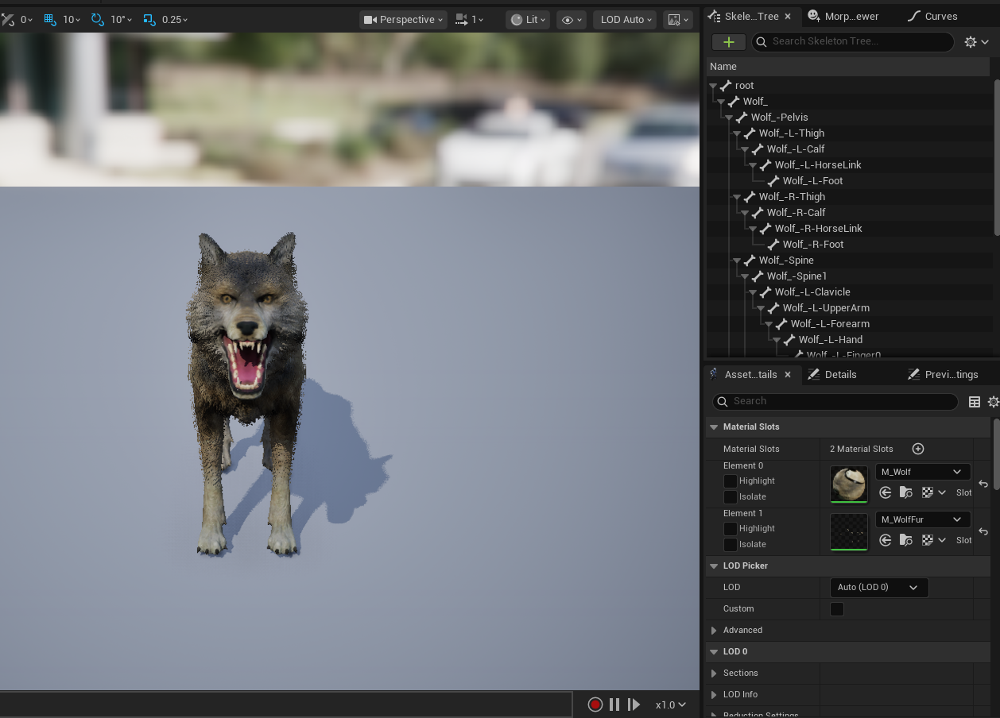
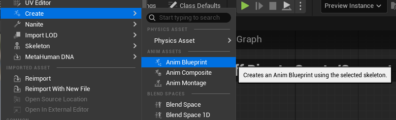

# 개요

**스켈레탈 메시**란 애니메이션을 만들기 위해 조작할 수 있는 리깅된 메시를 의미한다.
**애니메이션 블루프린트**는 스켈레탈 메시에서 증강시켜 레벨 내의 애니메이션 행동과 인터랙션을 제어하는 로직을 적용할 수 있다.

스켈레탈 메시를 기반으로 애니메이션 BP를 통해 애니메이션을 구현할 수 있다.

# 애니메이션 에디터

스켈레탈 메시 애니메이션 시스템은 스켈레탈 메시, 애니메이션 에셋으로 작업할 때 사용 가능한 에디터로 구성되어 있다. 이를 통해 애니메이션, 레벨 내의 인터랙션, 기타 프록시져럴 행동을 생성할 수 있다.

기본적으로 스켈레탈 메시는 콘텐츠 브라우저에서 열어서 확인할 수 있다.

플머들은 저 스켈레탈에 크게 손 댈일은 없지만, 눌러보면 각각의 관절을 선택할 수 있다.
상단의 툴바에서 애니메이션 추가, 포즈 추가, 블렌딩 등이 가능하다.

우측 상단의 에디터 모드에서 3, 4번 버튼이 주로 우리가 쓰게 될 기능들이 들어있는 것이다.

# 애니메이션 블루프린트

흔히 ABP라고 줄여서 부른다.
리얼타임에서 스켈레탈 메시의 애니메이션을 제어하는 특수 목적이 있는 블루프린트이다. 그래프를 편집하여 애니메이션 블렌딩, 스켈레톤 본 제어, 각 프레임에서 사용할 애니메이션 포즈등을 결정할 로직을 세울 수 있다.
이는 반드시 스켈레탈 메시가 필요하다.

아까 봤던 스켈레탈 메시에다가 우클릭 하면 저런식으로 생성해줄 수 있다.
저기에 로직을 짜고, 캐릭터에 할당시키면 동작하는 것이다.

## 에디터

처음 봐야할 부분은 그래프이다.
세 가지 종류의 그래프를 통해 우리가 캐릭터를 제어할 로직을 생성한다.

### 1. 애님 그래프

 캐릭터에 대한 **애니메이션 별** 로직을 생성한다. 블루프린트와 똑같은 방법으로 활용한다.
 보통 블렌딩, 본 트랜스폼, 로코모션 등의 애니메이션 이펙트를 제어하는 경우 활용한다. 애님 그래프 내에서 함수나 계산된 값을 사용해 입력으로 활용하는 식으로 사용하여 최종 포즈를 정의 시킨다.

### 2. 이벤트 그래프

모든 ABP에 하나씩 존재한다. 관련한 이벤트 컬렉션을 사용해서 시퀀스를 개시하는 그래프이다. 기본적으로 애님 그래프 노드에서 사용하는 값이나 프로퍼티를 업데이트 한다.

이 또한 일반적인 블루프린트와 사용법은 유사하다. 하지만 알아두면 좋을 몇가지 이벤트 노드가 있다.

- `BeginPlay`: 게임 또는 시뮬레이션 시작 시 실행되며, Actor의 `BeginPlay()` 보다 먼저 실행된다.
- ` Initialize Animation`: 초기화 작업을 수행하기 위해 ABP 인스턴스 생성시 딱 한번 실행된다. Actor의 컨스트럭션 스크립트 보다도 먼저 실행된다. 
- `Linked Animation Layers Initialized`: 애니메이션 초기화 후 한 번 실행된다.
- `Post Evaluate Animation`: 매 프레임 호출된다. 하지만 애니메이션 평가 후 현재 프레임의 포즈를 적용한 후 실행된다.
    - 주로 값을 리셋하거나, 정확한 본의 Transform을 가져올 때 유용하다.
- `Update Animation`: 매 프레임 호출된다. ABP가 필요한 값에 대해 계산을 하기 위한 용도로 사용한다고 보면 된다. DeltaTime을 제공해준다.
- `Anim Notify`: 노티파이가 트리거 되면 호출된다.

### 3. 스테이트 머신

각 애니메이션 간의 재생 시기를 정의하기 위한 모듈형 시스템이다.