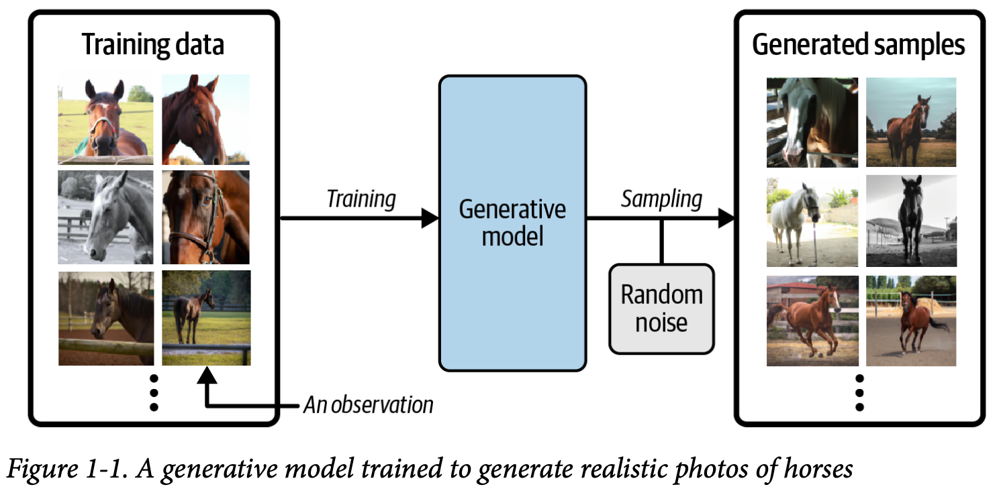
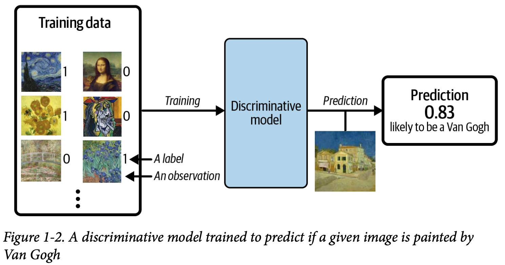
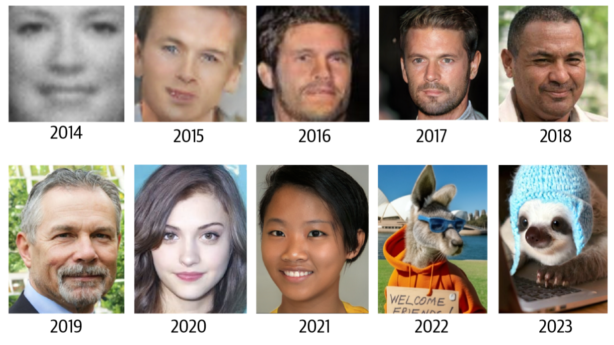
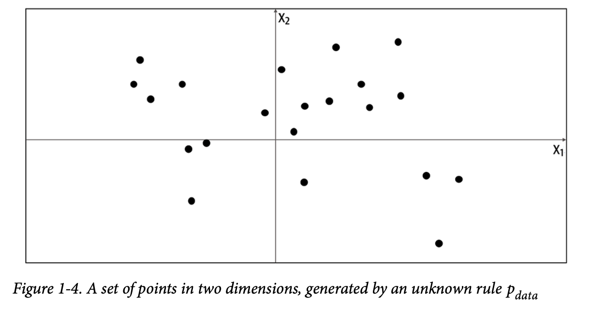
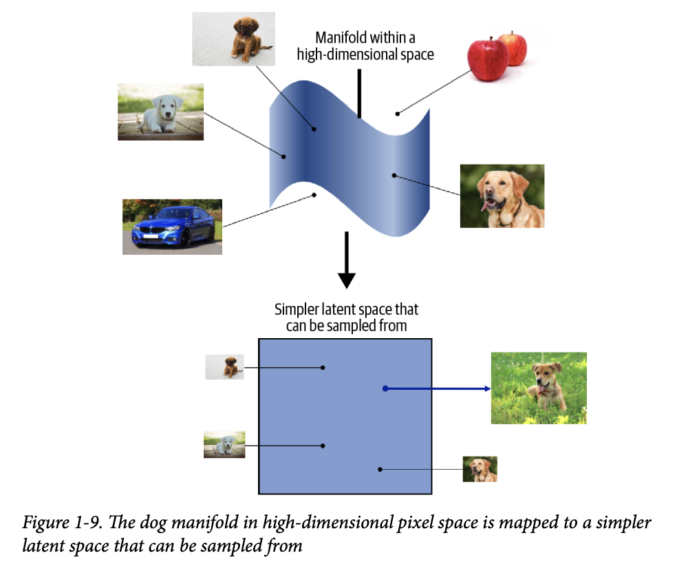
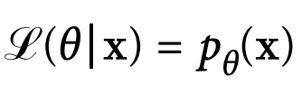
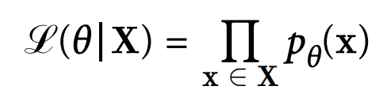
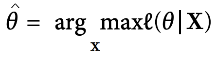
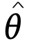
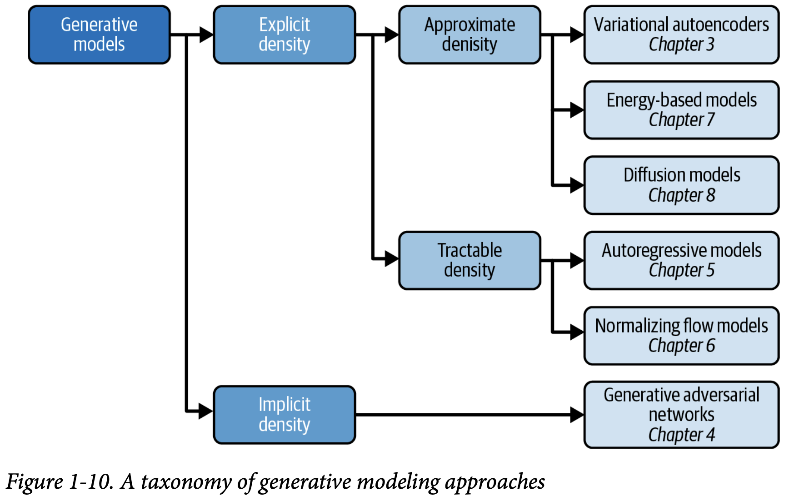

# Chapter 1. 생성 모델링

## 1.1 생성 모델링이란?

주어진 데이터셋과 유사한 새로운 데이터를 생성할 수 있게 모델을 훈련하는 것

**훈련 데이터**를 통해 생성 모델을 **훈련** → 말 사진의 픽셀간의 복잡한 관계를 정의하는 규칙을 포착 → 이 모델에서 **샘플링**을 통해 데이터 셋에 없는 새로운 말 이미지 생성

**샘플** : 훈련 데이터에서 하나의 데이터 포인트, 많은 특성으로 이루어져있다.

이 특성은 텍스트 생성으로 예를 들면 단어 하나, 또는 문자 덩어리 일 수 있음.
결과적으로 원본 데이터와 동일한 규칙으로 보이는 새로운 특성을 생성하는 모델을 만드는 것.

결정적이지 않음, 확률적이어야 함 → 다양한 출력 결과를 샘플링할 수 있어야 하기 떄문.
생성 모델은 생성되는 개별 샘플에 영향을 미칠수 있는 랜덤 요소가 포함되어야 함.

### 1.1.1 생성 모델링과 판별 모델링

판별 모델링: 생성 모델링의 반대개념

- 반 고흐의 그림 + 다른 화가들의 그림이 있는 데이터셋을 통해 반고흐의 그림인지 예측하는 판별모델을 훈련할 수 있음.
    - 특정 색깔, 형태, 질감을 학습하여 예측 지수를 높임
- **레이블**: 판별 모델링 수행시 필요. 반고흐 예제같은 이진 분류 문제에서 반 고흐 그림의 레이블은 1, 아닌 그림의 레이블은 0.
- 하지만 생성 모델링은 레이블 예측이 아니라 이미지 생성이 목적이므로 레이블 필요 없음.
- 판별 모델링은 `p(y | x)`를 추정한다 → 판별 모델링은 샘플 x를 통해 레이블 y의 확률을 모델링하는 것이 목표
- 생성 모델링은 `p(x)`를 추정한다 → 생성 모델링은 샘플 x를 관측(샘플링)할 확률을 모델링하는 것이 목표.
    - 물론 조건부를 추가하여 `p(y | x)`를 추정하는 모델을 만들수도 있음 (과일 사진들을 통해 사과 이미지를 생성하는 식)
- 완벽히 판별하는 모델을 만들 지언정 만드는 방법은 알지 못한다. 그저 확률만 출력할 뿐
    - 생성 모델을 훈련하고 이 모델에서 샘플링하여 원본 훈련 데이터셋에 속할 가능성이 높은 이미지를 생성해야 한다.

### 1.1.2 생성 모델의 등장

생성 모델을 만드는 건 어렵고, 근접할 수 없는 영역이었지만 머신러닝 기술의 발전이 이를 가능하게 만들었다.

### 1.1.3 생성 모델링과 AI

- 생성 모델을 복잡한 인공지능 문제를 푸는 열쇠로 생각되는 세 가지 이유
    1. 이론적 이유: 단순히 레이블 수준을 넘어서 데이터의 분포를 완전히 이해해야 하기 때문에.
    2. 실용적 이유: 전통적 강화학습의 떨어지는 유연성을 생성 모델을 통해 작업과 독립적으로 환경의 월드 모델을 학습 시키는 방식으로 해결이 가능하기 때문에.
    3. 근본적 이유: 인간의 지능은 생성적이기 때문이다. 보이지 않는 것을 상상하고 미래를 떠올리는 것은 생성적이다.
        - 뇌의 작동원리와 인공 일반지능을 이해하는데 핵심적인 도구가 될 것이다.

## 1.2 첫 번째 생성 모델

### 1.2.1 간단한 생성 모델

2차원 생성 모델링 게임 예시)
포인트 집합 `X` → 규칙 `P_data` 같은 규칙으로 보이는 다른 포인트 `x=(x1, x2)`를 고르는 것이 목표.

우리는 점들의 정보를 통해 마음속으로 모델(`P_model`)을 만들었다. 즉 `P_model`은 `P_data`의 추정이다.

새로운 샘플을 생성 할 때 이 네모 상자 안에서 랜덤한 점을 고르면 된다. 조금 더 이론적으로 말하면, `P_model`분포로 부터 샘플링 한다고 한다.
우리는 이를 통해 훈련 데이터(점들)를 통해 다른 포인트(훈련 데이터에 없는)를 생성할 수 있는 모델(주황색 구역)을 만든 것이다.

### 1.2.2 생성 모델링 프레임워크

위의 내용을 통해 생성 모델링 프레임 워크를 작성해보자.

---

#### 샘플 모델링 프레임워크

- 샘플 데이터셋 `X`를 가지고 있다.
- 샘플이 알려지지 않은 어떤 `P_data`분포로 생성 된 것으로 가정.
- `P_data`를 흉내내는 생성모델 `P_model`을 만들려고 한다. `P_model`에서 샘플링하여 `P_data`에서 뽑은 것 같은 샘플을 생성할 수 있다.
- 그러므로 `P_model`은 다음의 특징을 가져야 한다.
    - 정확도: 생성된 샘플의 `P_model`이 높으면 `P_data`에서 뽑은 것 처럼 보여야 한다. 반대의 경우도 성립해야 한다.
    - 생성: `P_model`에서 새로운 샘플을 쉽게 샘플링 할 수 있어야 한다.
    - 표현: 데이터의 다양한 고수준의 특성이 `P_model`로 어떻게 표현되는지 이해가 가능해야 한다.

---

`P_model`은 `P_data`를 과도하게 단순화 했다. 점 A, B, C를 확인해보자.

- 점 A: 모델이 생성했지만, 바다에 있기 때문에 `P_data`가 생성한 것으로 보이지 않는다.
- 점 B: 주황 상자 밖에 있기 때문에 `P_model`이 생성한 것으로 보이지 않는다. 이 모델엔 허점이 있다.
- 점 C: `P_model`이 생성했고, `P_data`에도 속한다.

이는 완벽하지 않지만 주황 상자에 대한 균등 분포이기 때문에 샘플링이 쉽다. 단순히 이 상자에서 점을 고르면 된다.
또한 복잡한 분포의 단순 표현이라 볼 수 있다. 이는 내재된 고수준의 특성을 일부 포착 가능하다.
실제 분포상으론 여러 대륙과 바다로 구분되지만, 모델에선 하나의 큰 대륙만이 있다.
이는 생성 모델링의 기본 개념을 보여준다. 훨씬 고차원적인 다른 문제도 기본 프레임 워크는 같다.

### 1.2.3 표현 학습

사람을 찾을 때 사진의 픽셀들의 색깔로 찾는 것이 아니라, 금발에 안경을 썼다 등 픽셀의 그룹의 특성으로 찾는다. 이런 설명이 10개 정도 있으면 픽셀로 매핑해 머리 속에 이미지를 만들 수 있다.
이렇게 수많은 픽셀을 몇 개의 의미 있는 특징으로 요약하는 것을 자동으로 배우는 게 표현 학습이다.

고차원의 표본 공간을 직접 모델링 하지 않고, 저차원의 잠재 공간에 표현하는 것이다.

이 비스킷 통들은 겉보기엔 픽셀 덩어리 들이지만, 높이와 너비만 다르다는 것을 알 수 있다.
이때 비스킷 통 이미지를 높이, 너비 두개의 숫자로 표현하자고 하면 고차원의 이미지가 2차원 점으로 바뀐다.
이 2차원 공간이 잠재 공간(latent space)이다.

하지만 이걸 기계가 깨닫는건 어렵다.
저 높이와 너비를 이해하기 위해서 한 점을 비스킷 깡통 이미지에 매핑하는 매핑 함수 `f`를 학습해야함.
머신러닝 (특히 딥러닝)을 사용하면 사람의 개입 없이 관계를 이해하도록 훈련 시킬 수 있다.

좌측의 잠재 공간과 우측의 실제 비스킷 통 이미지가 있다. 
잠재공간을 활용하면 표현 벡터를 조작하여 이미지의 고수준의 속성에 영향을 미치는 연산이 가능하다.
깡통 이미지를 키우려면 수많 은 개별 픽셀을 조절할게 아니라, 잠재 공간의 높이 차원에 1을 더하고 매핑 함수 $$f$$를 적용시켜서 쉽게 이미지를 얻을 수 있다. 즉, 유의미한 조작이 가능하다는 것이다.

예시 그림에서 강아지 이미지들이 흩어진 게 아닌 어느 곡면 위에만 놓여있다. 이 곡면을 매니폴드라고 한다. 
이는 복잡해서 샘플링하기가 거의 불가능하기 때문에, 아무 점이나 찍으면 노이즈가 나올 확률이 훨씬 높다.
그래서 이 복잡한 매니폴드를 더 단순한 잠재 공간으로 펼쳐야 한다. 이미지 공간을 잠재공간으로 인코딩, 잠재 공간에서 이미지 공간으로 디코딩 하는 것이다.
훈련 데이터셋 → 인코딩 → 샘플링 → 디코딩하는 과정은 많은 생성 모델링 기법에서 사용된다.
쉽게 말해 복잡한 고차원 공간을 단순한 공간으로 바꾼다는 이야기이다.

## 1.3 핵심 확률 이론

생성 모델링은 확률 분포의 통계적 모델링과 밀접하다.
다섯 가지 핵심 용어 정리

- 표본 공간: 샘플 `x`가 가질 수 있는 모든 값의 집합
- 확률 밀도 함수(밀도 함수): 점 x를 0과 1사이 숫자로 매핑하는 함수 `p(x)`이다.
    - 샘플 데이터셋을 생성한 실제 밀도 함수 `p_data(x)`는 하나여도, 추정하는데 사용할 수 있는 `p_model(x)`는 무수히 많음
- 모수 모델링: 안정적인 `p_model(x)`를 찾는데 사용할 수 있는 기법이다.
    - 유한한 개수의 파라미터 `θ`를 사용해 기술할 수 있는 밀도함수 `p_θ(x)`의 한 종류이다.
    - 데이터셋 `X`가 관측될 가능도를 최대화하는 파라미터 `θ`의 최적값을 찾는것이 목적
- 가능도: 파라미터 집합 `θ`의 가능도는 샘플 점 `x`가 주어졌을 때 `θ`의 타당성. → 점 `x`에서 을 파라미터로 가진 밀도함수의 값
    - 다음과 같이 정의됨: 
    - 독립된 샘플로 구성된 전체 데이터셋 `X`가 있으면: 
    - 0과 1사이 숫자를 곱하는건 계산 비용이 많이 들기 때문에 로그 가능도 `l`을 사용하는 경우가 많음:
        - 실제 데이터 생성분포가 `θ`을 파라미터로 가진 모델이면 파라미터 집합 θ의 가능도를 데이터 발견 확률로 정의
- 최대 가능도 추정: 를 추정할 수 있는 기법
    - : 관측 된 데이터를 가장 잘 설명하는 밀도함수 `p_θ(x)`의 파라미터 집합 θ.
    - , 를 최대 가능도 추정이라고도 부름
    - 신경망은 일반적으로 손실 함수를 최소화한다. 따라서 음의 로그 가능도를 최소화하는 파라미터 집합을 찾는 것과 같다.
        -  
    - 생성 모델링을 최대 가능도 추정의 형태로 생각할 수 있음.
    - 모델에 담긴 신경망의 가중치. 주어진 데이터를 관측할 가능도를 최대화(음의 로그 가능도는 최소화)하는 파라미터 θ를 찾는다.
- 일반적으로 고차원 문제에서 `p_θ(x)`를 직접 계산하기는 매우 어렵다.

## 1.4 생성 모델 분류

모든 생성모델은 밀도 함수 `p_θ(x)`를 모델링 하는 방식이 조금씩 다르다. 크게 세 가지가 있다.

1. 명시적으로 밀도 함수를 모델링. 다루기 쉽게 제약을 둠.
2. 다루기 쉬운 밀도함수의 근사치를 명시적으로 모델링
3. 데이터를 직접 생성하는 확률적 과정을 통해 밀도 함수를 암묵적으로 모델링

- 암묵적 밀도 모델(implicit density model)은 확률 밀도 추정이 목적은 아님. 데이터를 직접 생성하는 확률적 과정을 만드는데 집중.
    - 생성적 적대 신경망(generative adversarial network)이 가장 잘 알려짐.
- 명시적 밀도 모델(explicit density model)
    - 다루기 쉬운 모델(tractable model): 모델 구조에 제약이 생겨 밀도함수 계산이 쉬운 케이스
        - 자기 회귀 모델(autoregressive model): 입력 특성에 순서를 부과하여 출력이 순차적(단어, 픽셀 단위)으로 생성됨.
        - 노멀라이징 플로우 모델(normalizing flow model): 복잡한 분포 생성시 단순한 분포에 다루기 쉽고 역전 가능한 함수를 연속적으로 적용
    - 근사 밀도 모델(approximate density model)
        - 변이형 자동인코더(variational autoencoder): 잠재 변수를 도입하고, 결합 밀도 함수의 근사치를 최적화.
        - 에너지 기반 모델(energy-based model): 변분 방법이 아닌 마르코프 연쇄 샘플링을 활용
        - 확산 모델 (diffusion model)은 오염된 이미지에서 점진적으로 잡음을 제거하도록 모델 훈련

모두 **딥러닝**이다. 거의 모든 정교한 생성 모델의 핵심은 심층 신경망이다.

## 1.5 생성 딥러닝 예제 코드 

https://github.com/davidADSP/Generative_Deep_Learning_2nd_Edition

## 1.6 요약

- 생성 모델링은 판별 모델링을 대체하는 수준이 아닌 중요한 머신러닝의 분야이다.
- 생성 모델의 핵심 목표는 개별 데이터를 맞히는 것이 아닌 데이터가 생성되는 전체 분포 모델링.
- 다음 챕터에서 알아볼 6가지 생성 모델에 대해 알아봄.
- 2장에서 딥러닝에 대해 알아보고, 판별 모델링 작업을 위한 모델을 케라스로 어떻게 만드는지 배울 예정.