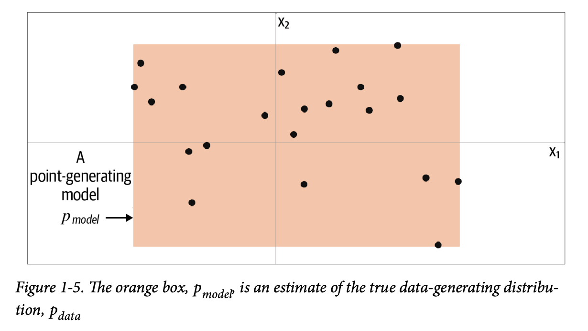

# Chapter 1. 생성 모델링

## 1.1 생성 모델링이란?

주어진 데이터셋과 유사한 새로운 데이터를 생성할 수 있게 모델을 훈련하는 것

말사진 예시)
**훈련 데이터**를 통해 생성 모델을 **훈련** → 말 사진의 픽셀간의 복잡한 관계를 정의하는 규칙을 포착 → 이 모델에서 **샘플링**을 통해 데이터 셋에 없는 새로운 말 이미지 생성

**샘플** : 훈련 데이터에서 하나의 데이터 포인트, 많은 특성으로 이루어져있다.

이 특성은 텍스트 생성으로 예를 들면 단어 하나, 또는 문자 덩어리 일 수 있음.
결과적으로 원본 데이터와 동일한 규칙으로 보이는 새로운 특성을 생성하는 모델을 만드는 것.

결정적이지 않음, 확률적이어야 함 → 다양한 출력 결과를 샘플링할 수 있어야 하기 떄문.
생성 모델은 생성되는 개별 샘플에 영향을 미칠수 있는 랜덤 요소가 포함되어야 함.

### 1.1.1 생성 모델링과 판별 모델링

- 판별 모델링: 생성 모델링의 반대개념
- 반 고흐의 그림 + 다른 화가들의 그림이 있는 데이터셋을 통해 반고흐의 그림인지 예측하는 판별모델을 훈련할 수 있음.
    - 특정 색깔, 형태, 질감을 학습하여 예측 지수를 높임
- **레이블**: 판별 모델링 수행시 필요. 반고흐 예제같은 이진 분류 문제에서 반 고흐 그림의 레이블은 1, 아닌 그림의 레이블은 0.
- 하지만 생성 모델링은 레이블 예측이 아니라 이미지 생성이 목적이므로 레이블 필요 없음.
- 판별 모델링은 p(y | x)를 추정한다 → 판별 모델링은 샘플 x를 통해 레이블 y의 확률을 모델링하는 것이 목표
- 생성 모델링은 p(x)를 추정한다 → 생성 모델링은 샘플 x를 관측(샘플링)할 확률을 모델링하는 것이 목표.
    - 물론 조건부를 추가하여 p(y | x)를 추정하는 모델을 만들수도 있음 (과일 사진들을 통해 사과 이미지를 생성하는 식)
- 완벽히 판별하는 모델을 만들 지언정 만드는 방법은 알지 못한다. 그저 확률만 출력할 뿐
    - 생성 모델을 훈련하고 이 모델에서 샘플링하여 원본 훈련 데이터셋에 속할 가능성이 높은 이미지를 생성해야 한다.

### 1.1.2 생성 모델의 등장

- 생성 모델을 만드는 건 어렵고, 근접할 수 없는 영역이었지만 머신러닝 기술의 발전이 이를 가능하게 만들었다.

### 1.1.3 생성 모델링과 AI

- 생성 모델을 복잡한 인공지능 문제를 푸는 열쇠로 생각되는 세 가지 이유
    1. 아론적 이유: 단순히 레이블 수준을 넘어서 데이터의 분포를 완전히 이해해야 하기 때문에.
    2. 실용적 이유: 전통적 강화학습의 떨어지는 유연성을 생성 모델을 통해 작업과 독립적으로 환경의 월드 모델을 학습 시키는 방식으로 해결이 가능하기 때문에.
    3. 근본적 이유: 인간의 지능은 생성적이기 때문이다. 보이지 않는 것을 상상하고 미래를 떠올리는 것은 생성적이다.
        - 뇌의 작동원리와 인공 일반지능을 이해하는데 핵심적인 도구가 될 것이다.

## 1.2 첫 번째 생성 모델

### 1.2.1 간단한 생성 모델

2차원 생성 모델링 게임 예시)
포인트 집합 $$X$$ → 규칙 $$P_{data}$$ 같은 규칙으로 보이는 다른 포인트 $$x=(x1, x2)$$를 고르는 것이 목표.

우리는 점들의 정보를 통해 마음속으로 모델($$P_{model}$$)을 만들었다. 즉 $$P_{model}$$은 $$P_{data}$$의 추정이다.

새로운 샘플을 생성 할 때 이 네모 상자 안에서 랜덤한 점을 고르면 된다. 조금 더 이론적으로 말하면, $$P_{model}$$분포로 부터 샘플링 한다고 한다.
우리는 이를 통해 훈련 데이터(점들)를 통해 다른 포인트(훈련 데이터에 없는)를 생성할 수 있는 모델(주황색 구역)을 만든 것이다.

### 1.2.2 생성 모델링 프레임워크

위의 내용을 통해 생성 모델링 프레임 워크를 작성해보자.

---

#### 샘플 모델링 프레임워크

- 샘플 데이터셋 $$X$$를 가지고 있다.
- 샘플이 알려지지 않은 어떤 $$P_{data}$$분포로 생성 된 것으로 가정.
- $$P_{data}$$를 흉내내는 생성모델 $$P_{model}$$을 만들려고 한다. $$P_{model}$$에서 샘플링하여 $$P_{data}$$에서 뽑은 것 같은 샘플을 생성할 수 있다.
- 그러므로 $$P_{model}$$은 다음의 특징을 가져야 한다.
    - 정확도: 생성된 샘플의 $$P_{model}$$이 높으면 $$P_{data}$$에서 뽑은 것 처럼 보여야 한다. 반대의 경우도 성립해야 한다.
    - 생성: $$P_{model}$$에서 새로운 샘플을 쉽게 샘플링 할 수 있어야 한다.
    - 표햔: 데이터의 다양한 고수준의 특성이 $$P_{model}$$로 어떻게 표현되는지 이해가 가능해야 한다.

---

$$P_{model}$$은 $$P_{data}$$를 과도하게 단순화 했다. 점 A, B, C를 확인해보자.

- 점 A: 모델이 생성했지만, 바다에 있기 때문에 $$P_{data}$$가 생성한 것으로 보이지 않는다.
- 점 B: 주황 상자 밖에 있기 때문에 $$P_{model}$$이 생성한 것으로 보이지 않는다. 이 모델엔 허점이 있다.
- 점 C: $$P_{model}$$이 생성했고, $$P_{data}$$에도 속한다.

이는 완벽하지 않지만 주황 상자에 대한 균등 분포이기 때문에 샘플링이 쉽다. 단순히 이 상자에서 점을 고르면 된다.
또한 복잡한 분포의 단순 표현이라 볼 수 있다. 이는 내재된 고수준의 특성을 일부 포착 가능하다.
실제 분포상으론 여러 대륙과 바다로 구분되지만, 모델에선 하나의 큰 대륙만이 있다.
이는 생성 모델링의 기본 개념을 보여준다. 훨씬 고차원적인 다른 문제도 기본 프레임 워크는 같다.

### 1.2.3 표현 학습

사람을 찾을 때 사진의 픽셀들의 색깔로 찾는 것이 아니라, 금발에 안경을 썼다 등 픽셀의 그룹의 특성으로 찾는다. 이런 설명이 10개 정도 있으면 픽셀로 매핑해 머리 속에 이미지를 만들 수 있다.
이렇게 수많은 픽셀을 몇 개의 의미 있는 특징으로 요약하는 것을 자동으로 배우는 게 표현 학습이다.

고차원의 표본 공간을 직접 모델링 하지 않고, 저차원의 잠재 공간에 표현하는 것이다.

이 비스킷 통들은 겉보기엔 픽셀 덩어리 들이지만, 높이와 너비만 다르다는 것을 알 수 있다.
이때 비스킷 통 이미지를 높이, 너비 두개의 숫자로 표현하자고 하면 고차원의 이미지가 2차원 점으로 바뀐다.
이 2차원 공간이 잠재 공간(latent space)이다.

하지만 이걸 기계가 깨닫는건 어렵다.
저 높이와 너비를 이해하기 위해서 한 점을 비스킷 깡통 이미지에 매핑하는 매핑 함수 $$f$$를 학습해야함.
머신러닝 (특히 딥러닝)을 사용하면 사람의 개입 없이 관계를 이해하도록 훈련 시킬 수 있다.

좌측의 잠재 공간과 우측의 실제 비스킷 통 이미지가 있다. 
잠재공간을 활용하면 표현 벡터를 조작하여 이미지의 고수준의 속성에 영향을 미치는 연산이 가능하다.
깡통 이미지를 키우려면 수많 은 개별 픽셀을 조절할게 아니라, 잠재 공간의 높이 차원에 1을 더하고 매핑 함수 $$f$$를 적용시켜서 쉽게 이미지를 얻을 수 있다. 즉, 유의미한 조작이 가능하다는 것이다.

예시 그림에서 강아지 이미지들이 흩어진 게 아닌 어느 곡면 위에만 놓여있다. 이 곡면을 매니폴드라고 한다. 
이는 복잡해서 샘플링하기가 거의 불가능하기 때문에, 아무 점이나 찍으면 노이즈가 나올 확률이 훨씬 높다.
그래서 이 복잡한 매니폴드를 더 단순한 잠재 공간으로 펼쳐야 한다. 이미지 공간을 잠재공간으로 인코딩, 잠재 공간에서 이미지 공간으로 디코딩 하는 것이다.
훈련 데이터셋 → 인코딩 → 샘플링 → 디코딩하는 과정은 많은 생성 모델링 기법에서 사용된다.
쉽게 말해 복잡한 고차원 공간을 단순한 공간으로 바꾼다는 이야기이다.