데이터 처리 유닛의 층을 여러 개 쌓아 구조화가 안된 데이터에서 높은 수준의 표현을 학습한다.

# 2.1 딥러닝용 데이터

대부분의 알고리즘은 테이블 형태로 된 정형(구조화 된) 데이터를 입력으로 사용한다.
이런 형태의 테이블 데이터를 사용해 로지스틱 회귀(랜덤 포레스트), XGBoost 모델을 훈련하여 이진 응답 변수 예측이 가능하다.

> 예를 들어 어떤 사람의 나이, 소득, 방문 횟수등을 통해 이 사람이 구독을 할지(1) 안 할지(0)를 나타낼 수 있다.

비정형 데이터 (구조화 되지 않은 데이터)는 이미지, 오디오, 텍스트 처럼 따로 열로 구성할 수 없는 데이터이다.

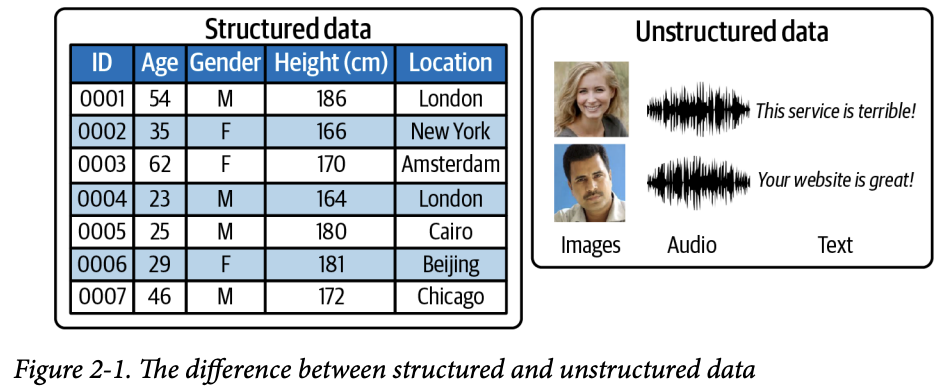

픽셀, 진동수, 문자 하나하나엔 거의 정보가 없다. 234번째 픽셀의 색을 보고 무슨 이미지인지 알 수 없고, 24번째 문자가 e라는 사실로 축구에 관한 내용인지 정치에 관한 내용인지 알 수 없다.
그러므로 이런 원시 픽셀에서 로지스틱 회귀, 랜덤 포레스트, XGBoost 알고리즘을 훈련하면 단순 분류작업 뺴곤 성능이 낮은 모델만 나온다.

딥러닝은 정형 데이터에도 적용이 되지만 비정형 데이터에서 빛을 발한다. 특히 생성 모델링에선 더욱 더 그렇다.

# 2.2 심층 신경망

여러 은닉 층(hidden layer)을 쌓은 인공 신경망(artificial neural network)이다. 그러므로 딥러닝 = 심층 신경망이라고 봐도 무방하다.

## 2.2.1 신경망이란?

심층 신경망은 층을 연속해서 쌓음, 층은 유닛으로 이루어짐, 유닛은 가중치로 연결됨. 여러 종류의 층이 있다.
널리 사용되는 건 Fully Connected Layer(완전 연결 층 또는 밀집 층), 인접한 모든 층이 연결되면 다층 퍼셉트론(MLP)이라고 함.


다중 퍼셉트론의 예시, 입력이 출력 레이어 까지 도달할 때 까지 순서대로 변환됨. → 정방향 계산(Forward pass)
각 유닛이 입력의 가중치 합에 비선형 변환 적용하여 다음 층에 전달. 정점이 바로 최종 출력 레이어. 하나의 유닛으로 원래 입력이 카테고리에 속활 확률을 출력함.

정확한 예측에 필요한 각 레이어의 가중치 조합을 찾는것이 목표. → 네트워크를 훈련 한다고 함.

훈련 과정에서 이미지의 배치(Batch)가 네트워크에 전달 되고 예측 값을 정답과 비교한다.
100 or 0으로 출력시키는게 목표이지만 웃는 이미지엔 80프로, 안 웃는 얼굴엔 23프로인 식으로 오차가 발생 할 수 있긴 함.

예측 오류는 이 네트워크를 거꾸로 전파해서 예측을 제일 많이 향상시키는 방향으로 가중치를 고쳐나간다. (예시 사진에서 간선을 고친다고 생각하면 편함) 이를 **역전파 (Backpropagation)**라고 한다. 이를 통해 점점 나은 예측을 하게 된다.

## 2.2.2 고수준 특성 학습

신경망의 가장 강력한 속성은 사람이 개입하지 않아도 알아서 입력 데이터에서 특성을 학습하는 능력이다.
우리가 굳이 눈 모양과, 입가의 밝기등을 계산해주지 않아도 되기 때문에 매우 유용하다.
이 오차를 최소화하기 위해 가중치를 어떻게 조절할지 모델이 결정한다.

그림 2-2가 훈련이 완료되었다고 가정하면.

1. 유닛 A는 픽셀의 개별 채널값을 받는다.
    - 이미지 픽셀하나, RGB 채널 하나.
2. 유닛 B는 입력값을 결합해 엣지(edge)와 같은 특정 저수준 특성이 존재할 경우 가장 큰 값을 출력한다.
    - 경계선, 밝기변화, 패턴 등. (여기 선이 있다.)
3. 유닛 C는 저수준 특성을 결합해 이미지에 치아와 같은 고 수준 특성이 보일때 가장 큰 값을 출력한다.
    - 눈, 입, 이빨 등. (이 선들이 이런식으로 모이면 이빨로 보인다.)
4. 유닛 D는 고수준 특성을 결합해 원본 이미지의 사람이 웃을때 제일 큰 값을 출력한다.
    - 웃는다, 안 웃는다. (이빨이 보이고 입 모양을 봤을때 웃고 있다/있지 않다.)

 후속 층의 유닛은 이전 층의 특성을 결합해 원본 입력의 정교한 측면을 표현한다. 이는 학습과정에서 자연스레 일어난다.
각 유닛에 뭘 찾아야 할지, 어떤 수준의 특성을 찾아야 할지 알려줄 필요가 없다.

 입력 층(입력 자체)과 출력 층 사이의 층을 은닉 층이라고 한다. 예제에선 히든 레이어가 두 개밖에 없지만, 실제론 더 많이 있을 수 있다.
많이 쌓을수록 저수준의 특성에서 점진적으로 정보를 구축해 고수준의 특성을 얻을 수 있다.

> 이미지 인식용으로 설계된 ResNet은 152개의 층으로 이루어져 있다.

## 2.2.3 텐서플로우와 케라스

- 구글의 텐서플로우
    - 오픈소스 파이썬 머신러닝 라이브러리이며, 머신러닝 솔루션을 만들 때 널리 사용된다.
    - 텐서 조작에 강점이 있고, 신경망 훈련에 필요한 저수준 기능을 제공한다.
        - 예를 들어 임의의 미분 가능한 표현식의 그레이디언트를 계산하고, 텐서 연산을 효율적으로 실행할 수 있다.
- 케라스
    - 텐서플로우 위에 구축된 고 수준의 API이다. 다양한 신경망 구성요소를 제공하고, 함수형 API로 복잡한 딥러닝 구조를 만들 수 있다.
    - 유연성이 높고 쉽기 때문에 딥러닝 입문에 사용하기 좋다.

# 2.3 다층 퍼셉트론

지도 학습(Supervised Learning)을 통해 이미지를 분류하는 MLP를 케라스를 통해 쉽게 만들어보자.
판별모델이긴 하지만, 여러 유형의 생성 모델에서 지도 학습이 중요한 역할을 하기 때문에 좋은 주제이다.

## 2.3.1 데이터 준비하기

케라스에서 제공된 6만개의 32x32픽셀 컬러이미지 데이터인 CIFAR-10 데이터셋을 활용. 총 10개의 클래스 중 하나로 분류된다.

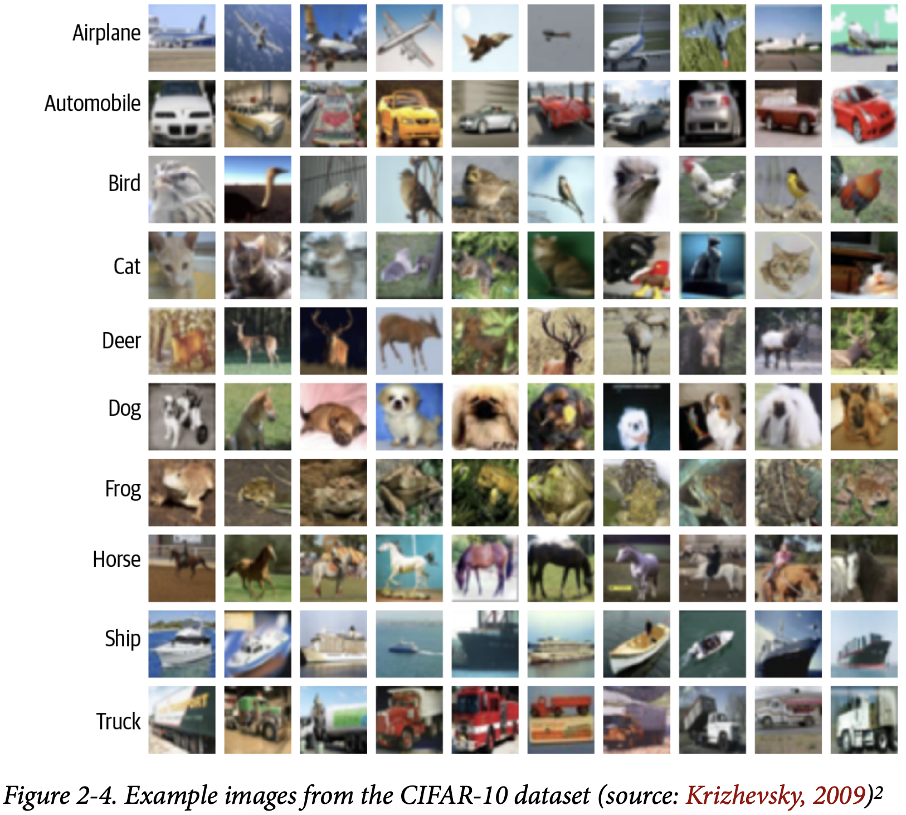

기본적으로 각 픽셀 채널에 대해 0에서 255사이 정수로 구성됨. 
신경망은 각 입력의 절댓값이 1보다 작으면 제일 잘 작동하므로 `/ 255f`를 해줌.
신경망 출력: 이미지가 클래스에 속할 확률 → 이미지 정수 레이블을 one-hot-encoding 된 벡터로 바꿔야 함.

> one-hot encoding을 쉽게 표현한 예시
>
> 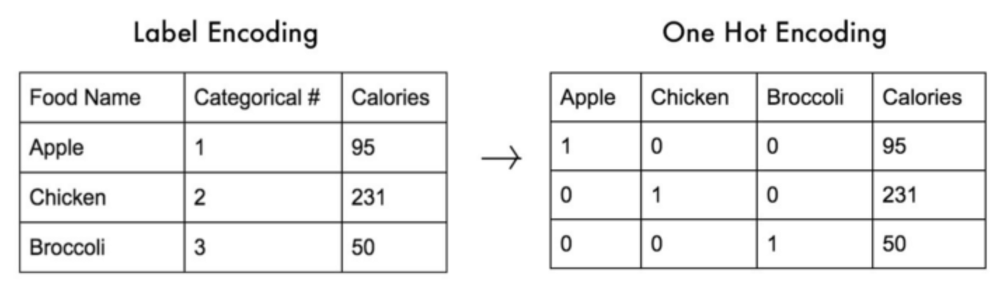 

```python
import numpy as np
from tensorflow.keras import datasets, utils

# 1. CIFAR-10 데이터셋 로드
# x_train: [50000, 32, 32, 3], x_test: [10000, 32, 32, 3] (이미지 5만장, 32x32 짜리, 색상 채널 3개)
# y_train: [50000, 10], y_test: [10000, 10]	()

(x_train, y_train), (x_test, y_test) = datasets.cifar10.load_data()

NUM_CLASSES = 10

# 2. normalize
x_train = x_train.astype('float32') / 255.0
x_test = x_test.astype('float32') / 255.0

# 3. one-hot encoding
y_train = utils.to_categorical(y_train, NUM_CLASSES)
y_test = utils.to_categorical(y_test, NUM_CLASSES)
```

## 2.3.2. 모델 만들기

케라스에서 Sequential 모델, 함수형 API를 사용한 신경망 구조 정의 가능.

- Sequential 모델: 일렬로 층을 쌓은 네트워크를 빠르게 만들 때 사용하기 좋음 
    - 분기 없이 이전 층이 그대로 다음 층으로 연결
- 함수형 API: 더 복잡한 구조에서 활용.
    - 한 층의 출력이 여러 층으로 가거나, 여러 입력을 받는 모델도 가능

```python
from tensorflow.keras import layers models

model = models.Sequential([
    layers.Flatten(input_shape=(32, 32, 3)),
    layers.Dense(200, activation = 'relu'),
    layers.Dense(150, activation = 'relu'),
    layers.Dense(10, activation = 'softmax'),
])
```

책에 나오는 대부분의 모델은 한 층의 출력이 여러개의 후속층으로 전달됨. 또는 반대로 한 층이 여러 이전층으로 전달받음.
 -> Sequential 클래스는 적합하지 않음. 훨씬 유연한 함수형 API를 사용해야 함.

```python
input_layer = layers.Input((32, 32, 3))

x = layers.Flatten()(input_layer)
x = layers.Dense(200, activation="relu")(x)
x = layers.Dense(150, activation="relu")(x)

output_layer = layers.Dense(NUM_CLASSES, activation="softmax")(x)

model = models.Model(input_layer, output_layer)
```

함수형 API를 사용하여 만든 모델.

위 두 가지 코드는 같은 모델을 만듦. 아래는 구조를 그림으로 나타낸 모습.


### 레이어

여기서 사용하는 층은 세 가지이다.

- Input: 입구 레이어, 앞으로 들어올 데이터의 모양을 네트워크에 알려줌.
- Flatten: 펴는 레이어, 입체적인 구조의 이미지를 한 줄로 펴서 MLP가 알아먹을 수 있게 만듦
    - 32 x 32에 색상 채널 3가지를 3072개의 숫자로 쭉 펼친다. 색 위치 말고 모양만 바꿔 줌
- Dense: 핵심 레이어, 입력 숫자들을 받음 -> 가중치 적용 -> 전부 더하고 -> 활성화 함수에 통과
    - 활성화 함수는 반드시 필요함. 비선형성을 넣어줘서 신경망이 특성을 배울 수 있게 해줌.

### 활성화 함수

이 뉴런의 계산 결과를 그냥 넘길지, 조정해서 넘길지 조정하는 규칙이다.
신경망에 곡선을 넣어서 복잡한 패턴을 배울 수 있게 만들어준다.


- ReLU: 제일 기본, 가장 많이 쓰는 함수
    - 입력이 0보다 작으면 0 더 크면 그대로 통과
    - 빠르고, 학습이 잘되고, 깊은 신경망에서도 안정적
- Leaky ReLU: ReLU의 보완 버전
    - 계속 음수만 출력하면 출력이 0이 되고 학습이 멈춤 -> 뉴런이 죽음
    - 음수여도 아주 작은 값은 통과 시킴
- Sigmoid: 층의 출력을 0에서 1 사이로 조정함
    - 이진 분류, 여러 개 중 동시에 참일 수 있는 문제에서 유용
    - 신경망이 깊으면 gradient가 작아져서 학습이 느려짐
    - 요즘은 중간 레이어에서 잘 안쓰고 출력 레이어에서만 사용함.
- Softmax: 확률 분배기, 모든 출력값의 합을 반드시 1로 만듦.
    - 샘플이 정확히 하나의 클래스에만 속해야 하는 다중 분류 문제임.
    - $$y_i = \frac{e^{x_i}}{\sum^J_{j=1} e^{x_j}}$$, J는 층에 있는 전체 유닛의 개수

Keras에서 직접 Dense 안에 바로 쓰거나, Activation 레이어로 따로 쓰는 식으로 활성화 함수를 정의할 수 있다.

```python
x = layers.Dense(units=200, activation = 'relu')(x)
x = layers.Dense(units=200)(x)
x = layers.Activation('relu')(x)
```

모델 조사하기

`mode.summary()` 메서드를 사용해 각 층의 크기를 조사할 수 있다.
Dense의 레이어 파라미터 수를 계산하는 방법은 $$(입력 개수 + 1) x 유닛 수$$ 이다.
여기서 +1은 bias 때문이다.

| 층 (타입)  | 출력 크기         | 파라미터 개수 | 파라미터 수 계산법         |
| ---------- | ----------------- | ------------- | -------------------------- |
| InputLayer | (None, 32, 32, 3) | 0             |                            |
| Flatten    | (None, 3072)      | 0             |                            |
| Dense      | (None, 200)       | 614,600       | (3072 + 1) × 200 = 614,600 |
| Dense      | (None, 150)       | 30,150        | (200 + 1) × 150 = 30,150   |
| Dense      | (None, 10)        | 1,510         | (150 + 1) × 10 = 1,510     |

---

| 총 파라미터 개수            | 646,260 |
| --------------------------- | ------- |
| 훈련되는 파라미터 개수      | 646,260 |
| 훈련되지 않는 파라미터 개수 | 0       |

학습해야 할 숫자가 64만개, 전부 학습 대상이며, 고정된 파라미터가 없다.

---

파라미터는 가중치(weight)와 편향(bias)의 총합이다
Dense 레이어 파라미터 수 계산 방법: (입력 개수 + 1) +1은 bias

### 결론

Flatten은 모양을 바꾸고, Dense로 가중치를 학습한다.
파라미터의 수는 모델의 무게와 난이도를 결정한다.

## 2.3.3 모델 컴파일

예제 2-7처럼 손실 함수와 옵티마이저로 모델을 컴파일 한다.

```python
from tensorflow.keras import optimizers

opt = optimizers.Adam(learning_rate=0.0005)
model.compile(loss='categorical_crossentropy', optimizer=opt,
 metrics=['accuracy'])
```

### 손실 함수

신경망이 예측 출력과 정답을 비교하는 데 사용.
샘플마다 정답에서 얼마나 떨어져 있는지 하나의 수치를 반환함. 적을수록 좋고 클수록 나쁨.

케라스에서 많은 손실 함수들을 기본으로 제공함. 또한 직접 정의도 가능.

많이 사용되는 세 가지 손실함수

- 평균 제곱 오차: $$\text{MSE} = \frac{1}{n} \sum_{i=1}^{n} (y_i - p_i)^2$$
    - 정답 $$y$$와 예측값 $$p_i$$사이의 차이를 제곱하고 평균을 낸 것이다. 즉 얼마나 빗나갔는가를 재는 척도이다.
    - 주로 회귀 문제에 활용된다. 즉 연속적 값을 예측한다.
    - 온도 예측, 가격 예측 등의 예시에서 활용
- 범주형 크로스 엔트로피: $$- \sum_{i=1}^{n} y_{i} \log(p_{i})$$
    - 샘플이 여러 클래스 중 하나에 속해야 하는 분류 문제에서 사용.
    - 현재 예시에서 활용
- 이진 크로스 엔트로피: $-\frac{1}{n}\sum_{i=1}^n \left( y_i \log(p_i) + (1 - y_i) \log(1 - p_i) \right)$
    - 출력 유닛이 하나인 이진 분류 문제거나, 샘플이 여러 클래스에 속할 수 있는 다중 레이블 분류 문제에서 활용.
    - 사진에 사람이 있는지 판별, 여러 태그가 동시에 붙어야 할 경우

### 옵티마이저

Loss가 문제점 지적을 하면, Optimizer로 수정을 한다.

- Adam Optimizer (Adaptive Moment Estimation)
- RMSProp (Root mean Squared Propagation)

두가지 다 크게 매개변수를 건드릴 필요는 없다.
다만 학습률은 건드려야 하는데. 쉽게 말해 한번에 얼마나 크게 고쳐볼지를 조절해야 하는 것이다.
학습률이 크면 훈련 스텝마다 가중치 변화가 커서 훈련 속도가 빠르다. 하지만 불안정하고 최적점을 지나칠수도 있다.
그래서 적절하게 맞춰주어야 한다.

모델의 Compile()에 손실 함수와 옵티마이저를 전달하여 진행한다.
metrics 매개변수에 정확도와 같은 지표를 추가로 지정해줄 수 있다.

## 2.3.4 모델 훈련

모델을 만들었으니 훈련을 시켜보자.

```python
model.fit(	# fit() -> 데이터에 모델을 맞춰라
    x_train,	# 원본 이미지 데이터
    y_train,	# 원 핫-인코딩 된 클래스 레이블 
    batch_size=32,	# 훈련 스텝당 네트워크에 넘길 샘플 수 (한 번에 몇 장씩 공부할지)
    epochs=10,	# 네트워크가 전체 훈련 데이터에 대해 반복 훈련 할 횟수 (전체를 10번 반복)
    shuffle=True	# 훈련 스텝마다 배치를 훈련 데이터에서 중복허용 없이 랜덤하게 추출할지 여부
)
```

CIFAR-10 데이터 셋의 이미지 범주를 예측하기 위한 심층 신경망 훈련 과정이다.

1. 네트워크 가중치를 랜덤한 값으로 초기화
2. Batch 하나(32장)을 모델에 넣음
3. 예측 결과 만듦
4. 정답과 비교해서 Loss 계산
5. Loss를 줄이기 위해 역전파 및 가중치 업데이트
6. 다음 Batch로 이동

모든 샘플이 사용될 때 까지 계속 되며, 이것이 완료되면 첫 번째 에폭(Epoch)이 된다.
이제 두 번째 에폭을 위해 다시 배치로 쪼개어 네트워크에 전달하며, 10번 반복한다.

배치를 크게 잡으면 안정적이지만 느리고, 작게 잡으면 빠르지만 노이즈가 많다.

### 2.3.5 모델 평가

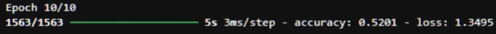

직접 만들어서 돌려보니 10번째 에폭에서 52.01%의 정확도를 보인다.
하지만 중요한 건 처음 보는 문제에서도 비슷하게 맞출 수 있느냐이다.
한번 테스트 해보자.

```python
model.evaluate(x_test, y_test)
```

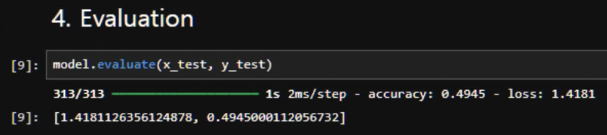

약 49.45%의 정확도를 보인다. → 훈련 정확도 52.01%와 큰 차이가 나지 않는다.
	→ 외운게 아닌 어느정도 일반화를 하고 있다는 의미

CIFAR-10은 클래스가 10개 이므로, 랜덤 예측을 하면 확률이 10%인걸 감안하면 꽤 잘하고 있다고 볼 수 있다.

그럼 이제 predict()를 통해 테스트 세트에 대한 예측 결과를 보자.

```python
CLASSES = np.array(['airplane', 'automobile', 'bird', 'cat', 'deer', 'dog', 'frog', 'horse', 'ship', 'truck'])

preds = model.predict(x_test)	# [10000, 10] 샘플마당 10개의 클래스 확률
preds_single = CLASSES[np.argmax(preds, axis = -1)]
# argmax는 확률이 가장 큰 클래스의 인덱스를 뽑는 함수. 하나의 예측 결과로 바꿈.
# axis = -1 -> 마지막 차원에 배열을 압축해라.
# preds_single은 [10000, 1]이다.
actual_single = CLASSES[np.argmax(y_test, axis = -1)]
```

이미지, 예측값, 실제 레이블을 나란히 출력한다.

```python
import matplotlib.pyplot as plt

n_to_show = 10
indices = np.random.choice(range(len(x_test)), n_to_show)

fig = plt.figure(figsize=(15, 3))
fig.subplots_adjust(hspace=0.4, wspace=0.4)

for i, idx in enumerate(indices):
	img = x_test[idx]
	ax = fig.add_subplot(1, n_to_show, i+1)
	ax.axis('off')
	ax.text(0.5, -0.35, 'pred = ' + str(preds_single[idx]), fontsize=10, ha='center', transform=ax.transAxes)
	ax.text(0.5, -0.7, 'act = ' + str(actual_single[idx]), fontsize=10, ha='center', transform=ax.transAxes)
    ax.imshow(img)
```

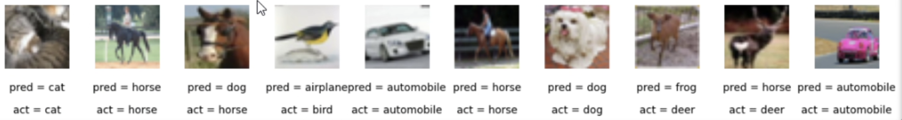

역시 대충 절반정도만 정확히 맞는다.

우린 이제, 케라스를 통해 다중 퍼셉트론을 만들고, 이를 사용해 새 데이터에서 예측을 수행했다.
이는 비록 지도학습 문제이긴 하지만, 다음 장에서 만들 분야에서 매우 중요한 핵심 개념이 등장한다.

## 2.4 합성곱 신경망

MLP가 한계가 있었던 이유는 입력 이미지의 공간 구조를 다루는 요소가 없었기 때문이다.
Dense 층에 전달하려고 이미지를 처음에 하나의 벡터로 펼쳐버렸기 때문이다.
이를 해결하기 위해 CNN을 사용해야 한다.

### 2.4.1 합성곱 층

쉽게 말해 필터를 이미지 위에 올려서 비슷한 패턴이 있는지 검사함.

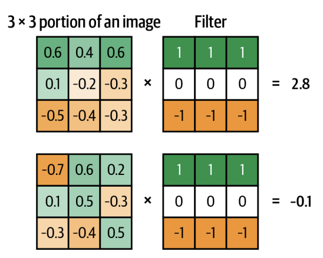

필터를 전체 이미지에 상하좌우로 이동하며 합성곱의 출력을 기록함.
고른 이미지 조각이 필터 모양과 비슷하면 숫자가 크게 나오고, 전혀 다르면 상쇄되어 0근처. 반대면 음수.
즉 이 위치에 있는 이미지는 내가 찾는 패턴과 얼마나 유사하게 있는지를 봄.

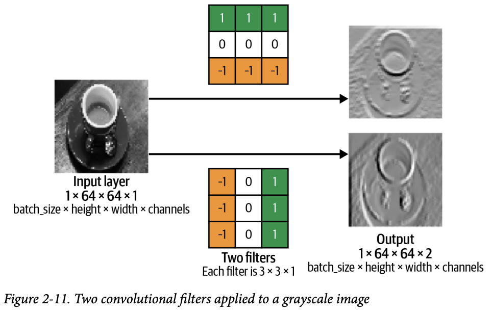

필터를 좌→우, 상→하로 쭉 움직이면 이미지들이 새로 만들어지고, 주어진 필터에 얼마나 반응했는 지를 알 수 있다.
필터는 랜덤하게 만들어주고, 어떤건 선, 어떤건 색 조합, 어떤건 모서리 등을 잡으며 확인을 한다.

케라스에선 Conv2D를 통해 높이, 너비를 가진 입력 텐서에 합성곱을 적용한다.
아래 예제는 위의 그림 2-11을 만든 코드이다.

```python
layers.Conv2D(
  filters=2,
  kernel_size=(3,3),
  strides=1,
  padding="same"
)
```

### 스트라이드

strides는 필터가 한번에 입력 위를 이동하는 간격을 의미한다. 2이므로 두칸씩 건너뛰며 이동하는 것이다.
Stride가 커지면 결과 이미지가 작아질것. 즉 해상도를 줄이는 역할도 한다.

### 패딩

쉽게 말해 이미지 테두리에 0을 붙이는 것.
 padding="same"은 입력 데이터를 0으로 패딩해서 strides = 1일 때 출력의 크기를 입력 크기와 동일하게 만든다.


이미지를 보면, 테두리에 줄 하나를 추가함으로 인해 필터링 이후에도 크기가 그대로 유지된다.
여기서 `padding = "same"`으로 지정하면 여러 합성곱 층을 통과할 때 텐서의 크기를 쉽게 파악할 수 있다.
이때 합성 곱 층의 출력 크기는 $$( \frac{입력 높이}{스트라이드}, \frac{입력 너비}{스트라이드}, 필터개수)$$이다.

쉽게 요약하자면

- stride ↑ → 공간 크기 ↓ 
- filters ↑ → 채널 수 ↑
- padding = same → 크기 유지

### 합성곱 층 쌓기

Conv2D 층의 출력도 (batch_size, height, width, filters) 인 4차원 텐서이다.
그러므로 Conv→Conv→Conv 계속 쌓을 수 있다. 이는 깊은 CNN이다.
아래는 CIFAR-10 데이터 셋에 Conv2D 층을 적용하고, 레이블을 예측하는 예제이다.

```python
from tensorflow.keras import layers, models

input_layer = layers.Input(shape=(32,32,3))
conv_layer_1 = layers.Conv2D(
    filters = 10,
    kernel_size = (4,4),
    strides = 2,
    padding = 'same')(input_layer)
conv_layer_2 = layers.Conv2D(
    filters = 20,
    kernel_size = (3,3),
    strides = 2,
    padding = 'same')(conv_layer_1)
flatten_layer = layers.Flatten()(conv_layer_2)
output_layer = layers.Dense(units=10, activation = 'softmax')(flatten_layer)
model = models.Model(input_layer, output_layer)
```

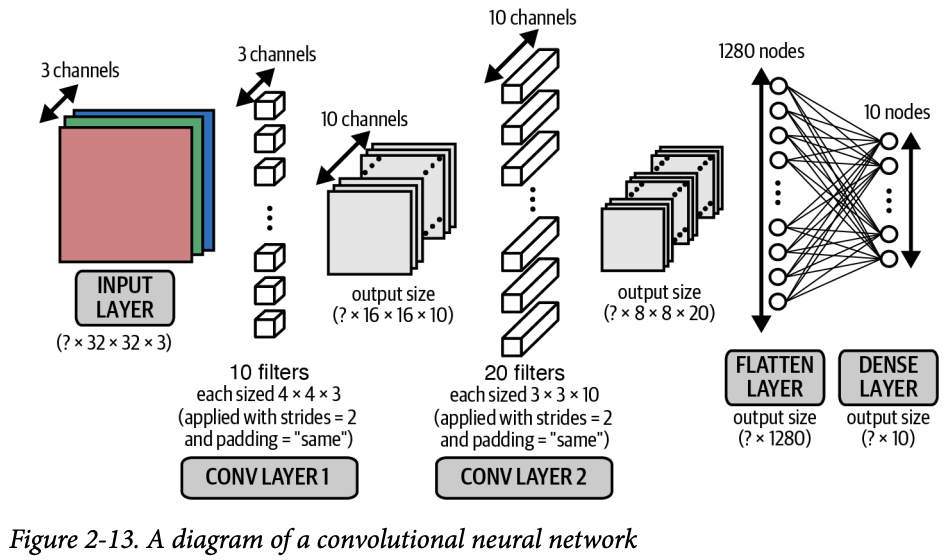

컬러 이미지 이므로 첫번째 합성곱 필터의 깊이는 3이다 (rgb). 입력 이미지의 3개 채널에 맞추기 위해서이다.
두 번째 필터에도 비슷하게 적용한다.

Conv2D → Conv2D 과정을 통해 특징을 추출하고, Flatten → Dense를 거쳐 최종적으로 분류를 하며 마무리 한다.

### 모델 조사하기

데이터가 합성곱 층을 흘러가며 텐서 크기가 어떻게 바뀌는지 살펴보면 큰 도움이 된다.
`model.summary()`함수를 통해 네트워크를 지나가며 모양이 어떻게 변하고, 각 층이 얼마나 학습하는지 알 수 있다.

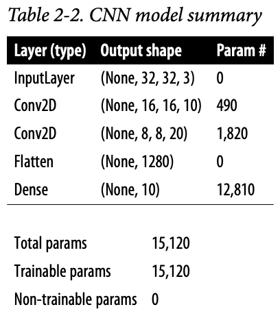

1. 입력의 크기는 (None, 32, 32, 3)이다. 
2. 첫 번째 합성곱 층의 10개 필터 각각의 크기는 4x4x3이다. 필터의 높이, 너비를 4로 골랐고 (kernel_size = (4, 4)). 이전 층의 채널이 3개이기 때문이다. 이 층의 파라미터(가중치) 수는 (4 x 4 x 3 + 1) * 10 490개 이다.
    여기서 +1은 필터마다 편향 항이 포함되기 때문이다.
    각 필터의 출력은 필터 가중치, 4x4x3 영역의 픽셀끼리 곱한 값이다.
    strides = 2, padding = "same"이므로 높이와 너비는 반으로 줄어 16이 된다. 10개의 필터를 사용했기에
    이 층의 출력 크기는 [16, 16, 10]이다.
3. 두 번째 합성곱 층에서는 필터 크기를 3x3으로 선택했고, 이전 층의 채널수는 10이므로 깊이가 10이다.
    이 층에서 필터는 20개를 사용하기 때문에 전체 파라미터(가중치)의 수는 (3 x 3 x 10 + 1) x 20 = 1820개이다.
    여기서도 높이와 너비가 반으로 줄기 때문에 출력은 (None, 8, 8, 20)이다.
4. 이제 Flatten 층을 통해 텐서를 펼쳐서 1280개의 유닛을 만든다.
5. 마지막으로 10개의 유닛과 소프트맥스 활성화 함수를 통한 Dense층에 연결.
    이 층은 (1280 + 1) * 10 = 12810개의 파라미터(가중치)를 학습해야 한다.

이제 성능을 향상시켜 보자.

## 2.4.2 배치 정규화

심층 신경망에서 제일 어려운게 가중치를 일정한 범위 내에서 유지시키는 것이다.
값이 커지기 시작하면 그레디언트 폭주 문제가 발생했다는 것이다.
이때 오차가 네트워크를 통해 역전파 되며 앞에 놓인 그레디언트 계산이 기하급수적으로 늘어난다.
이러면 가중치가 큰 폭으로 출렁이게 된다.
NaN이 반환되기 시작하면 오버플로우가 됐을 정도로 커졌다는 것이다.
이걸 막으려면 문제의 근본 원인을 이해해야 한다.

### 공변량 변화 (covariate shift)

신경망에 주입되는 입력 데이터를 스케일 조정하는 이유는 처음 몇 번은 안정적으로 시작하기 위해서다.
네트워크의 가중치가 랜덤하게 초기화 되었을 때, 스케일이 조정되지 않은 입력은 큰 활성화 출력이 생기고, 폭주로 이어진다.
그래서 우리는 0~255 사이의 픽셀값을 -1~1 사이로 스케일을 바꾸었다.
하지만 초반에만 맞다. 네트워크는 학습을 계속한다는 것이 문제다.

이때 네트워크 훈련에 따라 가중치값이 랜덤한 초깃값과 멀어지기 때문에 가정이 무너지고, 이를 공변량 변화라고 한다.

> 높이 쌓인 책을 나르다가 돌풍을 만났다고 하자. 이걸 감쇠시키려고 반대로 책을 틀었다. 하지만 이러면 책이 비스듬하게 놓여지면서 더 불안해지기 시작한다. 이러다가 결국 무너지게 되고 이것이 공변량 변화이다.

### 배치 정규화를 사용한 훈련

배치 정규화는 이 문제를 극적으로 줄이는 해결책이다.
방법은 정말 단순하게 배치 정규화 층에서 배치 마다의 입력 채널의 평균, 표준편차를 가지고 정규화 한다.
스케일 파라미터 γ, 이동 파라미터 β를 더 사용하여, 정규화된 입력을 γ만큼 스케일, β만큼 이동시켜 출력한다.

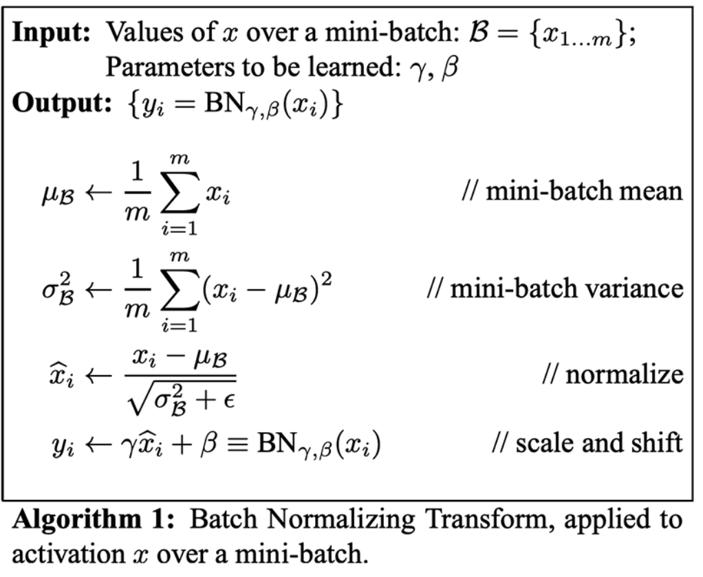

- 미니배치 평균 계산: 현재 배치에서 값들의 평균이 얼마인지
    - 중심 잡기
- 미니배치 분산 계산: 값들이 다들 얼마나 퍼져있는지
    - 흔들림 크기 측정
- 정규화: 평균은 0, 분산은 1에 가깝게 만드는 것. 이때 ε은 분산이 0이 되는걸 막는 안전장치이다.
    - 이때 $$\hat{x}$$는 완전히 표준화 된 값이다.

> 아까 책 탑 예시에서 책사이를 스프링으로 이어서 크게 위치가 바뀌지 않게 하는 방식이라고 생각하면 된다.

### 배치 정규화를 사용한 예측

예측할 때에는 어떻게 동작하는지 애매하다. 예측을 할 때엔 하나의 샘플, 하나의 예측이므로 평균도 표준편차도 없다.
그러므로 훈련 과정에서 배치 정규화 층이 채널 별 평균, 표준 편차의 이동 평균을 계산하여 저장한다.
이때 배치 정규화 층에서 필요한 파라미터가 아까 말한 두가지 γ, β이다. 이전 층의 채널마다 학습되어야 한다.

케라스에서는 BatchNormalization 층이 배치 정규화를 구현해준다.

```python
from tensorflow.keras import layers
layers.BatchNormalization(momentum=0.9)
# momentum = 평균, 표준편차의 이동 평균을 계산하기 전에 주는 가중치.
```

## 2.4.3 드롭아웃

시험 공부를 할 때 기출/예상문제의 답만 외우고 이해를 못하면 당연히 시험에서 떨어진다.
모범적 학생은 내용을 이해하는데 연습 문제를 활용한다. 이런 학생은 없는 문제를 내도 정확히 답을 맞춘다.
머신러닝도 이런 원리가 필요하다. 특정 데이터셋에서만 작동하고 테스트 셋에서 고장나면 **과대적합**문제가 있다고 한다.
이를 규제 기법을 사용하여 모델이 과대적합 되면 벌칙을 부여한다. 이것이 드롭아웃층이다.


간단하게 말하면, 이전층의 유닛 중 일부를 랜덤하게 골라 출력을 0으로 만들어버린다.
이 방식은 간단해 보이지만서도 과대 적합이 크게 줄어든다. 네트워크가 일부 유닛에 과도하게 의존하지 않는 효과가 있기 때문이다. 
훈련 세트를 외워버리는 문제를 방지해주고, 학습된 지식이 전체 네트워크에 고르게 퍼질것이다.

랜덤하게 유닛이 꺼지는 돌발 상황에도 정확한 예측을 하도록 훈련시키기 때문에 새로운 데이터에 대한 성능이 크게 향상된다.
드롭아웃은 따로 훈련되는 가중치가 없고 랜덤하게 결정하며, 예측을 할 때엔 어떤 유닛도 드롭하지 않고 전체 네트워크를 사용해 예측을 만든다.

> 이건 아까 그 학생이 수학 노트에 적힌 주요 공식을 하나씩 가려가며 기출 문제를 푸는 것과 같다.
> 매번 사전에 있는 공식을 컨닝하여 푸는것이 아니기 때문에 핵심 원리를 이해하여 푸는 법을 배우게 된다.
> 그래서 시험장에서도 본 적 없는 문제를 잘 풀 수 있게 되는 것이다.

케라스에도 당연히 구현되어있다. rate 매개변수를 통해 드롭아웃을 할 유닛 비율을 지정해준다.

```python
from tensorflow.keras import layers
layers.Dropout(rate = 0.25)
```

드롭아웃 층은 Dense층 이후에 주로 사용된다.
Dense층이 가중치 개수가 많아서 과대적합되기 가장 쉽기 때문이다. 하지만 합성곱 층 다음에 사용할 수도 있다.

> 배치 정규화도 과대적합을 감소시킨다고 알려져있다. 그래서 최신 딥러닝 구조에서는 드롭아웃을 전혀 안쓰고 규제를 위해 배치 정규화만 사용한다.
> 이 또한 다른 딥러닝 원리들 처럼 황금률은 따로 없다. 여러 가지 테스트를 통해 어떤 구조가 검증 세트에서 가장 뛰어난 성능이 나오는 가 확인해야 한다. 

## 2.4.4 CNN 만들기

여태까지 배운 케라스 층들을 활용해 CNN 모델을 만들고 CIFAR-10 데이터셋에서 성능을 확인해보자.

```python
from tensorflow.keras import layers, models

input_layer = layers.Input((32, 32, 3))

x = layers.Conv2D(filters=32, kernel_size=3, strides=1, padding="same")(
    input_layer
)
x = layers.BatchNormalization()(x)
x = layers.LeakyReLU()(x)

x = layers.Conv2D(filters=32, kernel_size=3, strides=2, padding="same")(x)
x = layers.BatchNormalization()(x)
x = layers.LeakyReLU()(x)

x = layers.Conv2D(filters=64, kernel_size=3, strides=1, padding="same")(x)
x = layers.BatchNormalization()(x)
x = layers.LeakyReLU()(x)

x = layers.Conv2D(filters=64, kernel_size=3, strides=2, padding="same")(x)
x = layers.BatchNormalization()(x)
x = layers.LeakyReLU()(x)

x = layers.Flatten()(x)

x = layers.Dense(128)(x)
x = layers.BatchNormalization()(x)
x = layers.LeakyReLU()(x)
x = layers.Dropout(rate=0.5)(x)

x = layers.Dense(NUM_CLASSES)(x)
output_layer = layers.Activation("softmax")(x)

model = models.Model(input_layer, output_layer)
```

Conv2D-BatchNormalization-LeakyReLU의 단계를 거치는 4개의 층을 먼저 쌓았다.
그리고 만들어진 텐서를 일렬로 쭉 펼치고 128개의 유닛을 가진 Dense층에 통과시키고 다시 한번 BatchNormalization-LeakyReLU층을 거친다.
그리고 규제를 위한 Dropout을 진행한다. 이후 유닛이 10개인 Dense층이 최종 출력을 만든다.

> 배치 정규화 층, 활성화 층의 순서는 취향에 따라 다르다. 일반적으로는 활성화 층 이전에 배치 정규화 층을 놓지만, 
> 다른 모델에선 이와 반대로 두고 좋은 결과를 만들기도 한다. 활성화 함수 이전에 배치 정규화 층을 놓으려면
> BAD(BatchNormalization - Activation - Dropout)을 기억하자.


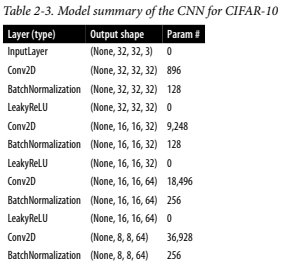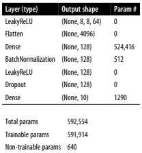

만들어진 모델의 구조를 잘 정리한 표이다. 한번 파라미터 개수를 직접 계산해보고 검증해보자. Conv2D와 Dense층에 있는 편향을 잊지말자.

## 2.4.5 CNN 훈련하고 평가하기

이전과 동일한 방식으로 모델을 컴파일하고 훈련한다. `evaluate()`를 통해 진행해보자.

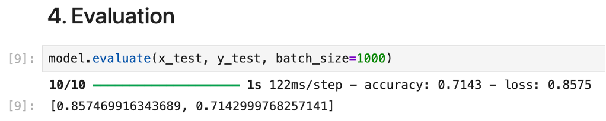

이전에 했던 49%에 비해 무려 72%라는 큰 성장을 이루었다. 아래는 예측한 예시이다.

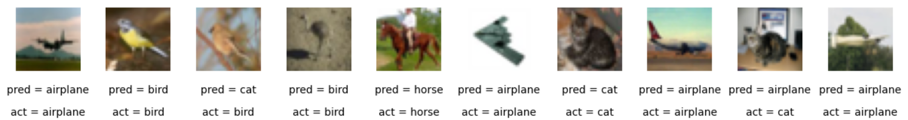

간단하게 합성곱, 배치 정규화, 드롭아웃 층을 모델 구조에 직접 추가해 성능을 향상시켜 보았다.
층의 수는 늘었지만 파라미터 개수는 오히려 줄었다. 
다양한 모델 구조를 실험하고 어떤 층이 도움이 될 지 이해하는것이 중요하다.
생성 모델을 만들 때엔 네트워크 중간 층에서 관심 대상인 고수준 특성을 잡아낼 수 있기 때문에 내부 작동 방식을 이해 하는것이 더 중요해진다.

# 2.5 요약

- 딥러닝 모델 구조에는 **정답 하나만 존재하지 않는다**.
- 레이어의 종류와 순서에는 **가이드라인은 있지만 절대 규칙은 없다**.
- 모델 설계는 **블록을 조립하듯 실험과 시도를 통해 발전**한다.
- 다음 장에서는 이 구성요소들을 활용해 **이미지를 생성하는 모델**로 확장한다.
