# 3.1 소개

오토인코더가 해결하려고 하는 근본적인 문제가 있다.

> ### 무한 옷장 문제
>
> 바지, 윗도리, 신발, 코트 등 온갖 종류의 옷이 바닥에 쌓여있다고 상상해보자.
> 스타일리스트 브라이언은 필요한 옷을 찾는데 시간이 오래 걸려서 아이디어를 냈다.
>
> 무한히 높고 넓은 옷장에 정리하자고 제안을 했다.
> 특정 옷이 필요할 때 위치만 알려주면 고성능 재봉틀로 새 옷을 만든다.
> 브라이언이 새 옷을 만들기 편하게 비슷한 옷을 서로 가까이 배치해야 한다.
>
> 몇 주간의 연습 끝에 당신과 브라이언은 옷장 배치에 관해서 적응했다.
>
> 여기서 브라이언에게 빈 곳의 위치를 알려주면, 전혀 본 적 없던 새로운 옷을 만들 수 있다.
> 완벽하진 않아도 새로운 옷을 생성할 수 있는 무한한 옵션이 생긴 것이다.

이 문제가 오토인코더와 무슨 관련이 있을까?

# 3.2 오토인코더

인코더는 각 옷 들을 옷장의 특정 위치로 옮긴다(인코딩).
디코더(브라이언)는 옷장의 위치를 받아서 그 아이템의 재생성을 시도한다(디코딩).

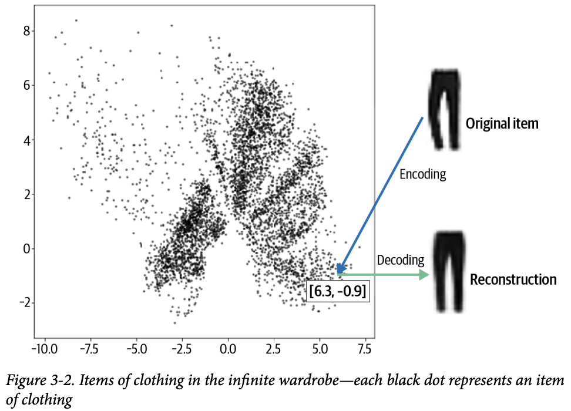

옷장의 각 위치를 2D 벡터로 표현한다. 그림 3-2의 바지는 [6.3, -0.9]로 인코딩한다.
이 벡터를 임베딩(원래 데이터의 핵심 정보를 담은 압축된 표현)이라고도 한다.

오토인코더는 단순히 어느 항목의 인코딩과 디코딩을 수행하도록 훈련된 신경망이다.
이를 통해 출력이 최대한 원본에 가깝게 나오게 한다.
결과적으로 2D 공간에 있는 모든 포인트를 디코딩하여 새로운 의류 아이템을 생성할 수 있으므로 생성 모델로 사용할 수 있다.

케라스를 통해 직접 만들어보자.

## 3.2.1 패션 MNIST 데이터셋

28x28의 흑백 이미지로 구성된 패션 MNIST데이터 셋을 사용하겠다.
이는 텐서플로우에 포함되어있다.

```python
from tensorflow.keras import datasets
(x_train, y_train), (x_test, y_test) = datasets.fashion_mnist.load_data()
```

원본 이미지가 흑백이므로 픽셀값은 0~1사이이다.
예제 3-2처럼 신경망 통과시에 텐서 크기를 쉽게 조절할 수 있게 패딩을 추가해 32x32로 이미지를 키운다.

```python
def preprocess(imgs):
	imgs = imgs.astype("float32") / 255.0
	imgs = np.pad(imgs, ((0, 0), (2, 2), (2, 2)), constant_values=0.0)
	imgs = np.expand_dims(imgs, -1)
	return imgs

x_train = preprocess(x_train)
x_test = preprocess(x_test)
```

## 3.2.2 오토인코더 구조

두 부분으로 구성되어있다.

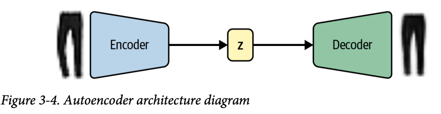

- 인코더: 네트워크는 이미지 같은 고차원 입력 데이터를 저차원 임베딩 벡터로 압축한다.
- z: 잠재 임베딩 벡터(latent embedding) 중간 다리 역할을 한다.
- 디코더: 네트워크는 임베딩 벡터를 원본 도메인으로 압축 해제한다. (이미지로 되돌리는 등)

임베딩(z)은 원본 이미지를 저차원 잠재 공간으로 압축시키는 것이다. 
잠재 공간에서 임의의 점을 골라 디코딩하면 새로운 이미지를 생성할 수 있다.

> 잡음제거 오토인코더
>
> 랜덤 노이즈는 재구성에 도움이 되지 않기 때문에 인코더가 잠재공간에 노이즈를 저장하지 않음.
> 그러면 디코더는 깨끗한 이미지에 가까운 결과를 생성한다.

## 3.2.3 인코더

입력 이미지를 받아서 잠재 공간 안의 임베딩 벡터에 매핑하는 역할을 한다. 구조는 아래와 같다.

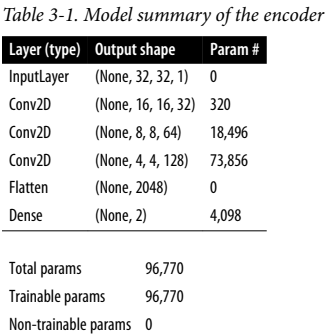

Input ->  Conv2D ->  Conv2D ->  Conv2D -> Flatten -> Dense의 단계를 거친다.
이때 세 개의 합성곱 층에서 스트라이드 2를 적용하여 각 층에서 출력의 크기를 반으로 줄이고, 반대로 채널의 개수는 늘린다.
마지막 합성곱 층에서는 펼치고 2차원 잠재공간인 크기 2짜리 Dense층에 연결한다.

```python
encoder_input = layers.Input(
    shape=(32, 32, 1), name="encoder_input"
) # input층 정의

x = layers.Conv2D(32, (3, 3), strides=2, activation="relu", padding="same")(encoder_input)	# 순서대로 Conv2D 층을 쌓음
x = layers.Conv2D(64, (3, 3), strides=2, activation="relu", padding="same")(x)
x = layers.Conv2D(128, (3, 3), strides=2, activation="relu", padding="same")(x)

shape_before_flattening = K.int_shape(x)[1:]  # (4, 4, 128) 저장 (Decoder에서 reshape에 사용)

x = layers.Flatten()(x)	# 마지막 합성 층의 출력을 벡터로 펼침
encoder_output = layers.Dense(2, name="encoder_output")(x)	# 펼친 벡터를 2D 임베딩에 해당하는 Dense층에 연결함

encoder = models.Model(encoder_input, encoder_output) # 케라스 Model 클래스로 인코더 정의. 이제 이 모델은 2D 임베딩에 인코딩하는 역할이 생김.
```

## 3.2.4 디코더

인코더의 반대 역할을 한다. 합성곱 층 대신 전치 합성곱 층을 사용한다. 구조는 아래와 같다.

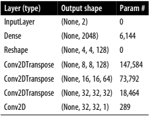

매우 직관적이다. 말그대로 인코더의 역순이다.
2D latent 벡터 z를 입력으로 받아서 Dense로 늘려서 Flatten 이전의 텐서 크기로 복구한다.
이후 Reshape를 통해 형태도 되돌려준다.
Conv2DTranspose를 통해 세 번 업샘플링을 하여 다시 원래 상태로 되돌린다.
이후 Conv2D 채널을 1로 맞추고, 출력 픽셀값의 범위를 위해 시그모이드를 사용한다.

### 전치 합성곱 층

`strides = 2` 인 표준 합성곱 층은 텐서의 높이와 너비를 모두 절반으로 줄인다.
전치 합성 곱 층은 원리는 표준 합성곱 층과 동일하지만 `strides = 2`로 늘리면 입력 텐서의 높이와 너비를 두 배로 늘린다.


그림에서 처럼 전치 합성곱 층의 `strides`는 픽셀 간에 추가되는 추가 제로 패딩(쉽게 말해 픽셀 사이를 메꾸는 거)을 결정한다.
3x3x1의 필터가 `strides = 2`로 6x6x1의 출력 텐서가 만들어진다.
이를 케라스에서는 Conv2DTranspose 층을 통해 수행할 수 있다.

```python
decoder_input = layers.Input(shape=(2,), name="decoder_input")	# 디코더의 input 층
x = layers.Dense(np.prod(shape_before_flattening))(decoder_input)	# 입력을 Dense층에 연결
x = layers.Reshape(shape_before_flattening)(x)	# 첫 Conv2DTranspose 층에 입력으로 쓰기위해 Reshape

# Conv2DTranspose 층을 연속으로 쌓음
x = layers.Conv2DTranspose(128, (3, 3), strides=2, activation="relu", padding="same")(x) 
x = layers.Conv2DTranspose(64, (3, 3), strides=2, activation="relu", padding="same")(x)
x = layers.Conv2DTranspose(32, (3, 3), strides=2, activation="relu", padding="same")(x)

decoder_output = layers.Conv2D(
    1, (3, 3),
    strides=1,
    activation="sigmoid",
    padding="same",
    name="decoder_output"
)(x)

# 케라스 Model 클래스로 디코더 정의. 잠재공간의 임베딩을 통해 원본 이미지 도메인으로 디코딩함.
decoder = models.Model(decoder_input, decoder_output)
```

## 3.2.5 인코더와 디코더 연결하기

인코더, 디코더를 동시에 훈련하기 위해 이미지가 인코더를 통과해 디코더로 나오게 만들어보자.

```python
autoencoder = Model(encoder_input, decoder(encoder_output)) # 케라스 Model 클래스이다. 완전한 오토 인코더를 정의한다.
```

이제 모델 정의는 끝났으니 손실 함수와 옵티마이저로 모델을 컴파일 해야한다.

```python
autoencoder.compile(optimizzer="adam", loss="binaryh_crrossentropy")
```

> ### 손실함수 선택
>
> 출력 이미지의 성격에 영향을 준다.
> RMSE를 쓰면 평균 픽셀값 근처에서 대칭적으로 값의 차이가 동일하게 불이익을 받는다.
>
> 이진 크로스 엔트로피 손실은 비대칭이다. 극단적 오차가 0.5에 가까운 오차보다 훨씬 큰 손실을 만든다.
> 픽셀값이 0.7처럼 높을경우 0.8인 픽셀이 생성되면 0.6인 픽셀이 생성되었을 때 보다 더 손실이 크다.
> 0.3처럼 낮을 때엔 0.2인 픽셀이 생성 되었을 때 0.4인 픽셀보다 더 손실이 크다.
> 즉 0.5에 가까운 예측이 낮은 손실을 만들기 때문에 이진 크로스 엔트로피가 좀 더 흐릿한 이미지를 만드는 효과가 있다.
>
> 하지만 RMSE가 픽셀 격차가 뚜렷한 엣지를 만들 수 있기 때문에 흐릿한 효과가 도움이 된다.
> 즉 정답은 없고 테스트를 해보고 맞는 방법을 골라야 한다.

```python
autoencoder.fit(
    x_train,
    x_train,
    epochs=5,
    batch_size=100,
    shuffle=True,
    validation_data=(x_test, x_test),
)
```

## 3.2.6 이미지 재구성 하기

이제 재구성 능력을 확인해보자.

```python
example_images = x_test[:5000]
predictions = autoencoder.predict(example_images)
```

아래 이미지는 원본 - 인코딩된 2D벡터, 재구성된 이미지이다.

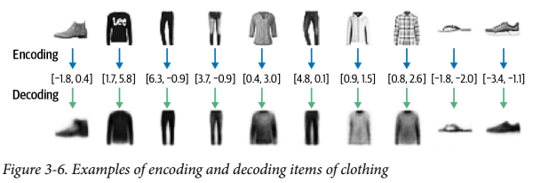

재구성은 완벽하지 않다. 로고와 같은 원본 이미지의 세부 사항이 디코딩 과정에서 보이지 않는다.
이는 숫자 두개정도로 축소한 잠재 벡터정도론 손실될 수 밖에 없기 때문이다.

## 3.2.7 잠재공간 시각화하기

한번 어떻게 잠재공간에 임베딩 되는지 직접 확인해보자.

```python
embeddings = encoder.predict(example_images)

plt.figure(figsize=(8, 8))
plt.scatter(embeddings[:, 0], embeddings[:, 1], c="black", alpha=0.5, s=3)
plt.show()
```

이 코드의 결과로 아까본 산점도 이미지가 나올것이다.


여기서 MNIST 데이터셋의 레이블을 활용해 구조를 정리해보자.


이걸 통해 라벨에 각 색을 부여하여 포인트에 적용하면 아래의 그래프가 나온다.


이제 구조도 명확해지고, 따로 모델에게 레이블을 제공하지 않았음에도 자연스레 그룹화가 된 것을 알 수 있다.
예를 들어 빨간 점 구름은 모두 앵클 부츠이다.

## 3.2.8 새로운 이미지 생성하기

```python
mins, maxs = np.min(embeddings, axis=0), np.max(embeddings, axis=0)
sample = np.random.uniform(mins, maxs, size=(18, 2))
reconstructions = decoder.predict(sample)
```

아래 그림은 이미지 몇 개와 잠재 공간의 임베딩을 나타낸 것이다.

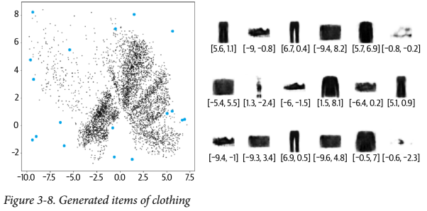

파란 점은 그래프 우측에 표시된 이미지 중 하나에 매핑된다.
그 아래에는 임베딩 벡터가 있다. 생성 된 아이템 중 일부는 다른 아이템보다 더 사실적이다. 이유가 뭘까?

이 점의 분포를 분석하면:

- 클래스가 차지하는 면적이 고르지 않다.
- 분포가 (0, 0) 대칭도 아니고, 경계가 명확하지 않다. y축을 보면 음수보다 양수가 훨씬 많고, 일부 포인트는 8이 넘는다.
- 점이 거의 없는 빈 공간이 크다.

이러한 점이 실제 잠재 공간에서 샘플링 하는 작업을 어렵게 만든다.

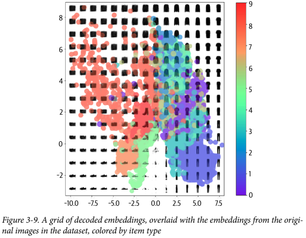

이 이미지를 보면 문제가 명확해진다.
일정 간격으로 격자로 디코딩했다.  이때 핵심적인 내용은 아래와 같다.

- 우리가 정의한 공간에서 균일하게 포인트를 고르면 잠재 공간의 가방 영역이 앵클 부츠 영역 보다 크기 때문에 앵클 부츠(ID 9)보다 가방 (ID 8)처럼 보이는 것을 디코딩할 가능성이 높다.
- 점의 분포가 따로 정의된 건 아니기 때문에 잠재 공간에서 랜덤한 포인트를 어떻게 골라야 할 지 명확하지 않다.
    기술적으로는 2D 평면에서 아무 점이나 고를 수 있고, 포인트가 (0, 0) 주변이라는 보장도 없다.
- 잠재 공간에서 원본 이미지가 인코딩되지 않은 구멍들이 있다. 보시다시피 가장자리에 공백이 매우 크다.
    여기엔 인코딩 된 원본 이미지가 거의 없기 때문에, 여기서 옷처럼 보이는 출력이 안나올 가능성이 높다.

예를 들어 (-1, -1)에선 샌들이 그럴듯 하게 나오더라도, 아주 가까운 다른 점(-1.1, -1.1)에서는 나오라는 보장이 없다.

2차원에서는 이 문제가 미묘해보이지만, 더 많은 차원을 사용하면 더 뚜렷해지고, 잘 형성된 이미지를 생성할 가능성이 낮다.

# 3.3 변이형 오토 인코더

이 문제를 해결해 줄 녀석이다.

> ### 다시 무한 옷장
>
> 이제 옷을 옷장 안의 점에 고정하여 두지 않는다.
> 각 아이템이 있을만한 구역(area)을 할당해준다. 이런 느슨한 배치가 옷장 안의 국소적 불연속을 해결해준다.
>
> 하지만 또 너무 느슨해지지는 않게 브라이언과 합의를 한다.
>
> - 각 아이템의 영역 중심은 가능한 한 옷장 중앙에 가까이 둔다.
> - 중앙에서의 편차는 최대한 1미터에 가깝게 유지한다.
> - 규칙에서 멀어질 수록 브라이언에게 돈을 더 많이 줘야 한다.

이제 이 규칙대로 변이형 오토인코더로 바꾸어 더 정교한 생성 모델을 만들어보자.

## 3.3.1 인코더

오토인코더에선 점이었지만 여기서는 분포가 중요하다. 포인트 주변의 다변량 정규 분포에 매핑된다.

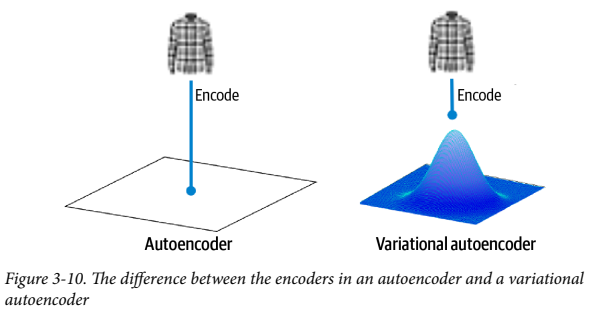

> ### 다변량 정규 분포
>
> 정규분포(= 가우시안 분포) $\mathcal{N}(\mu, \sigma)$는 **평균 $\mu$** 와 **분산 $\sigma^2$** 로 정의된다. 표준편차 $\sigma$는 분산의 제곱근이다.
>
> 1차원에서 확률밀도함수는 다음과 같이 주어진다:
> $$
> f(x\mid \mu,\sigma^2)=\frac{1}{\sqrt{2\pi\sigma^2}}\exp\left(-\frac{(x-\mu)^2}{2\sigma^2}\right)
> $$
> 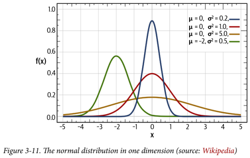
>
> 위 그래프는 평균과 분산 값에 따라 곡선 모양이 어떻게 달라지는지 보여준다. 또한 표준정규분포 는 $\mathcal{N}(0,1)$ 이다.
> 정규분포에서 포인트 z를 아래의 공식으로 샘플링하는 것이 가능하다. 여기서 $\epsilon$은 표준정규분포에서 샘플링된다.
> $$
> z = \mu + \sigma \epsilon
> $$
> 
>
> 이 개념을 1차원이 아닌 다차원으로 확장이 가능하다. $k$차원에서의 다변량 정규분포는 평균 벡터 $\mu$와 공분산 행렬 $\Sigma$로 표현되고, 확률밀도함수는 다음 형태다:
> $$
> f(x_1,\ldots,x_k)=\frac{\exp\left(-\frac12(x-\mu)^T\Sigma^{-1}(x-\mu)\right)}{\sqrt{(2\pi)^k|\Sigma|}}
> $$
> 보통 등방성 다변량 정규 분포를 사용한다.
>
> - $\Sigma$가 **대각행렬(diagonal)** 이라서 각 차원이 독립(상관 없음)이라고 가정한다.
> - 특히 **다변량 표준정규분포**는 $\mathcal{N}(0, I)$ 로 쓴다.
>      (평균 벡터는 0, 공분산은 항등행렬)
>
> “정규 분포”, “가우스 분포”을 같은 의미로 사용하고, 이는 "등방성 다변량 가우스 분포"와 같은 의미로 해석할 수 있다.

이때 인코더는 입력을 분포로 바꾸기 위해 두 벡터를 출력한다.

- z_mean: 분포의 평균 벡터
- z_log_var: 차원별 분산의 로그 값

여기서 점 z를 뽑으려면 아래의 식을 활용한다.
$$
z = z\_{mean} + z\_{\sigma} \cdot \epsilon
$$
여기서 시그마와 엡실론은

- $$z_{\sigma}=\exp\left(\frac{z_{log_var}}{2}\right)$$

- $$\epsilon \sim \mathcal{N}(0,I)$$

> z_sigma와 z_log_var는 $$\sigma=\exp(\log(\sigma))=\exp\left(\frac{2\log(\sigma)}{2}\right)=\exp\left(\frac{\log(\sigma^2)}{2}\right)$$의 관계를 가진다.

다만 디코더는 일반적인 오토인코더의 디코더와 동일하다.

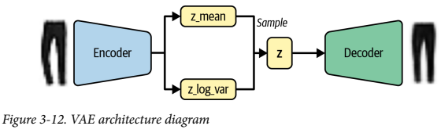

이 변화는 잠재공간에서 본 적 없는 점을 선택해도 제대로 된 이미지로 디코딩 될 가능성을 높여준다.
그 이유는 이전의 잠재공간에서는 연속성이 없었으나, 이제는 z_mean 주변에서 랜덤 포인트를 샘플링하기 때문이다.
이는 디코딩시 재구성 손실이 작게 유지되도록 같은 영역에 위치한 점을 매우 비슷한 이미지로 디코딩하게 된다.

### VAE 인코더 만들기

```python
class Sampling(layers.Layer):	# 케라스의 Layer를 상속해 새로운 층을 만든다.
    # Layer 상속시 call()을 정의해 새로운 층을 만들 수 있다. 케라스에 없는 변환을 적용하고 싶을때 유용하다.
    def call(self, inputs):	
        z_mean, z_log_var = inputs	
        # 변이형 오토인코더에선 z_mean, z_log_var로 정의된 정규분포에서 z를 샘플링하기 위해 상속받은 예제이다.
        batch = tf.shape(z_mean)[0]	
        dim   = tf.shape(z_mean)[1]
        epsilon = K.random_normal(shape=(batch, dim))
        return z_mean + tf.exp(0.5 * z_log_var) * epsilon
```

> ### 재 매개변수화 트릭
>
> z_mean, z_log_var로 정의된 정규 분포에서 직접 샘플링 하는 대신
> 표준 정규 분포에서 epsilon을 샘플링하고 올바른 샘플 분산을 갖도록 샘플을 수동 조정할 수 있다.
>
> 레이어의 모든 무작위성을 변수 epsilon에 포함시켜 레이어 입력에 대한 출력의 편도함수를 결정시킬 수 있다.
> 이를 통해 그레이디언트를 역전파시킬 수 있으며, 역전파에 필수적이다.

```python
encoder_input = layers.Input(shape=(32, 32, 1), name="encoder_input")

x = layers.Conv2D(32,  (3, 3), strides=2, activation="relu", padding="same")(encoder_input)
x = layers.Conv2D(64,  (3, 3), strides=2, activation="relu", padding="same")(x)
x = layers.Conv2D(128, (3, 3), strides=2, activation="relu", padding="same")(x)

shape_before_flattening = K.int_shape(x)[1:]
x = layers.Flatten()(x)

# Flatten층을 2D 잠재 공간에 바로 연결하는 대신 z_mean, z_log_var층에 연결.
z_mean    = layers.Dense(2, name="z_mean")(x)	
z_log_var = layers.Dense(2, name="z_log_var")(x)

# Sampling 층이 파라미터 z_mean, z_log_var로 정의된 정규 분포에서 잠재 공간에 있는 z를 샘플링 함
z = Sampling()([z_mean, z_log_var])	

# 케라스 Model클래스로 인코더 정의. 
encoder = models.Model(encoder_input, [z_mean, z_log_var, z], name="encoder")	
```

출력은 아래와 같다.


## 3.3.2 손실 함수

이제 손실 함수만 건드리면 된다.

이전엔 손실함수가 원본과 복원 이미지간의 재구성 손실로만 구성되어 있었다.
변이형 오토인코더에서도 그대로 존재하지만, 추가로 쿨백-라이블러 발산(KL 발산)을 사용한다.

```python
kl_loss = -0.5 * sum(1 + z_log_var - z_mean ^ 2 - exp(z_log_var))
```

수식 표기로는:
$$
D_{KL}\big[\mathcal{N}(\mu,\sigma)\,\|\,\mathcal{N}(0,1)\big]
= -\frac{1}{2}\sum \big(1+\log(\sigma^2)-\mu^2-\sigma^2\big)
$$

- 이 식의 덧셈은 잠재공간의 모든 차원에 대해 수행된다.
- 모든 차원에서 `z_mean = 0`, `z_log_var = 0`이면(즉 평균 0, 분산 1) `kl_loss`는 최소(0)가 된다.
    - 이 값들이 0에서 멀어질수록 KL loss는 증가한다.

쉽게 말해 KL 발산항은 샘플을 표준 정규 분포에서 크게 벗어난 z_mean과 z_log_var 변수로 인코딩하는 네트워크에 벌칙을 주는 것이다.

- 왜 이걸 손실함수에 추가하면 도움이 되는가?
    - 잠재공간에서 점을 고르기 위한 잘 정의된 분포를 갖게 된다.
    - 모든 인코딩 분포를 표준 정규쪽으로 밀어주기 때문에, 점 클러스터 사이에 큰 갭이 생길 확률이 줄어든다.
    - 인코더가 원점 주변의 공간을 더 대칭적이고 효율적으로 쓰게 된다.

원본 VAE 논문에선 단순하게 `재구성 손실 + KL 발산 손실 항`으로 표현되었다. 

여기서 변형으로  $$\beta$$-VAE가 있는데, KL 발산에 가중치를 부여하는 요소를 추가해 재구성 손실과 균형을 맞춘다.
하지만 너무 재구성을 강하게 가중하면 KL 항의 정규화 효과가 약해지면서 결국 원래 인코더랑 차이가 없어질수도 있다.
반대로 너무 KL 항을 강하게 가중하면 반대로 복원 이미지 품질이 나빠질 수 있다.
즉 이것도 VAE 훈련시에 튜닝이 필요한 파라미터이다.

## 3.3.3 변이형 오토인코더 훈련

이제 한 번 직접 훈련시켜보자.

```python
class VAE(models.Model):
    def __init__(self, encoder, decoder, **kwargs):
        super(VAE, self).__init__(**kwargs)
        self.encoder = encoder
        self.decoder = decoder
        self.total_loss_tracker = metrics.Mean(name="total_loss")
        self.reconstruction_loss_tracker = metrics.Mean(
            name="reconstruction_loss"
        )
        self.kl_loss_tracker = metrics.Mean(name="kl_loss")

    @property
    def metrics(self):
        return [
            self.total_loss_tracker,
            self.reconstruction_loss_tracker,
            self.kl_loss_tracker,
        ]

    def call(self, inputs):	# 이 함수는 특정 입력 이미지에서 VAE를 호출했을 때 반환값을 보여준다.
        z_mean, z_log_var, z = encoder(inputs)
        reconstruction = decoder(z)
        return z_mean, z_log_var, reconstruction

    def train_step(self, data):	# 손실 함수 계산을 포함한 VAE 훈련 스텝을 진행함
        with tf.GradientTape() as tape:
            z_mean, z_log_var, reconstruction = self(data)
            reconstruction_loss = tf.reduce_mean(
                500
                * losses.binary_crossentropy(
                    data, reconstruction, axis=(1, 2, 3)
                )
            )	# 재구성 손실에 베타 값으로 500이 사용됨
            kl_loss = tf.reduce_mean(
                tf.reduce_sum(
                    -0.5
                    * (1 + z_log_var - tf.square(z_mean) - tf.exp(z_log_var)),
                    axis=1,
                )
            )
            total_loss = reconstruction_loss + kl_loss	# 총 손실은 재구성 손실 + KL 발산 손실

        grads = tape.gradient(total_loss, self.trainable_weights)
        self.optimizer.apply_gradients(zip(grads, self.trainable_weights))

        self.total_loss_tracker.update_state(total_loss)
        self.reconstruction_loss_tracker.update_state(reconstruction_loss)
        self.kl_loss_tracker.update_state(kl_loss)

        return {m.name: m.result() for m in self.metrics}

vae = VAE(encoder, decoder)
vae.compile(optimizer="adam")
vae.fit(train, epoches=5, batch_size=100)
```

> 그레디언트 테이프
>
> 텐서 플로우의 GradientTape는 정방향 계산을 하는 동안 실행된 연산의 그레이디언트를 계산하는 메커니즘이다.
> 나중에 `tape.gradient()`를 통해 손실에 대한 미분(gradient)을 계산할 수 있게 해준다.
>
> 커스텀 손실함수 계산처럼 케라스 기본 루프 밖에서 직접 미분이 필요하거나, 커스텀 트레이닝 루프를 만들 때에도 같은 방식으로 사용된다.

## 3.3.4 변이형 오토인코더 분석

학습 시켰으니 잠재공간이 어떻게 바뀌었는지 확인해보자.

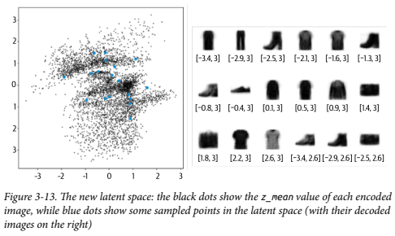

검은 점은 인코딩 된 각 이미지의 z_mean, 파란 점은 잠재 공간에서 샘플링된 몇몇 점들을 나타낸다. 오른쪽은 디코딩 된 이미지이다.

1. KL 손실 덕분에 분포가 표준 정규에서 크게 멀어지지 않았다.
    - z_mean, z_log_var 값이 표준 정규 분포에서 너무 멀리 벗어나지 않는다.
2. 잘못된 형태로 생성된 이미지가 별로 없다.
    - 인코더가 결정적이지 않고 확률적이기 때문에, 잠재 공간이 국부적으로 연속적이기 때문이다.

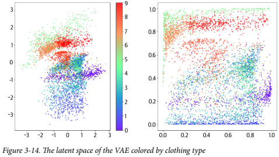

라벨에 따라 색칠한 결과의 차이다. 오른쪽 그래프는 잠재 공간을 p-값으로 변환한 것이다. 여기선 색마다 비슷한 영역을 차지한다.
특정 타입이 과하게 유리하게 취급되고 있고, 각 타입이 비교적 고르게 표현 되어진 것으로 보인다.
역시 여기서도 레이블은 훈련 과정에 사용되지 않았다.

# 3.4 잠재공간 탐색하기

여태 2차원 잠재공간에 한정해서 AE, VAE를 다루었다. 이제 더 복잡한 데이터셋을 다루어보자.

## 3.4.1 CelebA 데이터셋

유명 인사의 컬러이미지 20만개를 모아놓은 데이터셋이다.
각 샘플엔 여러 레이블(모자를 썼음, 웃고 있음 등)이 있다.


훈련엔 레이블이 필요 없지만, 다차원 잠재공간에서 어떻게 특성이 감지되는지 탐색할 때 레이블을 사용 할 것이다.
VAE가 훈련되면 잠재 공간에서 샘플링하여 새로운 유명인 얼굴을 생성할 수 있다.

```python
train_data = utils.image_dataset_from_directory(	
    # 이미지가 저장된 디렉터리에서 텐서플로우 데이터 셋을 생성하는 함수
    "/app/data/celeba-dataset/img_align_celeba/img_align_celeba",
    labels=None,
    color_mode="rgb",
    image_size=(64, 64),
    batch_size=128,
    shuffle=True,
    seed=42,
    interpolation="bilinear",
)	# 이미지 크기는 64x64로 조정하고 픽셀 사이를 보간한다
```

```python
def preprocess(img):
    # 원본 픽셀 값은 0~255 사이이다. 0~1로 스케일링 해준다.
    img = tf.cast(img, "float32") / 255.0
    return img

train = train_data.map(lambda x: preprocess(x))
```

## 3.4.2 변이형 오토인코더 훈련

네트워크 구조는 Fashin-MNIST 예제랑 유사하다. 하지만 몇 가지 차이점은 존재한다.

- 입력 채널이 그레이스케일에서 RGB로 바뀐다.
    - 디코더 마지막 전치 합성곱 채널의 수도 1에서 3으로 바꿔야 한다.
- 사용할 잠재공간은 2차원이 아닌 200차원이다.
    - 얼굴은 의상보다 훨씬 복잡하기 때문에 디테일을 만족스럽게 담기 위해 차원을 늘렸다.
- 각 합성곱 층 뒤에 배치 정규화 층을 둔다.
    - 한 배치가 도는 시간은 늘지만, 같은 수준의 손실에 도달하는 데 필요한 배치의 수가 크게 줄어든다.
- KL발산을 위한 $$\beta$$인수를 2000으로 증가시킨다.
    - 튜닝이 필요한 파라미터인데, 이 데이터셋과 이 네트워크 구조에서 좋은 성능을 내는 값을 찾은 것이다.

구조는 아래와 같다.


대략 5회 에폭정도 진행하면 VAE가 새로운 유명인의 얼굴을 그릴수 있다.

## 3.4.3 VAE 분석

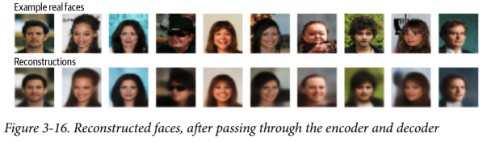

위는 원본 얼굴 이미지, 아래는 인코더-디코더를 거쳐 재구성 된 이미지이다.
세부 디테일은 좀 날라가긴 했지만 VAE가 얼굴, 헤어스타일, 표정 등의 얼굴의 특징들을 꽤 잘 잡아낸 모습이다.
그러나 오토인코더의 목적은 완벽한 재구성이 아니라, 새로운 얼굴의 생성이기 때문에 크게 상관없다.

새로운 얼굴을 만들려면 잠재공간의 점 분포가 다변량 표준정규분포를 잘 따르고 있는지 확인해야만 한다.
만약 특정 차원이 크게 다르면 KL 발산항이 영향이 부족하다는 뜻이기 때문에 재구성 손실 가중치($$\beta$$)를 줄여야 한다.


잠재 공간의 첫 50개 차원은 표준 정규 분포를 그럭저럭 잘 따르고 있는 모습이다.
즉, 이 잠재공간에서 샘플링을 해 얼굴을 생성해도 괜찮을것이다.

## 3.4.4 새로운 얼굴 생성

그럼 한번 만들어보자.

```python
grid_width, grid_height = (10, 3)
z_sample = np.random.normal(size=(grid_width * grid_height, 200))
# 200차원의 잠재공간에서 표준 다변량 정규분포로부터 30개의 점을 샘플링한다.

reconstructions = decoder.predict(z_sample)	# 이 점을 디코딩할것이다.

fig = plt.figure(figsize=(18, 5))
fig.subplots_adjust(hspace=0.4, wspace=0.4)
for i in range(grid_width * grid_height):
    ax = fig.add_subplot(grid_height, grid_width, i + 1)
    ax.axis("off")
    ax.imshow(reconstructions[i, :, :])	# 이미지 출력
```


생성된 이미지들을 보면 알 수 있듯이, 이 VAE는 표준 정규 분포에서 샘플링 된 포인트를 받아 확실한 사람 얼굴 이미지로 변환 된 모습이다.

## 3.4.5 잠재 공간상의 계산

이제 잠재공간을 활용해 생성된 이미지에 재밌는 연산을 해보자.
이미지를 저차원 잠재공간을 매핑하면 이 공간에서의 벡터 연산이 디코딩 후 시각적 변화로 보인다는 것이다.

슬픈 표정의 얼굴 이미지를 웃는 얼굴로 바꾸고 싶다고 가정해보자.
웃음이 많아지는 방향의 벡터를 찾아서 원본 이미지의 인코딩에 더하면 얻을 수 있을것이다.

그럼 미소벡터는 어떻게 찾아야 할까?
CelebA 데이터셋에 Smiling 레이블이 있다. 

- Smiling 속성이 있는 이미지들의 평균 위치를 구한다.
- Smiling 속성이 없는 이미지들의 평균 위치를 구한다.
- 두 평균의 차이를 계산하면 차이 벡터가 하나 나온다.

저 차이벡터가 바로 미소 벡터가 될 것이다. ($$z_{\text{new}} = z + \alpha \cdot \text{feature\_vector}$$)
개념적으로는 잠재 공간에서 다음 벡터 연산을 수행한다. alpha는 특성 벡터를 얼마나 더하거나 뺄지 결정한다.


적용한 예시이다. 하나의 원본 이미지를 기준에 두고, 특정 벡터(미소, 흑발, 안경 등)를 빼거나 더하면서 속성을 조절한다.
그럼 해당 특성만 바뀌는 다른 버전의 이미지를 얻을 수 있다.

점을 꽤 많이 움직여도 깔끔하게 웃는 모습만 변한다. 이는 VAE의 이미지에서의 고수준 특성을 잡아내고 조작하는 강력함을 잘 보여준다.

## 3.4.6 얼굴 합성

여기서 그치지 않고 두 얼굴을 합성해보자. 
두 점 A, B가 두 이미지를 나타낼 때 A에서 B까지의 직선 경로 위에서 이동하며 디코딩하면 점진적으로 변할 것이다.

## 잠재공간에서의 선형 보간

수식으로는 다음과 같이 표현된다.
$$
z_{\text{new}} = z_A \cdot (1 - \alpha) + z_B \cdot \alpha
$$
$$\alpha$$는 0과 1사이 값으로 포인트 A에서 얼마나 멀리 떨어져 있는지 결정한다.

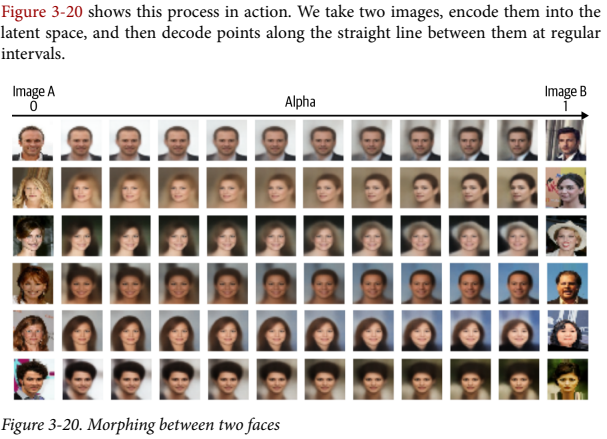

안경, 머리색, 성별 등이 동시에 변하지만 꽤나 자연스럽고 부드럽게 전이가 된다.
즉 VAE의 잠재공간은 연속적이고, 탐험이 가능한 공간이라는 것이다.

# 3.5 요약

- 표준 오토인코더가 잠재공간을 통해 고수준 특징을 추출할 수 있지만 생성 모델로 쓰기엔 문제가 있고, 학습된 잠재공간에서 샘플링이 어렵다.
- 변이형 오토인코더는 모델에 확률성을 도입하고, 잠재공간의 분포를 제약해 제대로 된 생성 모델로 바꾸어준다. 
- 얼굴 생성 문제에 적용했을 때, 벡터 연산을 통한 얼굴 조작이나, 이미지 복원, 얼굴 사이의 부드러운 변형 전환도 가능했다.
- 다음 4챕터에선 GAN을 다룰 예정이다.
