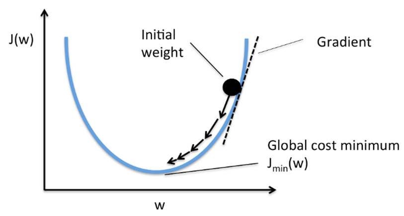

# 코드는 왜 작동하지 않았는가?

Keras 가 3.0으로 올라오면서 몇몇 기능들이 deprecated 됐거나 바뀌었기 때문이다.

오류가 났던 코드는 아래와 같다.

```python
x = layers.Dense(np.prod(shape_before_flattening))(decoder_input)
```

np.prod의 리턴값은 `numpy.int64` 타입이다. 이는 이전에는 지원했던 타입이지만 keras의 3.0 업데이트 이후로는 python의 기본 int를 사용하도록 바뀌었다.

그러므로 아래와 같이 수정했다.

```python
x = layers.Dense(int(np.prod(shape_before_flattening)))(decoder_input)
```

그리고 이 것 말고도 하나의 오류가 더 발생했는데.

```python
model_checkpoint_callback = callbacks.ModelCheckpoint(
    filepath="./checkpoint",
    save_weights_only=False,
    save_freq="epoch",
    monitor="loss",
    mode="min",
    save_best_only=True,
    verbose=0,
)
```

여기서 오류가 났다. 이유는 filepath에 저장 포맷을 명시해주지 않았기 때문이다.
케라스 3.0 이전에는 디렉토리 경로만 줘도 상관이 없었으나, 3.0으로 넘어오면서 포맷을 명시해줘야 한다.

아래와 같이 수정하여 해결하였다.

```python
model_checkpoint_callback = callbacks.ModelCheckpoint(
    filepath="./checkpoint.keras",
    save_weights_only=False,
    save_freq="epoch",
    monitor="loss",
    mode="min",
    save_best_only=True,
    verbose=0,
)
```

또한, `models.Model`을 상속받아서 만든 클래스의 경우, get_config을 오버라이딩 해서 작성해줘야 한다.
아래의 코드를 추가하여 해결하였다.

```python
class VAE(models.Model):
    ...
    
    def get_config(self):
            config = super().get_config().copy()
            config.update({
                'encoder': self.encoder,
                'decoder': self.decoder,
                'total_loss_tracker': self.total_loss_tracker,
                'reconstruction_loss_tracker': self.reconstruction_loss_tracker,
            })
            return config
    ...
```

그리고 `losses.mean_squared_error`의 명칭이 3.0에서 `MeanSquaredError`로 바뀌었고, 
직접 바로 호출해서 사용하면 케라스 내부에서 처리 불가한 분기가 발생한다.

```python
	reconstruction_loss = tf.reduce_mean(BETA * losses.MeanSquaredError(data, reconstruction))
```

이 코드를

```python
        mse = tf.keras.losses.MeanSquaredError()
        reconstruction_loss = BETA * mse(data, reconstruction)
        reconstruction_loss = tf.reduce_mean(reconstruction_loss)
```

이런 식으로 고쳐서 해결하였다.

# Adam이 뭔지 제대로 알아보자

아담 옵티마이저는 어떤 원리로 동작하는가?

## SGD 옵티마이저

SGD 옵티마이저에 대해 먼저 알아보자.
SGD는 확률적 경사 하강법이라는 뜻이다.
다차원의 산을 2차함수로 단순화해서 어떤식으로 값이 내려가는지 보여준다.



그림에 나온 그래프를 따라서 가중치가 점점 내려온다.
랜덤 위치에서 출발해 가장 로스가 최소가 되는 지점으로 가는것이 목표이다. 즉 저 함수의 최소점을 향해 가야한다.

$w_{t+1} = w_t - \eta \nabla wJ(w_t)$ 공식은 이와 같고, 이를 쉽게 풀이하자면 현재 위치 $w_t$에 다음 가중치 $w_{t+1}$를 찾는 것이다.
이때 $J(w)$는 손실 함수를 의미한다. 즉 지금 파라미터 $w$가 얼마나 실수했는지를 수치로 나타내준다.
즉 $∇wJ(wt)$는 손실함수의 기울기를 의미하는 것으로, 어떤 방향이 가장 급격하게 손실이 증가하는지를 의미하는 파라미터이다.
이는 수학적으로는 각 weight에 편미분을 하여 기울기를 구한것이다.
직관적으로는 지금 위치에서 가장 가파르게 올라가는 방법을 의미한다.
$η$은 바로 학습률을 의미한다. 이 웨이트가 얼마나 크게 움직일지를 결정하는 보폭의 의미를 한다.
여기서 끝이 아니라 값을 $w_t$에서 빼고 있는데. (즉 현재 위치에서 차를 구하고 있는데) 그 이유는 기울기는 올라가는 방향을 의미하기 때문에, 우리는 반대로 내려가는 방향을 알아야 하기 때문이다.

쉽게 요약하면: 현재 위치에서 손실이 가장 빨리 증가하는 방향의 반대 방향으로 η만큼 옮겨라. 라는 의미이다.

저 방식의 문제는 너무 점진적이고, 다차원의 산이기 때문에 눈을 감고 내려가는 것과 같다.
그래서 당장 여기가 최소점이라고 느껴지더라도, 최소점인지 알 방법이 없다.


그래서 그림에 보이는 local Minimum에 빠지면, 더이상 안내려가고 갇히기 때문에 한계가 있다.

이걸 개선하기 위해 나온 것이 바로 Adam인데, 이를 설명하기 전에 몇 가지 다른 옵티마이저들을 더 알아보아야 한다.

## Momentum

바로 저 local Minimum에 빠지는 문제를 해결하기 위해 태어난 기법이다.
저 굴곡에 갇혔을때 다시 탈출하여 Global Minimum에 도달하기 위해 바로 Momentum, 즉 관성을 이용하는 방법이다.
이 방식은 SGD의 한계였던 지그재그로 요동치며 나아가는 방식도 상쇄시켜 더 효율적으로 움직이게 유도한다.

수식은 SGD와 유사하다. $v_{t} = \gamma v_{t-1} + \eta \nabla f(w_{t-1})$ 인데, 여기서 $w_t$는 $w_{t-1} - v_t$ 이다.
$v(n)$은 속도를 의미한다. 즉 $v(n-1)$은 이전 위치에서의 속도 즉 관성이고, $\gamma$는 관성 계수가 된다.
우리가 설정해야 할 파라미터가 이 관성계수 감마이다. 이게 크면 클수록 속도가 관성의 영향을 많이 받게 되는 것이다. 

```python
class Momentum:

    def __init__(self, learning_rate=0.01, momentum=0.9):
        self.learning_rate = learning_rate
        self.momentum = momentum
        self.v = None
        
    def update(self, weights, grads):
        if self.v is None:
            self.v = {}
            for key, val in weights.items():                                
                self.v[key] = np.zeros_like(val)
                
        for key in weights.keys():
            self.v[key] = self.momentum*self.v[key] - self.learning_rate*grads[key]
            params[key] += self.v[key]
```

코드 예제를 보면 알수 있듯이, `__init__`함수에서 러닝레이트와 모멘텀을 초기화해줬다.
러닝 레이트는 일반적으로 0.01이 많이 사용되고, 모멘텀도 0.9가 일반적으로 많이 사용되는 값이다.

`update()`함수는 앞으로 나아가는 함수이다.
이전 값이 없는 (즉, 모멘텀이 없는) 상태일 때에는 속도에 0을 대입하고.
그 이후부터는 모멘텀, 즉 이전 속도 값을 통해 공식을 거쳐서 계산한다.
현재 속도 v에다가 `momentum * 현재 속도 - 학습률 * 그레디언트` 즉, `여태껏 쌓인 관성 * 이번 스텝이 새로 받은 기울기`를 대입하여 바뀐 속도를 찾아낸다. 
즉 예전에 가던 방향은 그대로 가되, 새 기울기는 조금만 (즉, 학습률만큼만) 반영하라 라는 뜻이다.
그리고 현재 가중치에 현재 속도 v를 더해주어 가중치를 갱신해준다.


꽤 괜찮은 방법이지만 가파른 구간에서 over shooting 문제가 발생할 수 있다.
이전의 기울기가 너무 가파르면 현재의 기울기가 작아져도 관성때문에 튀어나가서 최솟값을 지나치게 될 수 있다.

## AdaGrad (Adaptive Gradient)

이는 관성으로 접근하지 않고 학습률을 조절하는 식으로 모멘텀 방식을 개선한 기법이다.
일정한 러닝레이트를 사용하지 않고 변수, 스텝마다 변화를 준다. 
기본적으로 시간이 지날수록 러닝레이트를 점점 줄인다.
큰 변화를 겪은 변수의 러닝레이트는 대폭 작아지고, 작은 변화를 겪은 변수의 러닝레이트는 소폭 작아진다.
변화가 크다는 건 최적에 가까워졌다는 것이기 때문에, 보폭을 점점 줄여나가는 것이다.

그럼 어떻게 이게 크게 움직였는지 알까?
그냥 단순하게 여태껏 받은 그레디언트의 제곱 합을 저장한다. 그래서 매 파라미터마다 얼마나 자주 크게 업데이트 됐는지를 수치로 들고 있는다.

$G_{t,i} = \sum_{k=1}^{t} \left( \frac{\partial J(w_k)}{\partial w_i} \right)^2$ 공식은 이와같다. 쉽게 말하면 여태 모든 가중치가 받은 그레디언트의 제곱을 다 더한 값이다. 이걸 러닝레이트에 반영한다.

```python
class AdaGrad:
    def __init__(self, learning_rate=0.01):
        self.learning_rate = learning_rate
        self.h = None
        
    def update(self, weights, grads):
        if self.h is None:
            self.h = {}
            for key, val in weights.items():
                self.h[key] = np.zeros_like(val)
            
        for key in weights.keys():
            self.h[key] += grads[key] * grads[key]
            params[key] -= self.learning_rate * grads[key] / (np.sqrt(self.h[key]) + 1e-7)
```

코드를 보면 h에 그레디언트의 제곱을 더해주며 누적시켜주고.
원래 가중치에서 학습률 * 그레디언트를 h의 제곱근으로 나누어준 값을 빼준다.
코드에 있는 1e-7은 분모가 0이 되어서 오류가 나는걸 방지 하기 위한 코드이다.

이 또한 러닝레이트가 점점 0에 수렴하기 때문에 나중엔 학습이 거의 멈춰버리는 문제가 발생한다.

## RMSProp

그래서 사람들은 굳이 먼 옛날의 Gradient를 잊어버리는 방식을 고안해냈다.
기본적으로는 AdaGrad처럼 제곱은 하지만 이동한 평균값을 사용한다.

$h_t = \gamma h_{t-1} + (1 - \gamma)\ g_t^2$ 이 공식을 통해 제곱 그레디언트의 이동 평균을 구한다.
여기서 감마는 디케이레이트(부식률?)인데, 이를 통해 과거의 값을 얼마나 크게 반영시킬지 조절할 수 있다.

감마가 클수록 과거의 값을 더 반영하고, 감마가 작을 수록 현재의 값을 더 반영하여 계산한다.

```python
class RMSprop:
    def __init__(self, learning_rate=0.01, decay_rate = 0.99):
        self.learning_rate = learning_rate
        self.decay_rate = decay_rate
        self.h = None
        
    def update(self, weights, grads):
        if self.h is None:
            self.h = {}
            for key, val in weights.items():
                self.h[key] = np.zeros_like(val)
            
        for key in weights.keys():
            self.h[key] *= self.decay_rate
            self.h[key] += (1 - self.decay_rate) * grads[key] * grads[key]
            params[key] -= self.learning_rate * grads[key] / (np.sqrt(self.h[key]) + 1e-7)
```

예제 코드를 보면 먼저 여태 쌓인 누적 그레디언트에 decay_rate를 곱해준다.
그리고 누적 그레디언트 값에다가 현재 그레디언트의 제곱을 더해준다. 이때 1 - 감소율을 하여 반영하고 싶은 만큼의 양만큼 더해준다.
원래 가중치에서 학습률 * 그레디언트를 h의 제곱근으로 나누어준 값을 빼준다.

## 그래서 아담은 대체 무엇인가

사실 Adam을 알기 위한 빌드업이었다.
Momentum 방식과 RMSProp 방식을 합쳐놓은 방식이다.
각 기법의 장점들만 모은것으로 가장 많이 쓰이는 옵티마이저이다.

두 가지 기법을 합친 것이기 때문에, 각각의 점화식을 구한 후 하나로 합치는 방식이다.
Adam의 점화식은 $X_{n+1} = X_n - \eta \frac {1} { \sqrt{ \hat V_n }} \odot \hat m_n$ 이다. $m_n$은 모멘텀, $\hat v_n$은 RMSProp을 변형한 방식이다.

$m_n = \beta_1 m_{n-1} + (1 - \beta_1) \nabla f(x_n), \space m_{-1} = 0$ 이는 관성을 탑재한 식.

$v_n = \beta_2 v_{n-1} + (1 - \beta_2) \nabla f(x_n) \odot \nabla f(x_n), v_{-1} = 0$ 이는 학습률을 조절하는 식이다.

이 두 가지 점화식을 처음 말한 점화식 하나로 합쳐지게 한다. 여기서 보통 $\beta_1$은 0.9, $\beta_2$는 0.999로 지정을 한다.

이때, 처음 시작할때 m(-1), v(-1)은 0이므로, $\beta_1$, $\beta_2$를 1에 가깝게 설정하면 과거의값을 더 크게 반영하는 adam의 특성상 원점에 편향된다.

> 모든 step에서 그레디언트가 같다고 가정해보자.
> 여기서 우리가 기대하는 값은 모멘텀의 진짜 평균 g이다.
>
> step 0: $(1 - \beta_1)g$, $m_0 = 0.1g$ 실제 평균의 10프로
> step 1: $\beta_1(0.1g) + 0.1g = (0.1\beta_1 + 0.1)g = 0.19g$ 19프로, 여전히 작다
>
> 즉 처음의 0 때문에 평균값이 망가진 상태로 있어야 하는 것이다.

이를 위해 $m_n$, $v_n$을 보정해줘야 한다.
$\hat m_n = \frac{m_n}{1-\beta_1^{n+1}}$, $\hat v_n = \frac{v_n}{1-\beta_2^{n+1}}$ 이는 보정을 위한 식으로, 간단하게 요약하자면 $\beta_1$를 1에 가까이 설정하면 $1-\beta(n+1)$은 반대로 작아지는 식이다.
여기에 역수를 취해서 곱했기 때문에 보정한 m(n)은 제대로 평균에 가까운 값이 된다.

```python
class Adam:
    def __init__(self, lr=0.001, beta1=0.9, beta2=0.999):
        self.lr = lr
        self.beta1 = beta1
        self.beta2 = beta2
        self.iter = 0
        self.m = None
        self.v = None
        
    def update(self, params, grads):
        if self.m is None:
            self.m, self.v = {}, {}
            for key, val in params.items():
                self.m[key] = np.zeros_like(val)
                self.v[key] = np.zeros_like(val)
        
        self.iter += 1
        lr_t  = self.lr * np.sqrt(1.0 - self.beta2**self.iter) / (1.0 - self.beta1**self.iter)         
        
        for key in params.keys():
            self.m[key] += (1 - self.beta1) * (grads[key] - self.m[key])
            self.v[key] += (1 - self.beta2) * (grads[key]**2 - self.v[key])
            params[key] -= lr_t * self.m[key] / (np.sqrt(self.v[key]) + 1e-7)
```

코드를 보면 명확하다.
lr_t에 값을 대입하는 부분을 보면, beta값에다 iter만큼 제곱하는 모습을 볼 수 있다. 
이는 시간에 따른 영향력을 조절하면서, 초기 이동평균이 0에서 시작하는 문제를 보정하기 위한 코드이다.
이후 m에 `(1-beta) * (grad - m)`을 더해주고, v에 `(1 - beta) * (grad^2 - v)`를 하여준다. 이는 공식과 일치한다.
v는 각 파라미터별 학습률 스케일러의 역할을 하기 때문에, 그레디언트가 자주 크게 나오는 파라미터는 v가 커져서 업데이트가 작아진다.
그리고 가중치에서 `적용하려 하는 학습률 * m / v의 제곱`을 빼주며 처음 점화식을 실행하는 모습이다.

자 이렇게 복잡한 방식들을 활용해서, 우리는 손실이 최소가 되는 지점을 알아내는 것이다.

# 컨볼루션이 뭘까

작은 필터를 큰 데이터위에서 움직이면서 겹치는 부분끼리 곱한다음 다 더하는 연산이다.
큰 이미지는 책 한페이지라고 생각하고, 커널(필터)는 책을 보기 위한 돋보기라고 하면 이해가 쉽다.
이때 돋보기를 한칸씩 옮기면서 여기에 내가 찾는 무늬가 있는지 점수로 기록하는 것이다.
쉽게 말해, 패턴 탐색기의 역할을 한다.

과정은 아래와 같다

1. 작은 필터 하나를 준비한다 (보통 3x3)
2. 입력 이미지 위를 좌 -> 우 -> 하로 이동한다
3. 각 위치에서 겹치는 값 끼리 곱하고 전부 더한다.
4. 그 결과를 출력 이미지의 한 픽셀의 값으로 사용한다.

직접 해보자.

1. 입력 이미지 5x5

    > 1 1 1 0 1
    > 0 1 0 1 2
    > 2 1 2 0 1
    > 1 2 2 2 2
    > 0 0 0 1 1

    커널 3x3 (세로 무늬를 찾기 좋은 필터)

    > 1 0 -1
    > 1 0 -1
    > 1 0 -1

2. 계산 과정, 좌측 상단부터 시작하며 칸끼리 다 곱하고 더한다.

    > (1×1) + (1×0) + (1×-1)
    >
    > (0×1) + (1×0) + (0×-1)
    >
    > (2×1) + (1×0) + (2×-1)
    >
    > 1 + 0 -1 + 0 + 0 + 0 + 2 + 0 -2 = 0

    이 0이 출력 이미지의 한 픽셀값이 된다. 이걸 한칸씩 옮기며 다 곱하고 더하면 결과적으로 새로운 이미지 하나가 나온다.
    이를 feature map이라고 하고, 어디에 세로 경계가 강하게 있는지 보여줄 것이다.


이는 64x64의 흑백 커피잔 이미지에 합성곱 연산을 하는 모습이다.
두 개의 필터를 적용해서 각각의 feature map을 뽑아낸 모습이다.
첫 번째 필터를 예로 들면, 이것은 가로무늬 특징을 잡아내는 필터이다. 그래서 feature map에 가로 선들이 강조된 모습을 확인할 수 있다.

```python
layers.Conv2D(
  filters=2,
  kernel_size=(3,3),
  strides=1,
  padding="same"
)
```

strides는 필터가 한번에 입력 위를 이동하는 간격을 의미한다. 
2이므로 두칸씩 건너뛰며 이동하는 것이다. 
Stride가 커지면 샘플링 위치 수가 줄어들기 때문에 출력 feature map의 공간 해상도가 감소한다.

padding은 쉽게 말해 이미지 테두리에 0을 붙이는 것이다. padding="same"은 출력 feature map의 크기를 입력 크기에 최대한 가깝게 유지하도록 패딩을 자동으로 추가한다. stride=1인 경우, 입력과 출력의 공간 크기가 동일하다.


이미지를 보면, 커널 크기에 맞춰 테두리에 0을 패딩하여, 합성곱 이후에도 공간 크기가 유지되도록 한다. 
`padding = "same"`으로 지정하면 여러 합성곱 층을 통과할 때 텐서의 크기를 쉽게 파악할 수 있다.
이때 합성 곱 층의 출력크기는 $(\frac{height}{stride}, \frac{width}{stride}, 필터개수)$이다.

# 소프트맥스가 뭘까

입력값을 지수 함수로 변환한 뒤, 전체 합으로 나누어 출력이 확률 분포(합이 1)가 되도록 만드는 함수이다.

클래스가 K개 일때의 공식은 이와 같다: $\frac{e^{z_i}}{\sum_{j=1}^K e^{z_j}}$ 이다. 
$e^{z_i}$는 $z_i$를 양수로 만들고, 큰값은 더 크게, 작은값은 더 작게 만드는 역할을 한다.
분모 $\sum_j e^{z_j}$는 전체를 다 더하여서 정규화하고 결과를 확률처럼 되게 만드는 역할을 한다.

출력층의 활성화함수로 많이 사용되는 함수이다.

> 간단한 예제를 하나 들어보겠다.
>
> $z = [2, 1, 0]$ 세 가지 데이터가 있다.
> 지수화를 하면 
> $e^{z[0]} = e^2 \approx 7.39, e^{z[1]} = e^1 \approx 2.72, e^{z[2]} = e^0 = 1$
>
> 총 합은 $7.39 + 2.72 + 1 = 11.11$
>
> 소프트 맥스 출력: [$\frac{7.39}{11.11}, \frac{2.72}{11.11}, \frac{1}{11.11}$] -> [0.665, 0.245, 0.090]

# 파이썬 프로퍼티

getter, setter 메서드를 만들어줄 수 있다.
getter를 만들어서 원하는 형식으로 데이터를 리턴하거나, 레퍼런스 참조 방지등의 작업을 해줄 수 있다.
setter를 만들어서 데이터 유효성 검사나, 추가 가공등의 작업을 해줄 수 있다.
이는 C#의 프로퍼티 기능과 유사하며, 파이썬에서의 사용방식은 조금 다르다.

```python
class Circle:
    def __init__(self, radius):
        self._radius = radius
    
    @property
    def radius(self):
        return self._radius
    
    @radius.setter
    def radius(self, value):
        if value < 0:
            raise ValueError("Radius cannot be negative")
        self._radius = value
        
circle = Circle(5)
print(circle.radius)
circle.radius = 7
print(circle.radius)

---
출력 결과:
5
7
```

이런식으로 `@property`, `변수이름.setter` 의 형태로 데코레이터를 추가해 적용할 수 있다. 
