# 1. 소개

챕터 3에서의 무한 옷장 문제와 같은 예시를 하나 들어보겠다.

> 브릭키 벽돌과 위조범
>
> 당신은 벽돌 회사 브릭키에 QA로 취업했다.
> 경쟁업체가 벽돌의 위조품을 만들기 시작했고, 고객이 받는 물류에 섞어넣었다.
> 당신은 위조 벽돌 판별 전문가가 되어 생산 라인에서 위조 벽돌을 찾아낸다.
> 경쟁사는 그런 나를 파악해서 위조 프로세스를 바꿔가며 더욱 구분하기 어렵게 만든다.
> 나는 포기하지 않고 재교육하며 더 잘 찾아내려고 노력한다.
> 이렇게만 해도 위조의 품질과 탐지 품질이 크게 향상된다.

이 이이야기는 GAN(Generative Adversarial Network)의 훈련 과정을 잘 설명한다.


GAN은 Generator와 Discriminator의 싸움으로 발전한다.
Generator는 랜덤한 잡음을 원래 데이터셋에서 샘플링한 것 처럼 보이는 샘플로 변환한다.
Discriminator는 샘플이 원래 데이터셋의 것인지 Generator의 위조품인지 예측한다.
그림은 출력의 예시이다.
이 순환이 계속 되며 성능 향상을 도모한다.

# 4.2 심층 합성곱 GAN (DCGAN)

Deep Convolutional Generative Adversarial Network을 케라스로 직접 만들어 벽돌 사진을 생성해 확인해보자.

## 4.2.1 레고 블록 데이터셋

Kaggle에 있는 레고블럭 데이터셋을 활용한다. (https://www.kaggle.com/datasets/joosthazelzet/lego-brick-images)
다각도에서 촬영된 레고 블록을 컴퓨터로 렌더링한 사진 40000장을 모아놓은 것.

```python
train_data = utils.image_dataset_from_directory(
    "/app/data/lego-brick-images/dataset/",
    labels=None,
    color_mode="grayscale",
    image_size=(64, 64),
    batch_size=128,
    shuffle=True,
    seed=42,
    interpolation="bilinear",
)
```

이미지 크기를 64x64로 조정하고 픽셀 사이를 보간한다.
원본 데이터는 [0, 255] 범위의 픽셀 강도지만 [-1, 1] 범위로 스케일한다.
그 이유는 생성자 마지막 층에서 시그모이드 함수보다 더 강한 gradient를 제공하는 tanh 활성화 함수를 사용하기 위함이다.

```python
def preprocess(img)
	img = (tf.cast(img, "float32") - 127.5) / 127.5
    return img

train = train_data.map(lambda x: preprocess(x))
```

## 4.2.2 판별자

판별자를 만들어보자.

판별자의 목표는 이미지의 진위여부 판별이다. 2장의 지도학습 분류 예제와 비슷한 구조를 사용할 수 있을 것이다.
즉 합성곱 층을 쌓고 하나의 유닛으로 출력을 생성한다.


구조는 이미지와 같다.
아래는 예제코드이다.

```python
# input 층 정의
discriminator_input = layers.Input(shape=(IMAGE_SIZE, IMAGE_SIZE, CHANNELS))
# Conv2D 층을 쌓고 그 사이에 BatchNormalization, LeakyReLU, Dropout 층을 놓음
x = layers.Conv2D(64, kernel_size=4, strides=2, padding="same", use_bias=False)(discriminator_input)
x = layers.LeakyReLU(0.2)(x)
x = layers.Dropout(0.3)(x)
x = layers.Conv2D(
    128, kernel_size=4, strides=2, padding="same", use_bias=False
)(x)
x = layers.BatchNormalization(momentum=0.9)(x)
x = layers.LeakyReLU(0.2)(x)
x = layers.Dropout(0.3)(x)
x = layers.Conv2D(
    256, kernel_size=4, strides=2, padding="same", use_bias=False
)(x)
x = layers.BatchNormalization(momentum=0.9)(x)
x = layers.LeakyReLU(0.2)(x)
x = layers.Dropout(0.3)(x)
x = layers.Conv2D(
    512, kernel_size=4, strides=2, padding="same", use_bias=False
)(x)
x = layers.BatchNormalization(momentum=0.9)(x)
x = layers.LeakyReLU(0.2)(x)
x = layers.Dropout(0.3)(x)
x = layers.Conv2D(
    1,
    kernel_size=4,
    strides=1,
    padding="valid",
    use_bias=False,
    activation="sigmoid",
)(x)
# 마지막 합성곱 층의 출력을 펼침. 이 시점에서 텐서의 크기는 1x1x1이다. 그래서 굳이 Dense층울 거칠 필요는 없다.
discriminator_output = layers.Flatten()(x)

# 판별자 모델을 만듦. 입력 이미지를 받아 0과 1사이 숫자 하나를 출력함.
discriminator = models.Model(discriminator_input, discriminator_output)
```

몇몇 Conv2D 층에 strides를 2로 지정했다. 그래서 이미지 크기가 반으로 줄다가 마지막엔 1x1이 된다.
반대로 채널수는 마지막 예측 전까지 늘어나서 512개가 된다.
마지막 Conv2D층에 시그모이드를 사용하여 0과 1사이 숫자를 출력한다.

## 4.2.3 생성자

이제 위조범을 만들어보자.
생성자의 입력은 다변량 표준 정규 분포에서 뽑은 벡터이다. 출력은 원본 이미지와 같은 크기의 이미지이다.
GAN의 Generator는 VAE의 Decoder와 목적이 같다. 잠재 공간에서 원래 도메인으로 다시 매핑하는건 자주 사용되는 방식이다.


구조는 이와같다.

```python
# 생성자의 입력층 (길이 100짜리 벡터)를 정의한다.
generator_input = layers.Input(shape=(100,))
# Reshape층을 통해 1x1x100 크기 텐서로 바꿈. 전치 합성곱 가능해짐.
x = layers.Reshape((1, 1, 100))(generator_input)
# 총 4개의 Conv2DTranspose층에 통과시킴. 사이에 BatchNormalization, LeakyReLU층을 놓음
x = layers.Conv2DTranspose(
    512, kernel_size=4, strides=1, padding="valid", use_bias = False
)(x)
x = layers.BatchNormalization(momentum=0.9)(x)
x = layers.LeakyReLU(0.2)(x)
x = layers.Conv2DTranspose(
    256, kernel_size=4, strides=2, padding="same", use_bias = False
)(x)
x = layers.BatchNormalization(momentum=0.9)(x)
x = layers.LeakyReLU(0.2)(x)
x = layers.Conv2DTranspose(
    128, kernel_size=4, strides=2, padding="same", use_bias = False
)(x)
x = layers.BatchNormalization(momentum=0.9)(x)
x = layers.LeakyReLU(0.2)(x)
x = layers.Conv2DTranspose(
    64, kernel_size=4, strides=2, padding="same", use_bias = False
)(x)
x = layers.BatchNormalization(momentum=0.9)(x)
x = layers.LeakyReLU(0.2)(x)
# 마지막 Conv2DTranspose층에 tanh를 활용해 출력을 원본 이미지 도메인과 같은 [-1, 1] 범위로 변환
generator_output = layers.Conv2DTranspose(
	1,
    kernel_size=4,
    strides=2,
    padding="same",
    use_bias = False,
    activation = 'tanh'
)(x)
# 생성자 정의, 길이가 100인 벡터를 받고 [64, 64, 1]크기의 텐서를 출력함
generator = models.Model(generator_input, generator_output)
```

이것도 위와 같이 strides를 2로 지정하여 반대의 효과를 본다. 즉 벡터는 1에서 64까지 커지고, 채널은 512에서 1이 된다.

Conv2DTranspose층 대신 UpSampling2D층과 strides가 1인 Conv2D층을 활용할 수도 있다.

```python
x = layers.UpSampling2D(size = 2)(x)
x = layers.Conv2D(256, kernel_size=4, strides=1, padding="same")(x)
```

UpSampling 층은 단순히 각 입력의 행과 열을 반복해서 크기를 두배로 키우는 레이어이다.
이후 strides가 1인 Conv2D층을 통해 합성곱을 진행한다. 
이는 전치 합성곱과 유사하지만 픽셀 사이 공간을 0으로 채우지 않고, 기존 픽셀값을 활용해서 업샘플링하는 방식이다.

이 방법도 테스트해서 어떤것이 더 나은 결과가 나오는지 확인해야 한다.

## 4.2.4 DCGAN 훈련

Discriminator는 트레이닝 셋에서 가져온 진짜 이미지와, Generator가 만든 가짜 이미지 두가지의 학습데이터를 가진다.
이를 지도 학습으로 진행한다. 진짜 이미지는 레이블 1, 가짜는 레이블 0로 구분하며, 손실함수로 이진 크로스 엔트로피를 사용한다.
Discriminator는 진짜와 가짜 이미지를 구분하도록 훈련되는 이진 분류기이다.

Generator는 위조된 가짜 이미지를 생성하고, Discriminator를 사용해 점수를 매긴다.
아래는 두 요소의 훈련 과정을 나타낸 그림이다.

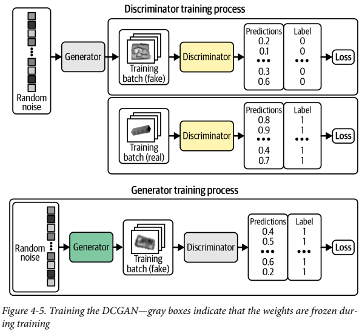

1. Generator가 가짜 이미지를 만듦
2. 진짜 이미지랑 섞음
3. Discriminator가 각각에 대한 확률을 냄
4. 레이블 1과 생성된 이미지에 대한 이진 크로스 엔트로피를 Generator의 Loss로 사용한다.

이때 제일 중요한건 Discriminator를 훈련시엔 Discriminator의 가중치만 업데이트하고, Generator를 훈련할 때엔 Generator의 가중치만 업데이트 한다.
왜냐하면 Generator 훈련시에 Discriminator의 가중치가 변경되도록 허용한다고 가정하면 Discriminator가 약해져서 Generator의 이미지를 진짜라고 예측할 수 있기 때문이다.
우리가 원하는건 Generator가 강해져서 진짜처럼 보이는 이미지를 만드는 것이다.

사용자 정의 `keras_step`함수를 만들어 케라스에서 로직 구현 가능

```python
class DCGAN(models.Model):
    def __init__(self, discriminator, generator, latent_dim):
        super(DCGAN, self).__init__()
        self.discriminator = discriminator
        self.generator = generator
        self.latent_dim = latent_dim

    def compile(self, d_optimizer, g_optimizer):
        super(DCGAN, self).compile()
        # 생성자와 판별자의 손실함수는 이진 크로스 엔트로피
        self.loss_fn = losses.BinaryCrossentropy()
        self.d_optimizer = d_optimizer
        self.g_optimizer = g_optimizer
        self.d_loss_metric = metrics.Mean(name="d_loss")
        self.d_real_acc_metric = metrics.BinaryAccuracy(name="d_real_acc")
        self.d_fake_acc_metric = metrics.BinaryAccuracy(name="d_fake_acc")
        self.d_acc_metric = metrics.BinaryAccuracy(name="d_acc")
        self.g_loss_metric = metrics.Mean(name="g_loss")
        self.g_acc_metric = metrics.BinaryAccuracy(name="g_acc")

    @property
    def metrics(self):
        return [
            self.d_loss_metric,
            self.d_real_acc_metric,
            self.d_fake_acc_metric,
            self.d_acc_metric,
            self.g_loss_metric,
            self.g_acc_metric,
        ]
    
    def call(self, inputs, training=False):
        return self.generator(inputs, training=training)

    def train_step(self, real_images):
        # 네트워크를 훈련하기 위해 먼저 다변량 표준 정규 분포에서 배치 벡터를 샘플링
        batch_size = tf.shape(real_images)[0]
        random_latent_vectors = tf.random.normal(
            shape=(batch_size, self.latent_dim)
        )

        with tf.GradientTape() as gen_tape, tf.GradientTape() as disc_tape:
            # 샘플링 된 배치 벡터를 Generator에 넘겨서 이미지 배치를 생성
            generated_images = self.generator(
                random_latent_vectors, training=True
            )
            # 이제 진짜 이미지에 대한 Discriminator의 예측을 만듦 
            real_predictions = self.discriminator(real_images, training=True)
            # 생성된 이미지에 대한 예측도 만ㄷ름
            fake_predictions = self.discriminator(
                generated_images, training=True
            )

            real_labels = tf.ones_like(real_predictions)
            real_noisy_labels = real_labels + NOISE_PARAM * tf.random.uniform(
                tf.shape(real_predictions)
            )
            fake_labels = tf.zeros_like(fake_predictions)
            fake_noisy_labels = fake_labels - NOISE_PARAM * tf.random.uniform(
                tf.shape(fake_predictions)
            )

            d_real_loss = self.loss_fn(real_noisy_labels, real_predictions)
            d_fake_loss = self.loss_fn(fake_noisy_labels, fake_predictions)
            # Discriminator의 손실은 진짜 이미지 (레이블 1), 가짜 이미지 (레이블 0)에 대한 이진 크로스 엔트로피의 평균
            d_loss = (d_real_loss + d_fake_loss) / 2.0

            # Generator의 손실은 레이블 1과 생성된 이미지에 대한 Discriminator의 예측 사이의 이진 크로스 엔트로피
            g_loss = self.loss_fn(real_labels, fake_predictions)

        gradients_of_discriminator = disc_tape.gradient(
            d_loss, self.discriminator.trainable_variables
        )
        gradients_of_generator = gen_tape.gradient(
            g_loss, self.generator.trainable_variables
        )

        # 가중치 업데이트
        self.d_optimizer.apply_gradients(
            zip(gradients_of_discriminator, discriminator.trainable_variables)
        )
        self.g_optimizer.apply_gradients(
            zip(gradients_of_generator, generator.trainable_variables)
        )

        # Update metrics
        self.d_loss_metric.update_state(d_loss)
        self.d_real_acc_metric.update_state(real_labels, real_predictions)
        self.d_fake_acc_metric.update_state(fake_labels, fake_predictions)
        self.d_acc_metric.update_state(
            [real_labels, fake_labels], [real_predictions, fake_predictions]
        )
        self.g_loss_metric.update_state(g_loss)
        self.g_acc_metric.update_state(real_labels, fake_predictions)

        return {m.name: m.result() for m in self.metrics}
```

서로 우위를 차지하기 위해 경쟁하기 때문에 DCGAN 훈련 과정이 불안정해질 수 있다.
이상적인건 의미있는 정보를 학습하는 균형점을 찾고 점점 품질이 향상되는 것이다.

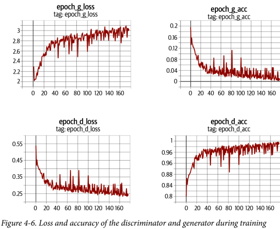

충분한 시간이 지나면 그림과 같이 판별자가 우세해지는 경향이 있지만, 
이미 생성자가 충분히 고품질 이미지를 뽑는 법을 터득했을 수 있으므로 문제가 되지 않는다.

> GAN 훈련시 레이블에 랜덤 잡음을 조금 추가하면 유용하다.
> 훈련 과정의 안전성이 개선되고 이미지를 선명하게 만들어준다.
> Label Smoothing 이라고 하며 Discriminator를 길들이는 역할을 한다.
> Discriminator가 풀어야 할 과제가 어려워지기 때문에 Generator를 과도하게 압도하지 못하게 한다.

## 4.2.5 DCGAN 분석

훈련하는 동안 특정 Epoch에서 생성자가 든 이미지를 보면 점점 능숙해짐을 알 수 있다.

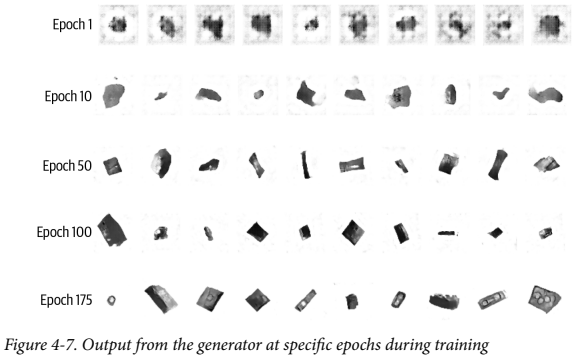

( 왜 내가 훈련시킨 모델은 이상한 결과나 나오는지 모르겠다. 그래서 책에 있는 사진을 옮겨 왔다. )

신경망이 랜덤한 잡음을 의미있는 무언가로 바꿀 수 있다는 사실이 다소 놀랍다.
원본 픽셀 이외엔 모델에 어떤 추가적 정보도 주지 않았다.
보시다시피 알아서 그림자, 직육면체, 원형의 구멍등의 고수준 개념을 완전히 스스로 만들어낸 모습이다.

성공적 생성모델에 반드시 지켜져야하는 것은 훈련 세트에서 이미지를 단순히 재생성 해선 안된다는 것이다.
생성된 특정 샘플에 가장 비슷한 훈련 세트의 이미지를 찾아 테스트해서 두 이미지 간 거리를 L1 노름으로 계산해보면,

> L1 노름은 모든 요소들의 절댓값을 더한 것

```python 
def compare_images(img1, img2,):
    return np.mean(np.abs(img1 - img2))
```

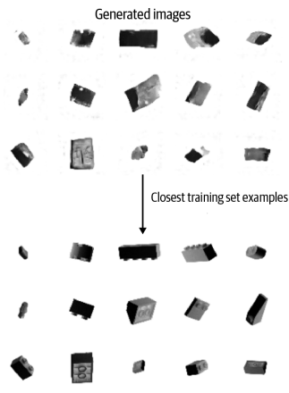

생성된 이미지와 훈련 세트가 어느정도 비슷하긴 하나 동일하진 않다. 
Generator가 고수준 특성을 이해하고 이미 본 그림을 이용해 뚜렷한 샘플을 생성할 수 있다.

## 4.2.6 GAN 훈련의 팁과 트릭

GAN은 큰 혁신이지만 훈련이 어렵기로 유명하다.
자주 마주치게 되는 문제점과 도전과제를 알아보자.

### Discriminator가 Generator보다 훨씬 뛰어난 경우

손실 함수의 신호가 약해져서 의미있는 향상을 기대할 수 없다.
최악의 경우엔 완벽하게 진위여부를 파악하게 되어서 Gradient가 완전히 사라지고 학습이 멈춰버리게 된다.

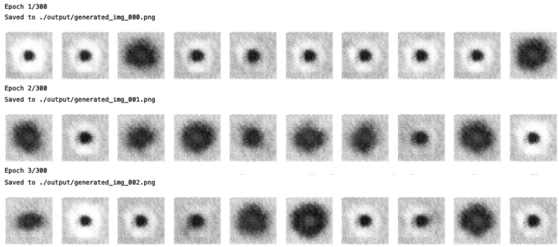

- 판별자를 약화시킬 방법
    - 판별자에 있는 Dropout층의 Rate 매개변수값을 늘려서 네트워크를 통해 흐르는 정보의 양을 줄인다.
    - 판별자의 러닝레이트를 줄인다.
    - 판별자의 합성곱 필터 수를 줄인다.
    - 판별자를 훈련할 때 레이블에 잡음을 추가한다.
    - 판별자를 훈련할 때 일부 이미지의 레이블을 무작위로 뒤집는다.

### Generator가 Discriminator보다 훨씬 뛰어난 경우

Generator가 거의 동일한 이미지 몇 개로 Discriminator를 쉽게 속일 방법을 찾게 될 것이다. 이를 mode collapse라고 한다.
mode는 Discriminator를 속이는 하나의 샘플을 의미한다.
Generator는 이걸 찾으려는 경향이 있고 latent space의 모든 point를 이 이미지에 매핑할 수 있다.
또한 손실함수의 gradient가 0에 가깝게 붕괴하므로 이 상태로부터 벗어날 수 없게 된다.
하나의 point에 속아 넘어가지 못하도록 Discriminator를 다시 훈련하더라도 또 다른 mode를 쉽게 찾아낼 것이다.
Generator가 이미 무감각해져서 다양한 output을 만들 이유가 없어지기 때문이다.


이 이미지는 mode collapse의 효과를 잘 보여준다. 이 문제를 해결하기 위해선 이전 섹션에서의 반대 방향으로 Discrimiator를 강화하거나,
두 네트워크의 러닝 레이트를 줄이거나, 배치 사이즈를 키우는 방법이 있다.

### 도움이 안되는 손실

딥러닝 모델은 손실함수를 최소화하기 때문에 Generator의 손실이 작을 수록 생성된 이미지의 품질이 더 좋을 것으로 생각된다.
하지만 Generator는 Discriminator만이 평가하고 Discriminator는 계속 향상되기 때문에 훈련 과정의 다른 지점에서 평가된 loss를 비교할 수가 없다.

그래서 [4-6 그림](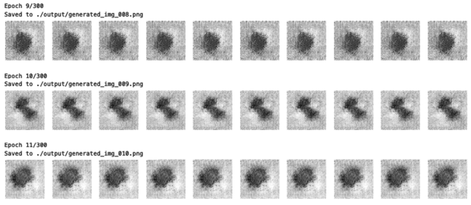)과 이미지 품질은 확실히 늘어나는데도 Generator의 손실함수는 오히려 증가해버린다.
즉, 손실과 이미지 품질 사이의 연관성이 떨어지기 때문에, GAN 훈련과정 모니터링을 어렵게 한다.

### 하이퍼파라미터

간단한 GAN이라도 튜닝해줘야 할 하이퍼파라미터의 개수가 매우 많다.

> 하이퍼파라미터는 사용자가 사전에 정해줘야 하는 파라미터를 말한다.
> 보통 클래스나 함수의 매개변수로 표현된다

 Discriminator, Generator의 전체 구조는 물론 배치 정규화, 드롭아웃, 학습률, 활성화 층, 합성곱 필터, 커널 크기, 스트라이드, 배치크기, 잠재공간 크기 등 전부 고려해주어야 한다.

미리 정의된 가이드라인 대신 계획적 시행착오를 통해 잘 맞는 파라미터 조합을 찾는 경우가 많다.
즉, GAN의 원리를 이해하고 손실함수를 해석하는 방법을 아는게 매우 중요하다.

### GAN의 도전과제 해결

근 몇 년간 GAN 모델의 안정성이 크게 향상됐고, mode collapse와 같은 문제들의 발생 가능성을 줄였다.
이제 GAN 프레임워크의 몇 가지 핵심 변경 사항을 적용하여 개선을 해보자.

# 4.3 Wasserstein GAN With Gradient Penalty (WGAN-GP)

와서스테인이라고 읽는것 같다.

CelebA 데이터셋을 통해 만들어 볼 것이다.
이는 안정적인 GAN 훈련을 돕는 큰 발전 중 하나이다.
원래 논문에서는 몇 가지 변경 만으로 Generator가 수렴과 샘플의 품질을 연관짓는 의미있는 손실 측정, 최적화 과정의 안정성 향상의 속성을 가질 수 있다고 제시했다.
이진 크로스 엔트로피 대신에 이 손실함수를 사용하면 더 안정적으로 수렴할 수 있다.

## 4.3.1 와서스테인 손실

> 이진 크로스 엔트로피: $(y * log(p) + (1 - y) log(1 - p)$

진짜 이미지에 대한 예측  $p = D(x_i)$와 타깃 y = 1을 비교하고 생성된 이미지에 대한 예측 $p = D(G(z_i))$와 타깃 y = 0을 비교하여 손실을 계산한다.
즉 D의 손실 함수 최소화 식은 다음과 같다.

> Discriminator 손실 최소화: $min_d - (E_{x \sim p_X}[log D(x)] + E_{z \sim p_Z}[log(1-D(G(z)))])$

생성자 G를 훈련하기 위해 생성된 이미지에 대한 예측 $p_i = D(G(z_i))$와 타깃 $y_i = 1$을 비교하여 손실을 계산한다.

> Generator 손실 최소화: $min_G - (E_{z \sim p_Z}[logD(G(z))])$

이제 와서스테인 함수와 비교해보자. 와서스테인 함수는 1과 0 대신 $y_i =1, y_i = -1$을 사용한다.
그리고 마지막 층에 시그모이드 함수를 제거해서 $p_i$가 [0, 1] 범위에 국한되지 않게 만든다.
그래서 WGAN의 Discriminator는 보통 Critic이라고 부르고 확률대신 점수를 반환한다.

> 와서스테인 손실함수: $-\frac{1}{n} \sum_{i=1}^n(y_i p_i)$

와서스테인의 D를 훈련하기 위해 진짜 이미지 예측 $p_i=D(x_i)$와 타깃 $y_i = 1$을 비교하고 생성 이미지 예측 $p_i=D(G(z_i))$와 타깃 $y_i = -1$비교하며 손실을 계산한다.

> 와서스테인 Critic 손실함수 최소화: $min_D - (E_{x \sim p_X}[D(x)] - E_{x \sim p_Z}[D(G(z))])$

WGAN Critic은 진짜와 가짜 사이의 차이를 최대화한다.

WGAN Generator는 생성된 이미지에 대한 예측 $p_i = D(G(z_i))$와 타깃 $y_i =1$을 비교하여 손실을 계산한다.

> 와서스테인 Generator 손실함수 최소화: $min_G - (E_{z \sim p_Z}[D(G(z))])$

WGAN Generator는 Critic한테서 가능한 한 높은 점수를 받는 이미지를 생성해야 한다. (Critic을 속여 높은 점수를 따야한다.)

## 4.3.2 립시츠 제약

점수는 무한대로 낼 수 있다. 하지만 신경망은 이런 큰 숫자를 좋아하지 않는다.
그러므로 Critic에 추가 제약을 걸어줘야 한다. 특히 1-립시츠 연속 함수(1-Lipschitz continuous function)여야 한다.
Critic은 하나의 이미지를 하나의 예측으로 변환하는 함수 D이다. 두 입력 이미지 $x_1$, $x_2$에 대해 다음 부등식이 만족하면 이 함수는 1-립시츠이다.

> 립시츠 함수는 임의의 두 지점이 어떤 상숫값 이상 증가하지 않는 함수이다. 이 상수가 1이면 1-립시츠 함수이다.

$\frac{|D(x_1) - D(x_2)|}{|x_1 - x_2|} \le 1 $ 여기서 분모는 두 이미지 픽셀의 평균 절댓값 차이이고, 분자는 Critic의 예측 간의 절댓값 차이이다.
Critic의 예측이 너무 급격히 변하지 못하게 변화율에 상한선을 두는 것이다.
즉 Gradient의 절대값이 언제나 최대 1이어야 한다.

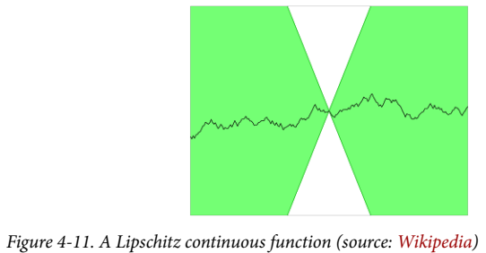

이 그래프를 보면 어떤 지점에 원뿔() 흰 부분을 놓아도 함수 그래프가 원뿔에 들어오지 않는다.
즉 이 직선은 어느 지점에서든 상승/하강 비율이 한정된다는 것이다.

## 4.3.3 립시츠 제약 부과하기

원본 논문에선 Critic의 가중치를 작은 범위인 -0.01, 0.01 안에 놓이게 훈련 배치가 끝난 뒤 가중치 클리핑을 통해 립시츠 제약을 부과했다.

이 방식은 Critic에서 가중치를 클리핑 했기 때문에 학습 속도가 크게 떨어진다는 문제가 있다.
사실 원본 논문에서도 립시츠 제약을 둘려고 가중치 클리핑을 하는 것은 확실히 나쁜 방법이라고 적어두었다.

그래서 다른 연구자들이 또 다른 방법을 연구하여 WGAN이 복잡한 특성을 학습할 수 있도록 향상시켰다.
그 방법 중 하나가 와서스테인-GAN-그레이디언트 패널티이다.
이 방식을 소개한 논문에서 그레이디언트 노름이 1에서 벗어날 경우 모델에 불이익을 주는 그레이디언트 패널티 항을 비판자의 손실 함수에 포함시켜 립시츠 제약 조건을 직접 강제하는 방법을 보여준다. 이렇게 하면 훈련 과정이 훨씬 더 안정적이다.

## 4.3.4 그레이디언트 패널티 손실

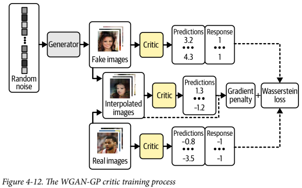

이 이미지는 WGAN-GP의 Critic의 훈련 과정을 보여준다. 
원래 Discriminator 훈련 과정과 비교하면, 진짜/가짜 이미지에 대한 와서스테인 손실과 그레디언트 패널티 손실이 추가된 모습을 볼 수 있다.

그레이디언트 패널티 손실은 입력 이미지에 대한 예측의 그레이디언트 노름과 1 사이의 차이를 제곱한 것이다.
이 모델은 자연스레 그레이디언트 패널티항을 최소화하는 가중치를 찾으려고 한다.

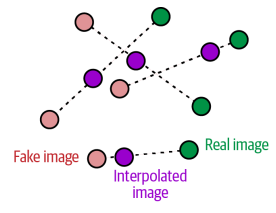

훈련 과정 내내 그레이디언트를 계산하긴 어렵다. 그래서 WGAN-GP는 일부 지점에서만 계산한다.
한 쪽에 치우치지 않으려고 그림 과 같이 진짜 이미지, 가짜 이미지를 연결한 직선을 따라 무작위로 포인트를 골라 보간한 이미지를 사용한다.

```python
def gradient_penalty(self, batch_size, real_images, fake_images):
    # 배치에 있는 이미지마다 0과 1사이 랜덤 숫자를 생성해 벡터 alpha에 저장한다
    alpha = tf.random.normal([batch_size, 1, 1, 1], 0.0, 1.0)
    diff = fake_images - real_images
    # 보간 이미지를 계산한다
    interpolated = real_images + alpha * diff
    
    with tf.GradientTape() as gp_tape:
        gp_tape.watch(interpolated)
        # 비평자에게 보간된 이미지의 점수를 요청한다
        pred = self.critic(interpolated, training=True)
       
    # 보간된 이미지에 대해 예측의 그레이디언트를 계산한다
    grads = gp_tape.gradient(pred, [interpolated])[0]
    # L2 노름을 계산한다
    norm = tf.sqrt(tf.reduce_sum(tf.square(grads), axis=[1, 2, 3]))
    # L2 노름과 1 사이의 평균 제곱 거리를 반환한다
    gp = tf.reduce_mean((norm - 1.0) ** 2)
    return gp
```

> L2 노름: 다 제곱하고 루트 씌운거 [1, 2, 3, 4, 5] -> sqrt(1 + 4 + 9 + 16 + 25) -> sqrt(55)

## 4.3.5 WGAN-GP 훈련

주요 장점은 Critic과 Generator의 훈련 균형을 맞출 필요가 없다는 점이다.
와서스테인 손실을 사용할 때에는 Generator의 그레이디언트가 정확하게 업데이트 되도록 Generator를  업데이트 하기 전에 Critic을 훈련하여 수렴시켜야 한다. 
원래의 GAN에서 Discriminator가 너무 강해지지 하던 것 과는 대조적이다.

그래서 WGAN을 사용할 때에는 Generator 업데이트 사이에 비평자를 여러 번 훈련하여 수렴에 가까워지게 할 수 있다.
일반적으로 사용되는 비율은 Generator를 한 번 업데이트 할 때마다 Critic을 세 번에서 다섯 번 업데이트 한다.

```python
	def train_step(self, real_images):
        batch_size = tf.shape(real_images)[0]

        # Critic 업데이트
        for i in range(self.critic_steps):
            random_latent_vectors = tf.random.normal(
                shape=(batch_size, self.latent_dim)
            )

            with tf.GradientTape() as tape:
                fake_images = self.generator(
                    random_latent_vectors, training=True
                )
                fake_predictions = self.critic(fake_images, training=True)
                real_predictions = self.critic(real_images, training=True)

                # Critic을 위한 와서스테인 손실 (가짜와 진짜에 대한 평균 예측 차이) 계산
                c_wass_loss = tf.reduce_mean(fake_predictions) - tf.reduce_mean(
                    real_predictions
                )
                # 그레이디언트 패널티 항 계산
                c_gp = self.gradient_penalty(
                    batch_size, real_images, fake_images
                )
                # 비평자 손실은 와서스테인 손실과 그레이디언트 패널티의 가중치 합
                c_loss = c_wass_loss + c_gp * self.gp_weight

            c_gradient = tape.gradient(c_loss, self.critic.trainable_variables)
            # Critic의 Weight 업데이트
            self.c_optimizer.apply_gradients(
                zip(c_gradient, self.critic.trainable_variables)
            )

        random_latent_vectors = tf.random.normal(
            shape=(batch_size, self.latent_dim)
        )
        with tf.GradientTape() as tape:
            fake_images = self.generator(random_latent_vectors, training=True)
            fake_predictions = self.critic(fake_images, training=True)
			# Generator를 위한 와서스테인 Loss 계산
            g_loss = -tf.reduce_mean(fake_predictions)

        gen_gradient = tape.gradient(g_loss, self.generator.trainable_variables)
        # Generator의 Weight를 업데이트
        self.g_optimizer.apply_gradients(
            zip(gen_gradient, self.generator.trainable_variables)
        )

        self.c_loss_metric.update_state(c_loss)
        self.c_wass_loss_metric.update_state(c_wass_loss)
        self.c_gp_metric.update_state(c_gp)
        self.g_loss_metric.update_state(g_loss)

        return {m.name: m.result() for m in self.metrics}
```

WGAN-GP에서는 Critic에서 배치 정규화를 사용하면 안된다는 것이다.
배치 정규화로 인해 같은 배치 안의 이미지 사이에 상관관계가 발생하면 그레디언트 패널티 로스의 효과가 떨어지기 때문이다.

요약하면 다음과 같다.

- WGAN-GP는 와서스테인 Loss를 사용한다.
- WGAN-GP는 진짜에 1, 가짜에 -1을 레이블로 사용해 훈련한다.
- Critic의 마지막 층에는 시그모이드를 사용하지 않는다.
- Critic의 Loss함수에 그레이디언트 패널티 항을 추가한다.
- Generator를 업데이트할 때마다 Critic을 여러번 훈련한다
- Critic에 BatchNormalization Layer가 없다.

## 4.3.6 WGAN-GP 분석

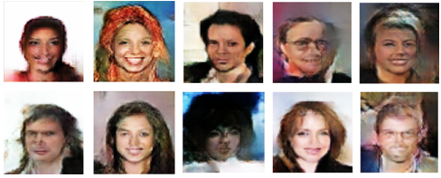

25 에폭정도 훈련시킨 결과물이다.
얼굴의 고 수준의 특성을 학습했고, mode collapse의 징후가 없다.

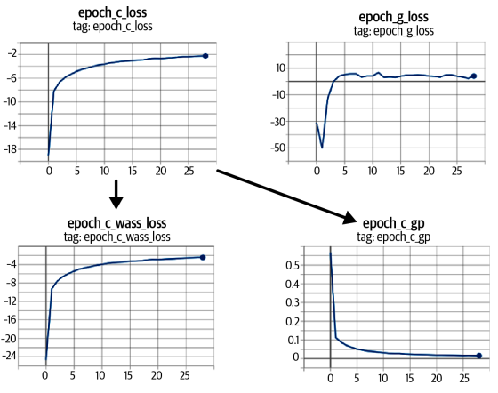

그래프 상으로 Critic과 Generator의 손실함수가 매우 안정적으로 수렴하고 있다.

WGAN-GP의 출력과 VAE 출력을 비교하면 GAN의 이미지가 더 선명함을 알 수 있다. 특히 머리와 배경 사이가 그러하다.
VAE는 색의 경계를 흐릿하게 하여 부드러운 이미지를 만들고, GAN은 선명하고 형태가 뚜렷한 이미지를 만든다.

또한 GAN은 VAE보다 더 훈련하기 어렵고 만족할만한 품질을 얻기 위해선 더 오래 훈련시켜야 한다.
GPU를 사용하여 대규모 긴 시간을 훈련하더라도, 보상이 크다.

# 4.4 조건부 GAN (Conditional GAN)

우린 사실적 이미지를 생성하는 GAN을 구축했다. 하지만 생성하고자 하는 이미지의 유형(남자나 여자의 얼굴, 크거나 작은 벽돌)을 제어할 순 없었다.
잠재 공간에서 랜덤한 한 포인트를 샘플링 할 순 있겠지만, 어떤 잠재변수를 골라야 어떤 종류의 이미지가 생성될지 파악이 어렵다
그래서 출력 제어가 가능한 Conditional GAN을 구축할 것이다.

## 4.4.1 CGAN 구조

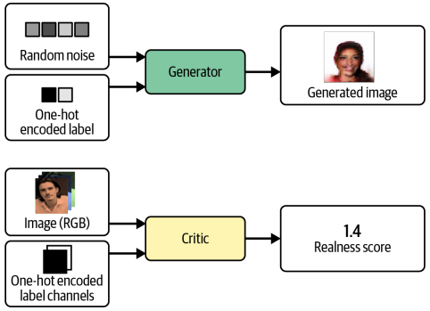

CelebA 데이터셋을 활용했다. 기본으로 탑재된 금발머리 레이블을 활용할 것이다.
데이터셋에 금발머리 속성으로 CGAN에 조건을 부여했다. 즉 금발 이미지를 생성할지 명시적으로 지정할 수 있다.

표준 GAN과 CGAN의 차이는 CGAN에선 레이블 관련 정보를 Generator와 Critic에 전달한다는 점이다.
Generator에선 이 정보를 원 핫 인코딩 된 벡터로 잠재 공간 샘플에 추가한다.

CGAN은 Critic이 이미지의 컨텐츠에 관한 추가 정보를 참고할 수 있다.
Generator는 Critic을 속이기 위해서, 제공된 레이블과 출력이 일치하는지 확인해야 한다.
만약 생성자가 완벽한 이미지를 생성해도 레이블이 틀리면, Critic은 가짜임을 알 수 있다.

```python
critic_input = layers.Input(shape=(64, 64, 3))	# 이미지 채널과 레이블 채널이 각각 Critic에 전달되어 연결된다
label_input = layers.Input(shape=(64, 64, 2))
x = layers.Concatenate(axis = -1)([critic_input, label_input])
...
generator_input = layers.Input(shape=(32,))	# 잠재 벡터와 레이블 클래스가 각각 Generator에 전달되어 연결된 후 크기가 변한다.
label_input = layers.Input(shape=(2,))
x = layers.Concatenate(axis = -1)([generator_input, label_input])
x = layers.Reshape((1,1, 34))(x)
```

## CGAN 훈련

```python
def train_step(self, data):
    real_images, one_hot_labels = data	# 입력에서 이미지와 레이블 분리

    image_one_hot_labels = one_hot_labels[:, None, None, :]	# 원핫 인코딩 된 벡터를 입력 이미지 크기와 같은 원핫 인코딩 이미지로 확장
    image_one_hot_labels = tf.repeat(
        image_one_hot_labels, repeats=IMAGE_SIZE, axis=1
    )
    image_one_hot_labels = tf.repeat(
        image_one_hot_labels, repeats=IMAGE_SIZE, axis=2
    )

    batch_size = tf.shape(real_images)[0]

    for i in range(self.critic_steps):
        random_latent_vectors = tf.random.normal(
            shape=(batch_size, self.latent_dim)
        )

        with tf.GradientTape() as tape:
            fake_images = self.generator(
                [random_latent_vectors, one_hot_labels], training=True
            )	# Generator에게 두 개의 입력 (랜덤한 잠재 벡터와 원핫 인코딩 된 레이블 벡터)로 구성된 리스트 주입

            fake_predictions = self.critic(
                [fake_images, image_one_hot_labels], training=True
            )	# Critic에게 두 개의 입력 (가짜/진짜 이미지와 원핫 인코딩 된 레이블 채널)로 구성된 리스트 주입
            real_predictions = self.critic(
                [real_images, image_one_hot_labels], training=True
            )

            c_wass_loss = tf.reduce_mean(fake_predictions) - tf.reduce_mean(
                real_predictions
            )
            c_gp = self.gradient_penalty(
                batch_size, real_images, fake_images, image_one_hot_labels
            )	# 그레이디언트 패널티 함수도 Critic 호출 시 전달할 원핫 인코딩 된 레이블 채널이 필요함
            c_loss = c_wass_loss + c_gp * self.gp_weight

        c_gradient = tape.gradient(c_loss, self.critic.trainable_variables)
        self.c_optimizer.apply_gradients(
            zip(c_gradient, self.critic.trainable_variables)
        )

    random_latent_vectors = tf.random.normal(
        shape=(batch_size, self.latent_dim)
    )

    with tf.GradientTape() as tape:
        fake_images = self.generator(
            [random_latent_vectors, one_hot_labels], training=True
        )	# Critic 트레인 스텝의 변경 사항은 그대로 Generator에게도 적용시킨다.
        fake_predictions = self.critic(
            [fake_images, image_one_hot_labels], training=True
        )
        g_loss = -tf.reduce_mean(fake_predictions)

    gen_gradient = tape.gradient(g_loss, self.generator.trainable_variables)
    self.g_optimizer.apply_gradients(
        zip(gen_gradient, self.generator.trainable_variables)
    )

    self.c_loss_metric.update_state(c_loss)
    self.c_wass_loss_metric.update_state(c_wass_loss)
    self.c_gp_metric.update_state(c_gp)
    self.g_loss_metric.update_state(g_loss)

    return {m.name: m.result() for m in self.metrics}
```

Generator와 Critic의 입력 포맷이 바뀌었으니 CGAN의 `train_step`도 조금 고쳐줘야 한다.

## 4.4.3 CGAN 분석

특정 원핫 인코딩 된 레이블을 Generator의 입력에 전달해서 CGAN의 출력을 제어할 수 있다.
금발이 아닌 얼굴을 만들려면 벡터 [1, 0]을 전달하고, 금발 머리를 하려면 [0, 1]을 전달한다.

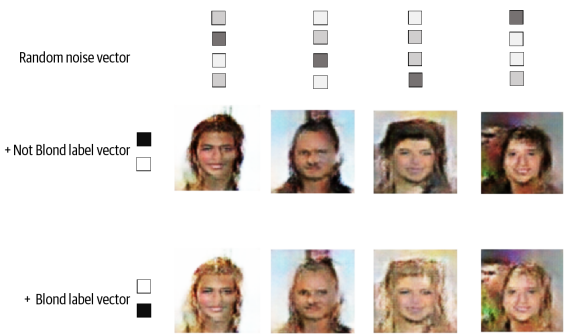

CGAN의 출력은 이와 같다. 샘플마다 랜덤한 잠재 벡터는 동일하게 유지하고 조건부 레이블 벡터만 변경한다.
CGAN이 레이블 벡터를 사용해 머리색 속성만 제어하는 방법을 학습했음을 알 수 있다. 머리 말고 나머지 부분은 거의 변하지 않았다.
이는 GAN이 개별 특성이 분리되도록 잠재공간의 포인트 구성이 가능함을 보여준다.

> 데이터셋에 레이블이 있으면, 따로 조건을 부여할 필요가 없어도 GAN의 입력에 레이블을 포함하는 것이 좋다.
> 일반적으로 생성된 이미지의 품질을 높이는 경향이 있기 때문이다.
> 레이블을 픽셀에 입력할 수 있는 유용한 정보이다.

# 4.5 요약

- DCGAN, WGAN-GP, CGAN 세 가지를 다뤘다.
- 모든 GAN은 Generator와 Discriminator(Critic)의 대립을 기반으로 한다.
    - Discriminator(Critic)은 진위 여부를 판별하고, Generator는 이를 속이도록 학습한다.
- DCGAN은 장난감 벽돌 이미지를 생성하면서 그림자, 형태, 질감등의 3D 속성을 학습했다.
    - GAN 학습은 mode collapse와 vanishing gradients 같은 훈련 실패 사례가 생길 수 있다.
- Wassersten loss는 이 문제를 완화시키고 더 예측 가능하고 안정적으로 만들어준다.
    - WGAN-GP는 Gradient norm을 1로 유도하는 항을 loss에 포함시켜서 1-립시츠 조건을 부과한다.
    - 얼굴 생성에 적용해 표준 정규분포 샘플링으로 새로운 얼굴을 만들었다.
- GAN은 VAE보다 일반적으로 더 선명하고 경계가 뚜렷한 이미지를 생성한다.
- CGAN은 라벨을 Generator와 Critic 입력에 추가해 생성 결과를 조건화할 수 있다.
- GAN 프레임워크는 매우 유연하며 다양한 문제 도메인으로 확장 가능하다.
