# 10.1 소개

Github에 있는 GAN Zoo 저장소에 다양한 논문의 링크와 500개 이상의 GAN 예제가 있다.
이미지 생성의 한계를 뛰어넘은 ProGAN, StyleGAN, StyleGAN 2를 살펴볼 것이다.

또한 어텐션을 통합한 SAGAN과 BigGAN 두개를 더 살펴볼것이다.

그리고 오토인코더, 당장 공부하진 않았지만 트랜스포머, GAN의 아이디어를 혼합한 VQ-GAN과 ViT VQ-GAN을 다룰것이다.
VQ-GAN은 구글의 최첨단 Text-To-Image 생성 모델인 Muse의 핵심 구성요소이다.

# 10.2 ProGAN

NVIDIA가 GAN 훈련 속도와 안정성읠 향상시키기 위해 2017년에 개발한 기술이다.
ProGAN 논문은 전체 해상도 이미지에서 바로 GAN을 훈련하는 대신 
4x4 픽셀의 저해성도 이미지로 Genrator와 Discriminator를 훈련한 다음 훈련 과정에 층을 점진적으로 추가하여 해상도를 높인다.

## 10.2.1 점진적 훈련

일반 GAN에서 Generator는 초기 단계에서도 항상 전체 해상도 이미지를 출력한다.
이 전략이 최적이 아니라고 생각할 수도 있다.
생성자가 처음부터 고해상도 이미지에서 작동하면 훈련 초기에 고수준의 구조를 학습하는 속도가 느릴수 있다.
먼저 정확한 저해상도 이미지를 출력하도록 경량 GAN을 훈련시키고, 점점 해상도를 높이는 것이 나을수도 있다.

ProGAN은 그림처럼 보간을 통해 4x4 픽셀 이미지로 압축된 이미지부터 단계적으로 훈련된다.
처음 (길이 512 짜리를 예로 들면) 잠재 입력 잡음 벡터 z를 4x4x3의 이미지로 변환하도록 Generator를 훈련시킬 수 있다.
이에 대응되는 Discriminator는 크기가 4x4x3인 입력 이미지를 하나의 스칼라 예측으로 변환해야 한다.

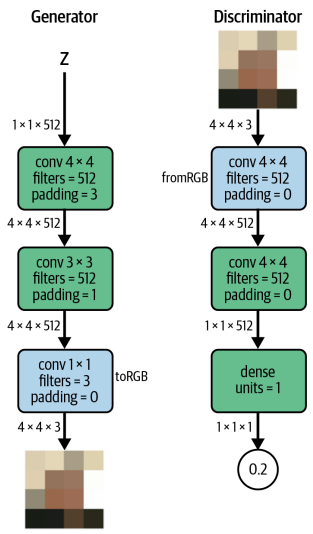

Generator의 파란 상자는 특성 Map을 RGB이미지로 변환하는 Conv층을 나타내고 (toRGB)
Discriminator의 파란 상자는 RGB이미지를 특성 Map으로 변환하는 Conv층을 나타낸다 (fromRGB)

논문에서는 Discriminator가 진짜 이미지 80만개를 볼 때까지 이 신경망 쌍을 훈련시킨다.
이제 Generator와 Discriminator를 확장해서 8x8 픽셀 이미지에서 작동하는 방법을 이해해보자.

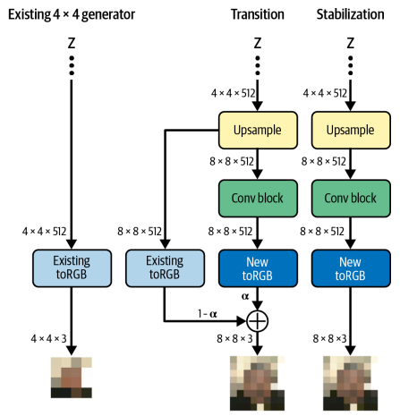

층을 추가시킨다. Transition과 Stabilization의 두 단계로 관리한다.
Generator를 먼저 보자.
Transition Phase에서 새로운 업샘플링 층과 Conv층이 원래 신경망에 추가된다.
이전에 훈련된 toRGB층의 출력을 그대로 유지하기 위해 잔차 연결이 추가된다.

> 잔차 학습: 일반적인 신경망의 학습과 다르게 입력과 출력간의 차이를 학습하는 방식

새 층은 처음에 파라미터 $\alpha$를 사용해 마스킹된다.
$\alpha$는 전환 단계동안 0에서 1로 점진적으로 증가하여 기존 toRGB 층의 출력을 줄이고 새로운 toRGB 층의 출력을 늘린다.
이는 새 층으로 이전시 신경망이 받을 충격을 피하게 해준다.

기존 toRGB 층을 통과하는 데이터가 사라지면 신경망은 Stabilization Phase로 넘어간다.
여기선 기존 toRGB층을 통한 데이터 흐름 없이 추가 훈련을 해서 신경망의 출력을 미세 조정한다.

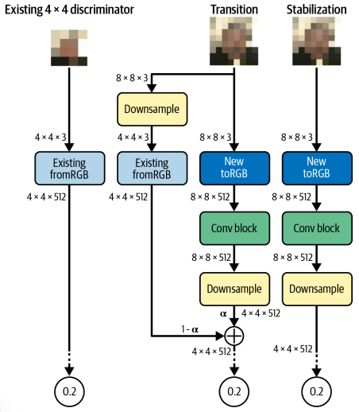

여기선 다운샘플링과 합성곱 층을 추가해야 한다.
신경망 시작 시 입력 이미지 바로 뒤에 추가 된다.
기존 fromRGB층은 잔차 연결로 연결되며 전환 단계에서 새 층으로 전환되면서 점진적으로 제거된다.
Stabilization Phase에서 판별자가 새 층을 사용하여 미세 조절 가능하다.

모든 Transition, Stabilization Phase는 Discriminator가 80만개 이미지를 볼 때까지 계속된다.
신경망이 점진적으로 훈련되지만 어떤 층도 동결되지 않으며, 모든 층은 완전히 훈련 가능한 상태로 유지된다.

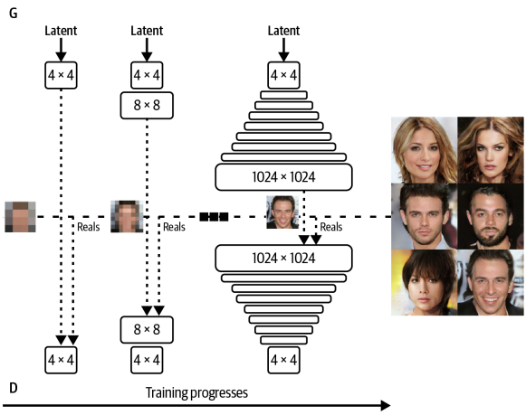

4x4 이미지에서 8x8, 16x16, 32x32로 증가시켜가며 1024x1024에 도달할 때 까지 계속 된다.

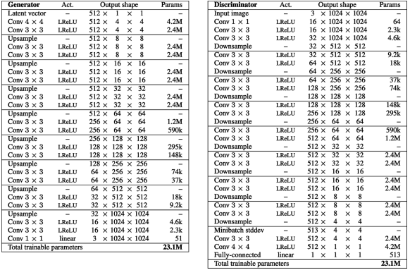

점진적 훈련 완료 이후의 Generator와 Discriminator의 구조이다.

이 논문은 미니 배치 표준 편차, 균등 학습률, 픽셀별 정규화 같은 여러가지 기술도 소개해주었다.

### 미니 배치 표준 편차

미니 배치 표준 편차(minibatch standard deviation)는 특성값의 표준 편차를 모든 픽셀과 미니 배치를 평균하여 (상수) 특성으로 판별자에 추가하는 층이다.
생성자가 출력에서 더 많은 다양성을 부여하는 데 도움이 된다.
미니 배치에서 다양성이 낮으면 표준 편차가 작아지고, Discriminator는 이를 통해 가짜와 진짜를 구분할 수 있다.
그래서 Generator는 진짜 훈련 데이터와 비슷한 양의 다양성을 만든다.

### 균등 학습률

ProGAN의 모든 밀집 층과 합성곱 층을 균등 학습률(Equalized Learning Rate)를 사용한다.
일반적으로 신경망의 가중치는 He초기화(표준 편차가 층에 대한 입력 개수의 제곱근에 반비례한 가우스 분포)와 같은 방법을 사용하여 초기화한다.
이러면 입력이 많으면 0에 가까운 값으로 가중치가 초기화 되기 때문에 안정성이 향상된다.

ProGAN 논문에선 Adam이나 RMSProp과 같은 최신 옵티마이저와 함께 사용해서 문제가 생김을 알아냈다.
이런 방식은 가중치에 대한 그레이디언트 업데이트를 정규화한다. 업데이트 크기가 가중치의 크기와 무관하다.
하지만 이는 범위가 큰 가중치(입력이 적은)가 범위가 작은 가중치(입력이 많은)보다 조정하는데 상대적으로 오래 걸린다.
ProGAN에서 생성자와 판별자의 여러 층에서 훈련 속도 간의 불균형이 발생함이 밝혀졌고, 이를 해결하기 위해 균등 학습률을 사용했다.

ProGAN의 가중치는 층에 대한 입력 개수와 무관하게 표준 가우스 분포를 사용하여 초기화한다.
정규화는 초기화때가 아니라 레이어의 정방향 계산 시 동적으로 적요오딘다.
이런 방법으로 옵티마이저는 각 가중치의 범위가 거의 동일하다 보고 동일한 학습률을 적용한다.

즉 레이어 호출 시 He 초기화 계수에 따라 가중치의 스케일이 조정된다.

### 픽셀별 정규화

ProGAN의 Generator에선 배치 정규화가 아닌 픽셀별 정규화를 사용한다.
이는 각 픽셀의 특성 벡터가 단위 길이로 정규화되고, 신호가 신경망으로 전파될 때 제어 불능 상태가 되는 문제를 방지할 수 있다.
픽셀 정규화 층에는 훈련 가능한 가중치가 없다.

## 10.2.2 출력

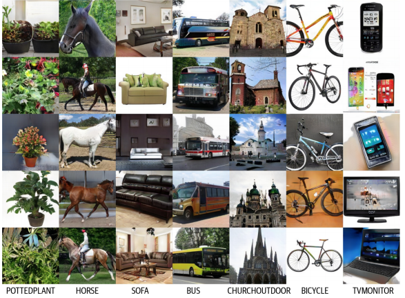

CelebA 외에도 LSUN(Large-Scale Scene Understanding)에 적용하여 괜찮은 결과를 얻어냈다.

# 10.3 StyleGAN

StyleGAN은 ProGAN 논문의 초기 아이디어를 기반으로 한다. Discriminator는 동일하고 Generator만 바뀌었다.

GAN을 학습하다보면 Latent Space 안의 벡터들이 고수준의 속성과 서로 얽힌 경우가 많다.
예를 들어 주근깨를 더하려고 latent 벡터를 조금 바꾸면 의도치 않게 얼굴 배경색이나 다른 색도 바뀌어버린다.
즉 Latent Space 안에서 하나의 속성만 독립적으로 조절하기가 어렵다.
ProGAN은 매우 사실적 이미지를 만듦에도 이런 문제에서 자유롭지 못하다.

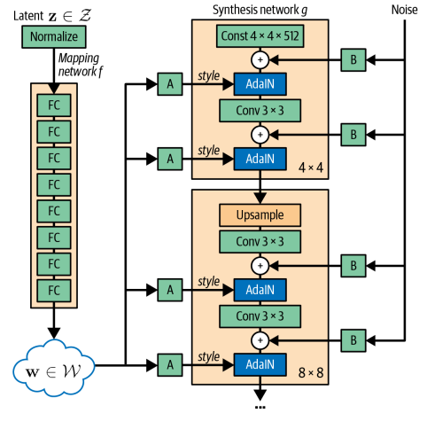

StyleGAN의 목표는 스타일 벡터를 신경망에 명시적으로 주입해서 이를 달성한다.
일부는 고수준의 특성(얼굴 방향), 일부는 저수준의 세부사항 (가르마)을 제어한다.
전체 구조는 그림과 같다.

## 10.3.1 매핑 신경망

매핑 신경망 $f$는 단순 피드 포워드 네트워크이다.
입력은 노이즈 벡터 $z∈Z$, 출력은 새로운 잠재 벡터 $w∈W$이다.
Generator는 잡음이 있는 입력 벡터를 뒤에 오는 스타일 생성 층에서 변동 요소로 해체할 수 있다.
이 작업의 요점은 스타일을 가진 이미지를 생성하는 과정 (합성 신경망) 이미지 스타일을 선택하는 과정(매핑 신경망)을 분리하는 것이다.

## 10.3.2 합성 신경망

합성 신경망은 매핑 신경망에서 제공하는 스타일로 실제 이미지를 만든다.
스타일 벡터 w가 합성 신경망의 여러 지점에서 매번 서로 다른 밀집 연결 층 $A_i$를 통해 주입된다.
이 밀집 층은 편향 벡터 $y_{b, i}$와 스케일벡터 $y_{s, i}$두 개를 출력한다.
이 벡터가 신경망의 해당 지점에 주입해야 할 특정 스타일을 정의한다.
특성 맵을 조정해서 생성 될 이미지를 특정 스탕리 방향으로 이동시키는 방법을 합성 신경망에 알려준다.
이 조정은 적응적 인스턴스 정규화(AdaIN) 층을 통해 이루어진다

### 적응적 인스턴스 정규화

AdaIN 층은 참조 스타일의 편향(bias)벡터 $y_{b, i}$와 스케일벡터 $y_{s, i}$를 사용해 각 특성 맵 $x_i$의 평균과 분산을 조정하는 신경망 층이다.
두 벡터의 길이는 합성 신경망의 이전 Convolution 레이어의 출력 채널 수와 같다.

$\text{AdaIN}(x_i, y) = y_{s,i} \frac{x_i - \mu(x_i)}{\sigma(x_i)} + y_{b,i}$

1. feature map $x_i$에서 평균 $\mu(x_i)$를 빼고 표준편차 $\sigma(x_i)$로 나눈다. (정규화)
2. 그 결과에 scaling 벡터 $y_{s,i}$를 곱한다
3. 마지막으로 bias 벡터 $y_{b,i}$를 더한다

AdaIN은 각 레이어에 주입된 스타일 벡터는 그 레이어의 feature에만 영향을 준다.
즉 스타일의 정보가 레이어 사이로 새어나가지 않는다.

AdaIN을 사용하면 mapping network가 만든 잠재 벡터 $w$가 원래의 $z$벡터보다 훨씬 덜 얽히게 되어 스타일 분리와 속성 제어에 유리해진다.

합성 신경망은 ProGAN 구조 기반이기 때문에 점진적으로 해상도를 키우며 훈련된다.
합성 신경망의 앞쪽 층(가장 낮은 해상도인 4x4, 8x8)에 있는 스타일 벡터는 뒷쪽 층(64, 1024)보다 거친 특성에 영향을 준다.

그러므로 잠재벡터 $w$를 통해 생성 이미지 전체를 제어할 수 있고, 합성 신경망의 서로 다른 지점에서 $w$를 교체하며 다른 수준의 스타일을 변경할 수 있다.

### 스타일 혼합

스타일 믹싱이라는 트릭을 통해 Generator가 훈련중에 인접한 스타일 끼리의 상관관계를 활용하지 못하게 합니다. (즉 얽히지 못하게 한다)
하나의 잠재 벡터 $z$만 샘플링하지 않고 두 스타일 벡터 ($w_1$, $w_2$)에 대응하는 두 잠재 벡터 ($z_1$, $z_2$)가 샘플링된다.
그 다음 각 층에서 둘 중 하나 ($w_1$ or $w_2$)를 랜덤하게 골라서 상관 관계를 끊는다. 

### 확률적 변동

합성 신경망은 머리카락 배치, 얼굴 뒤 배경 같은 확률적 세부사항을 위해서 합성곱 층 다음에 잡음을 추가한다.
여기서도 잡음이 주입되는 깊이가 이미지에 미치는 영향의 정도를 결정한다.

이는 합성 신경망에 대한 초기 입력이 잡음 대신 단순히 학습된 상수의 존재를 의미하기도 한다.
스타일 입력과 잡음 입력엔 충분한 분산이 생길 만큼의 확률성이 이미 존재한다.

## 10.3.3 StyleGAN의 출력

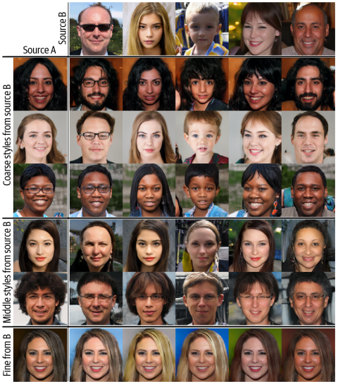

여기서 두 이미지 A와 B는 각기 다른 w 벡터로 생성되었다.
두 이미지를 합치기 위해서 A의 w 벡터를 합성 네트워크에 통과시키지만 어떤 지점에서 B의 w 벡터로 바꾼다.
이런 변경이 초기 (4x4, 8x8)에서 일어나면 자세, 얼굴모양, 안경같은 B에 있는 큰 스타일이 A로 전달된다.
하지만 변경이 나중에 (128, 256)일어나면 B에서 색깔, 얼굴의 미세 형태 같은 미세한 스타일이 전달되고 A 이미지의 큰 특징은 유지된다.

# 10.4 StyleGAN2

StyleGAN 구조를 기반으로 생성된 출력의 품질을 높이는 몇가지 변경 사항이 추가되었다.

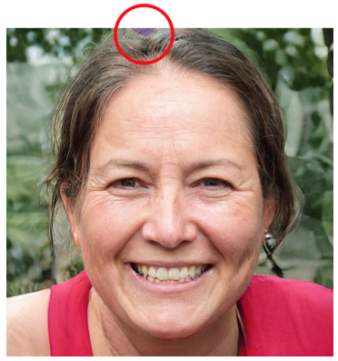

특히 StyleGAN2는 그림에서 볼 수 있듯이 이미지의 아티팩트(물방울이 번진 것 같은 현상)가 거의 발생하지 않는다.
이런 아티팩트 문제는 StyleGAN의 적응적 인스턴스 정규화 층으로 인해 발생하는 것으로 밝혀졌다.

StyleGAN2의 Generator, Discriminator는 모두 StyleGAN과 다르다.

## 10.4.1 가중치 변조 및 복조

아티팩트 문제를 잡기 위해 생성자에서 AdaIN 층을 제거하고, 가중치 Modulation, demodulation 단계로 대체한다.
합성곱 층의 가중치 w는 런타임에서 StyleGAN2의 Modulation, Demodulation 단계에서 직접 업데이트 된다.

StyleGAN의 AdaIN 층은 단순히 인스턴스 정규화후 스타일 변조를 하는것에 불과하다.
StyleGAN2의 아이디어는 그림과 같이 합성곱 층의 출력이 아닌 런타임에 합성곱 층의 w에 직접 스타일 변조 및 정규화(복조)를 적용하는 것이다.

스타일 제어를 유지를 하며, 아티팩트 문제를 제거하는 방법을 보여준다.

StyleGAN2 에서 각각의 Dense층은 하나의 스타일 벡터 $s_i$를 출력한다. 여기서 $i$는 합성곱 층에 있는 입력 채널의 인덱스이다.
이 스타일 벡터는 다음과 같이 합성곱 층의 가중치에 적용된다.

$w'_{i, j, k} = s_i \cdot w_{i, j, k}$ 여기서 j는 출력층의 채널 인덱스, k는 공간 차원의 인덱스이다. 이 과정이 Modulation(변조)단계이다.

$w''_{i, j, k} = \frac{w'_{i, j, k}}{\sqrt{\sum_{i,k}{w'_{i, j, k}}^2 + \epsilon}}$ 가중치를 정규화해서 다시 표준 편차를 갖게 하여 훈련 과정의 안전성을 보장하는 Demodulation(복조) 단계이다.
여기서 $\epsilon$은 0으로 나누는걸 방지한 상수이다.

## 10.4.2 경로 길이 규제

StyleGAN 구조에 가한 또 다른 변경 사항은 손실 함수에 Path Length Regularization라는 추가 페널티 항을 포함하는 것이다.

잠재공간에서 어떤 방향으로든 고정된 크기의 거리를 이동하면 고정된 크기의 변화가 이미지에 발생하는 것이 좋다.
이를 위해 StyleGAN2는 그레이디언트 페널티가 있는 와서스테인 손실과 함께 당므 항을 최소화하는 것을 목표로 한다.

$\mathbb{E}_{w, y}(||J_w^\top y||_2 - a)^2$ 
$w$는 매핑 신경망에 의해 생성된 스타일 벡터의 집합이고.
$y$는 $N(0, I)$에서 뽑은 잡음 이미지 집합이다.
$J_w = \frac{\delta g}{\delta w}$는 스타일 벡터에 대한 Generator 신경망의 야코비 행렬이다.

> 야코비 행렬: 여러 입력이 여러 출력으로 바뀔 때 각 출력이 입력에 얼마나 민감한지 모아놓은 것.
> 스칼라 -> 스칼라함수 -> 미분값 하나로 충분하지만
> 벡터 -> 벡터함수 -> 값 하나로 표현이 안되기 때문에 편미분을 모아서 행렬로 정의함.

$||J_w^\top y||_2$ 항은 야코비 행렬에 있는 그레디언트들로 변환된 이미지 y의 크기를 측정한다.
이 값이 훈련이 진행 됨에 따라서 $||J_w^\top y||_2$의 지수 이동 평균을 사용해 동적으로 계산되는 상수 a에 가깝게 되어야 한다.

이 추가항 덕에 잠재 공간을 더 안정적이고 일관되게 탐색할 수 있다.
또한 손실 함수의 규제항은 효율성을 높이기 위해 16개의 미니 배치마다 한 번만 적용된다.
게으른 규제(Lazy Regularization)라고 하는 기술 덕에 눈에 띌 성능 저하가 발생하지는 않는다.

## 10.4.3 점진적 훈련 없음

또 다른 변경 사항은 StyleGAN2를 훈련하는 방식이다.

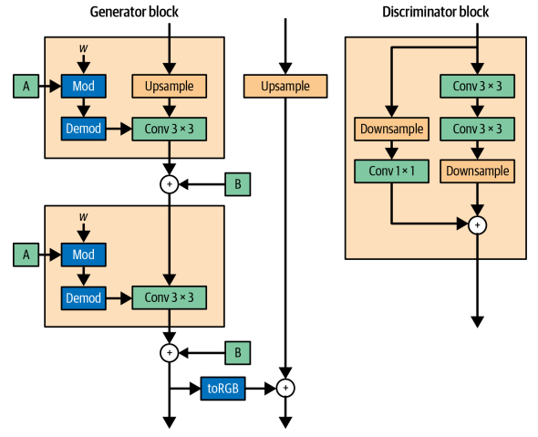

StyleGAN2는 점진적 훈련 메커니즘을 채택하는 대신 Generator의 스킵 연결과 Discriminator의 잔차 연결을 활용해 전체 신경망을 하나로 훈련한다.
더이상 다른 해상도에서 각각 훈련하고 합칠 필요가 없다.

StyleGAN2는 저해상도 특성 학습부터 훈련이 진행되며 점진적 향상을 유지할 수 있어야 한다.
논문에선 이 구조가 이게 이뤄진다는 걸 보여준다.
각 신경망은 훈련 초기 단계에서 저해상도 합성곱의 가중치를 미세 조정하며 이점을 얻는다.
이후 스킵 연결과 잔차 연결을 통해 대부분 영향을 받지 않고 고해상도 층으로 출력을 전달한다.
훈련이 진행되면서 Generator가 Discriminator를 속이도록 진짜 같은 이미지를 만드는 더 복잡한 방법을 발견하면서 고해상도 층이 지배적 역할을 한다.
아래 이미지는 시간에 따른 Generator의 출력에 대한 각 해상도 층의 기여도이다.

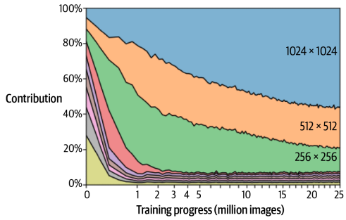

## 10.4.4 StyleGAN2의 출력

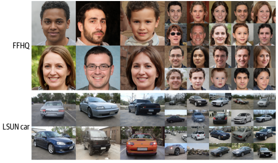

# 10.5 그 외의 중요한 GAN

## 10.5.1 SAGAN

Self-Attention GAN은 트랜스포머와 같은 순차모델에 사용하는 어텐션 매커니즘을 이미지 생성기반 GAN에 적용한 것이다.

> 어텐션 매커니즘은 9장 트랜스포머에서 등장하는 개념으로, 쉽게 말해 이미지의 한 위치가 다른 모든 위치를 참고해서 중요한 정보를 선택적으로 결합하는 매커니즘이다.
>
> 각 위치의 feature가 이미지 전체의 다른 위치들과의 관계를 계산해서 정보를 통합하는 구조이다.
> 이를 통해 멀리 떨어진 영역간의 의존성을 모델링할 수 있다.

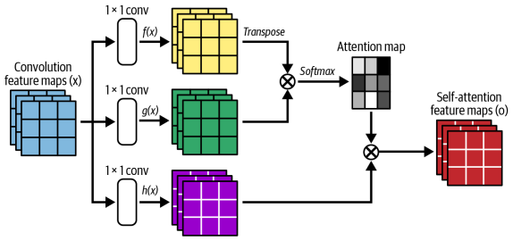

문제는 GAN 기반 모델은 합성곱 특성 맵이 지역적인 정보만 처리할 수 있다는 것이다.
이미지 한쪽의 픽셀 정보를 다른 곳에 연결하려면 여러 합성곱 층으로 채널을 늘려가며 이미지 크기를 감소시켜야 한다.
이러면 고수준 특성은 잡지만 정확한 위치 정보가 사라진다.
이런식으로 멀리 떨어진 픽셀 간의 너무 넓은 의존성을 학습하는 방식은 비효율 적이다.
SAGAN은 앞에서 본 어텐션 메커니즘을 GAN에 적용하여 이 문제를 해결한다.

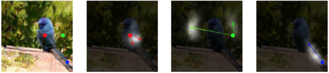

붉은 점은 새의 몸통 부분의 픽셀이다. 어텐션이 몸통 부분의 픽셀에 집중한다.
초록 점은 배경 부분이다.
이 어텐션은 새 머리의 뒷부분과 배경에 집중한다.
파란 점은 새의 꼬리부분이다. 이 어텐션은 파란점에서 멀리 떨어진 다른 꼬리 픽셀에도 집중한다.
어텐션을 사용하지 않고 이렇게 넓은 범위의 픽셀간 의존성을 유지하기는 어렵다.

## 10.5.2 BigGAN

SAGAN의 아이디어를 확장한 것이다. 아래는 128x128의 ImageNet 데이터 셋에서 훈련한 예제이다.

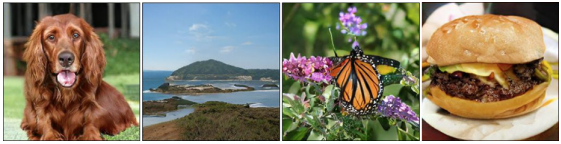

여기에 사용된 중요한 한 가지 기법은 truncation trick(절단 기법)이다.
훈련시에 잠재 벡터의 분포로 정규 분포를 사용하지만 샘플리에선 절단 정규 분포를 사용한다.
그래서 어떠한 임곗값보다 작은 z를 샘플링한다.
절단 임곗값이 작을 수록 다양성은 줄지만 샘플의 신뢰도가 커진다.

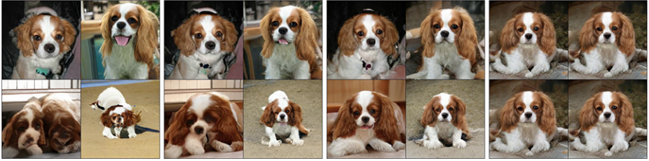

임곗값이 왼쪽에서부터 순서대로 2, 1, 0.5, 0.04이다.
BigGAN은 규모가 크다는 점에서 SAGAN보다 좋아졌다.
BigGAN의 배치 크기는 2048이다. SAGAN의 256보다 8배 크고 각 층의 채널 크기도 50프로 증가했다.
또한 SAGAN을 구조적으로도 향상해서 고유 임베딩, 직교 정규화가 포함되며 잠재 벡터 z를 첫 번째 층 뿐 아닌 생성자의 층 마다 사용한다.

## 10.5.3 VQ-GAN

VAE에서 학습한 표현은 연속적이 아니라 이산적일 수 있음을 기반으로 만들어졌다.
Discrete latent space(이산 잠재 공간)는 해당 인덱스에 연관된 학습된 벡터 목록을 의미한다.
이 벡터 목록을 코드북이라고 하는데, 간단히 말해 잠재 공간을 연속 공간이 아니라 벡터들의 목록으로 보고, 하나의 이산적 개념으로 동작하게 하는 것이다.
예를 들어 이미지의 $e_1$은 배경의 의미를 가질 수 있다.

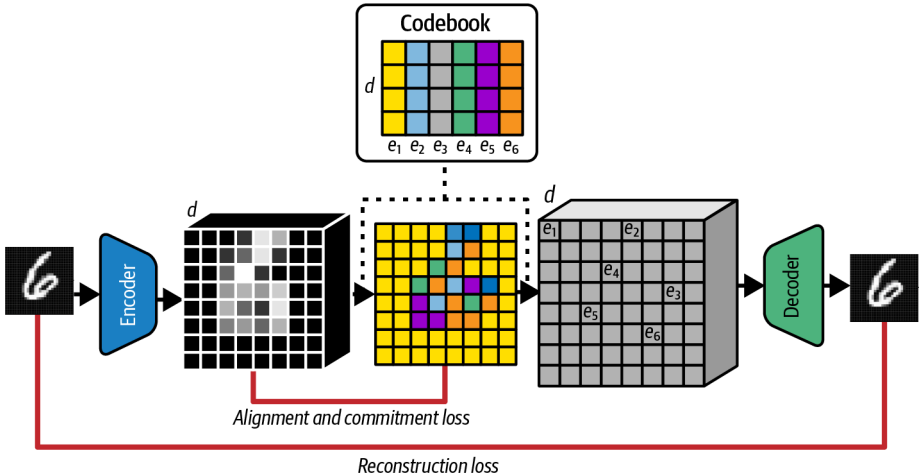

인코더는 입력된 이미지를 작은 격자 형태의 벡터들로 압축하여 코드북과 비교할 수 있게 만든다.
그리고 각 격자마다 코드북에서 제일 가까운 벡터를 하나 골라서 디코더에 전달한다.
그리고 디코더는 선택된 코드 벡터들을 받아서 이미지를 복원한다.

VQ-VAE의 Loss는 정렬(alignment) 손실과 commitment 손실을 더한 재구성 손실이다.
이 세가지 항을 통해 인코더 출력이 코드북 벡터와 최대한 가깝게 만드는데 쓰인다.
이 구조는 원래의 VAE의 KL 발산을 대체하는 역할을 한다.

그럼 문제가 하나 발생한다.
이 코드 격자를 가지고 어떻게 샘플링 할것인가? 이다. 모든 코드를 같은 확률로 뽑으면 작동하지 않을것이다.
단적인 예로 MNIST 기준으로 왼쪽 위는 배경이고 중앙은 안그럴텐데 똑같은 확률로 뽑을 순 없다.

이걸 해결하기 위해 5장에 등장하는 PixelCNN 같은 자기회귀 모델을 사용한다.
이 모델은 이전 코드들을 보고 다음 코드를 예측한다. 즉 분포(prior)를 모델이 직접 학습한다.

여기서 VQ-GAN으로 확장된다.
구조는 그대로 두고 여기에 Discriminator를 추가해서 GAN으로 만든다.
이 Discriminator는 VAE 디코더의 출력과 실제 이미지를 구분하려 하고, 여기에 따른 adversarial loss가 전체 loss에 추가된다.
이렇게 하여 GAN이 가진 선명한 이미지 생성 능력을 VAE에 더해준다.

또 다른 방식으로 PatchGAN의 방식이 있다.
Discriminator가 이미지 전체를 한 번에 보지 않고, 작은 패치 단위로 진위 여부를 판단한다.
이 방식을 통해 discriminator는 이미지의 스타일에 집중하게 되고 VAE가 만드는 흐릿한 스타일 문제를 보완해준다.

또 하나의 방식은 지각 손실(Perceptural loss)항을 사용하는 것이다.
기존의 VAE는 픽셀 단위의 MSE(평균 제곱 오차)를 사용한다. 
VQ-GAN은 Perceptural loss를 사용하여 인코더 중간의 feature와 디코더 대응 feature를 비교한다.
이를 통해 더 현실적인 이미지가 나온다.

마지막으로 Transformer로 코드를 생성하는 것이다.
PixelCNN 대신 Transformer를 자기회귀 부분으로 사용해서 코드 시퀀스를 생성하도록 훈련한다.
전체 VQ-GAN 학습이 끝나고 별도의 단계에서 학습을 진행한다.
모든 이전 토큰을 보지 않고 슬라이딩 윈도우 내에 있는 토큰만 사용하여 더 큰 이미지로 확장할 수 있다.

## 10.5.4 ViT VQ-GAN

VQ-GAN에서 쓰던 CNN 인코더/디코더를 Vision Transformer (ViT)로 바꾼것이다.

기존의 VQ-GAN에서 CNN을 활용하는 것을 Transformer로 대체해 이미지 인코더/디코더로 쓴다는 아이디어이다.

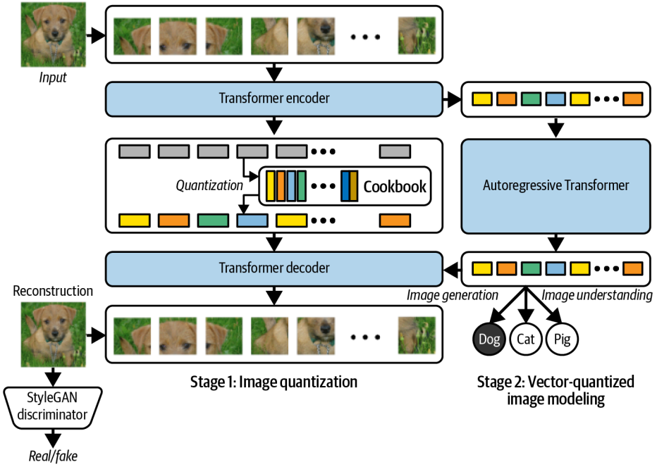

먼저 이미지를 겹치지 않는 작은 패치들 (ex 8x8) 로 분할하고 벡터로 펼친다.
이후 위치 임베딩을 추가하면 이 이미지는 토큰 시퀀스가 된다.

이제 Transformer encoder로 특징을 추출한다.
이 패치 시퀀스는 표준 Transformer 인코더에 입력되며, 출력은 패치별 임베딩 벡터들이다.

그리고 코드북을 통해 양자화 하여 각 패치 임베딩을 가장 가까운 코드북 벡터로 치환한다.
결과로 이산 코드 시퀀스가 나온다.

그리고 양자화된 코드 시퀀스를 transformer decoder에 넣어 다시 패치 시퀀스로 복원시킨다.
패치들을 이어붙여 최종 이미지를 생성한다.

GAN Discriminator는 그대로 사용한다.
기존의 VQ-GAN과 마찬가지로 StyleGAN Discriminator를 사용한다.
VAE 계열의 블러 문제를 줄이고 더 선명한 이미지가 나오기 때문이다.

첫 번째 단계에서 ViT 기반의 VQ-VAE + GAN Discriminator의 구조로 굴러가고
두 번째 단게에선 Autoregressive Transformer가 코드 시퀀스를 생성하도록 학습한다.

결과적으로 encoder, decoder, autoregressive model 세 가지의 Transformer가 사용된다.

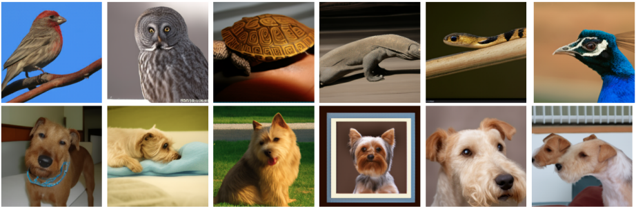

생성된 이미지는 이와 같다.

# 10.6 요약

- 2017년 이후 발표된 주요 GAN 논문들(ProGAN, StyleGAN, StyleGAN2, SAGAN, BigGAN, VQ-GAN, ViT VQ-GAN)을 전반적으로 다룸
- ProGAN에서 **progressive training** 개념을 도입해 해상도를 점진적으로 높이며 학습하는 방식을 소개
- StyleGAN에서는 **mapping network**와 **synthesis network**를 통해 스타일 벡터를 분리하고, 해상도별로 스타일을 주입할 수 있게 함
- StyleGAN2는 StyleGAN의 **AdaIN을 weight modulation/demodulation으로 대체**하고, path regularization 등 추가 개선을 도입
- StyleGAN2는 progressive training 없이도 점진적 해상도 정제 효과를 유지할 수 있음을 보임
- SAGAN은 **attention 메커니즘**을 GAN에 도입해, 이미지 전역에 걸친 장거리 의존성을 포착할 수 있게 함
- BigGAN은 SAGAN의 아이디어를 확장해 더 큰 모델과 여러 구조적 변경을 통해 이미지 품질을 추가로 향상
- VQ-GAN은 **이산 잠재공간을 갖는 VQ-VAE**에 GAN 판별자를 결합해, 블러를 줄이고 더 선명한 이미지를 생성
- VQ-GAN에서는 **autoregressive Transformer**를 사용해 코드 토큰 시퀀스를 생성하고, 이를 디코더로 복원해 새로운 이미지를 만듦
- ViT VQ-GAN은 VQ-GAN의 **합성곱 인코더/디코더를 Transformer로 대체**해 아이디어를 한 단계 더 확장