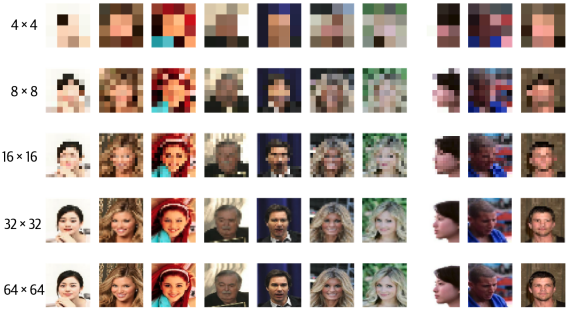

# 10.1 소개

Github에 있는 GAN Zoo 저장소에 다양한 논문의 링크와 500개 이상의 GAN 예제가 있다.
이미지 생성의 한계를 뛰어넘은 ProGAN, StyleGAN, StyleGAN 2를 살펴볼 것이다.

또한 어텐션을 통합한 SAGAN과 BigGAN 두개를 더 살펴볼것이다.

그리고 오토인코더, 당장 공부하진 않았지만 트랜스포머, GAN의 아이디어를 혼합한 VQ-GAN과 ViT VQ-GAN을 다룰것이다.
VQ-GAN은 구글의 최첨단 Text-To-Image 생성 모델인 Muse의 핵심 구성요소이다.

# 10.2 ProGAN

NVIDIA가 GAN 훈련 속도와 안정성읠 향상시키기 위해 2017년에 개발한 기술이다.
ProGAN 논문은 전체 해상도 이미지에서 바로 GAN을 훈련하는 대신 
4x4 픽셀의 저해성도 이미지로 Genrator와 Discriminator를 훈련한 다음 훈련 과정에 층을 점진적으로 추가하여 해상도를 높인다.

## 10.2.1 점진적 훈련

일반 GAN에서 Generator는 초기 단계에서도 항상 전체 해상도 이미지를 출력한다.
이 전략이 최적이 아니라고 생각할 수도 있다.
생성자가 처음부터 고해상도 이미지에서 작동하면 훈련 초기에 고수준의 구조를 학습하는 속도가 느릴수 있다.
먼저 정확한 저해상도 이미지를 출력하도록 경량 GAN을 훈련시키고, 점점 해상도를 높이는 것이 나을수도 있다.

이건 ProGAN 논문의 핵심 요소인 점진적 훈련으로 이어진다.
