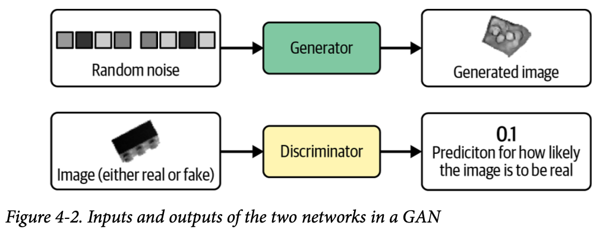
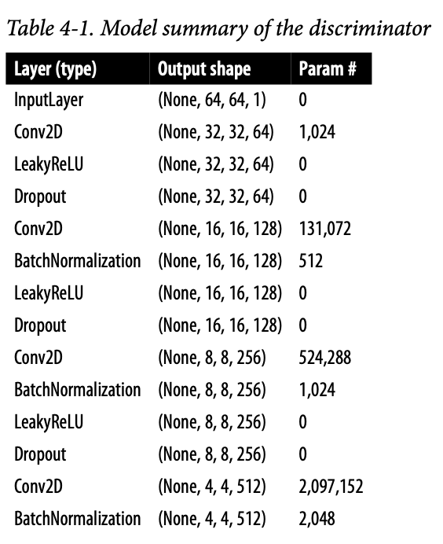
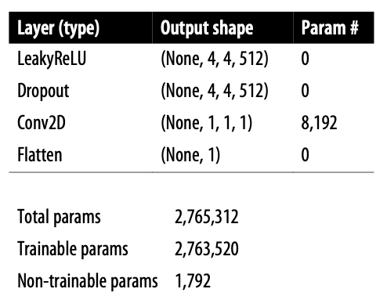
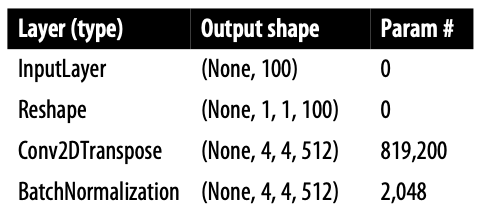
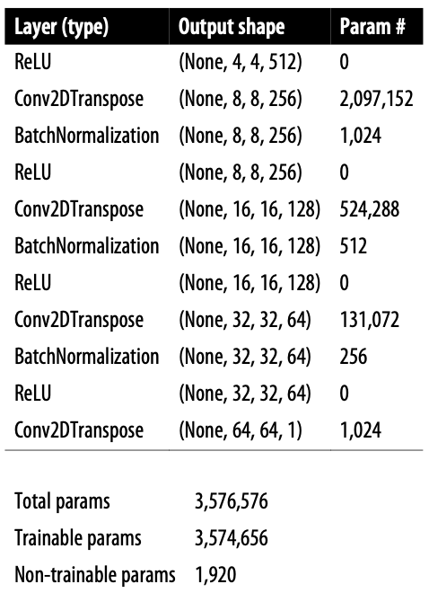

# 1. 소개

챕터 3에서의 무한 옷장 문제와 같은 예시를 하나 들어보겠다.

> 브릭키 벽돌과 위조범
>
> 당신은 벽돌 회사 브릭키에 QA로 취업했다.
> 경쟁업체가 벽돌의 위조품을 만들기 시작했고, 고객이 받는 물류에 섞어넣었다.
> 당신은 위조 벽돌 판별 전문가가 되어 생산 라인에서 위조 벽돌을 찾아낸다.
> 경쟁사는 그런 나를 파악해서 위조 프로세스를 바꿔가며 더욱 구분하기 어렵게 만든다.
> 나는 포기하지 않고 재교육하며 더 잘 찾아내려고 노력한다.
> 이렇게만 해도 위조의 품질과 탐지 품질이 크게 향상된다.

이 이이야기는 GAN(Generative Adversarial Network)의 훈련 과정을 잘 설명한다.



GAN은 Generator와 Discriminator의 싸움으로 발전한다.
Generator는 랜덤한 잡음을 원래 데이터셋에서 샘플링한 것 처럼 보이는 샘플로 변환한다.
Discriminator는 샘플이 원래 데이터셋의 것인지 Generator의 위조품인지 예측한다.
그림은 출력의 예시이다.
이 순환이 계속 되며 성능 향상을 도모한다.

# 4.2 심층 합성곱 GAN (DCGAN)

Deep Convolutional Generative Adversarial Network을 케라스로 직접 만들어 벽돌 사진을 생성해 확인해보자.

## 4.2.1 레고 블록 데이터셋

Kaggle에 있는 레고블럭 데이터셋을 활용한다. (https://www.kaggle.com/datasets/joosthazelzet/lego-brick-images)
다각도에서 촬영된 레고 블록을 컴퓨터로 렌더링한 사진 40000장을 모아놓은 것.

```python
train_data = utils.image_dataset_from_directory(
    "/app/data/lego-brick-images/dataset/",
    labels=None,
    color_mode="grayscale",
    image_size=(64, 64),
    batch_size=128,
    shuffle=True,
    seed=42,
    interpolation="bilinear",
)
```

이미지 크기를 64x64로 조정하고 픽셀 사이를 보간한다.
원본 데이터는 [0, 255] 범위의 픽셀 강도지만 [-1, 1] 범위로 스케일한다.
그 이유는 생성자 마지막 층에서 시그모이드 함수보다 더 강한 gradient를 제공하는 tanh 활성화 함수를 사용하기 위함이다.

```python
def preprocess(img)
	img = (tf.cast(img, "float32") - 127.5) / 127.5
    return img

train = train_data.map(lambda x: preprocess(x))
```

## 4.2.2 판별자

판별자를 만들어보자.

판별자의 목표는 이미지의 진위여부 판별이다. 2장의 지도학습 분류 예제와 비슷한 구조를 사용할 수 있을 것이다.
즉 합성곱 층을 쌓고 하나의 유닛으로 출력을 생성한다.





구조는 이미지와 같다.
아래는 예제코드이다.

```python
# input 층 정의
discriminator_input = layers.Input(shape=(IMAGE_SIZE, IMAGE_SIZE, CHANNELS))
# Conv2D 층을 쌓고 그 사이에 BatchNormalization, LeakyReLU, Dropout 층을 놓음
x = layers.Conv2D(64, kernel_size=4, strides=2, padding="same", use_bias=False)(discriminator_input)
x = layers.LeakyReLU(0.2)(x)
x = layers.Dropout(0.3)(x)
x = layers.Conv2D(
    128, kernel_size=4, strides=2, padding="same", use_bias=False
)(x)
x = layers.BatchNormalization(momentum=0.9)(x)
x = layers.LeakyReLU(0.2)(x)
x = layers.Dropout(0.3)(x)
x = layers.Conv2D(
    256, kernel_size=4, strides=2, padding="same", use_bias=False
)(x)
x = layers.BatchNormalization(momentum=0.9)(x)
x = layers.LeakyReLU(0.2)(x)
x = layers.Dropout(0.3)(x)
x = layers.Conv2D(
    512, kernel_size=4, strides=2, padding="same", use_bias=False
)(x)
x = layers.BatchNormalization(momentum=0.9)(x)
x = layers.LeakyReLU(0.2)(x)
x = layers.Dropout(0.3)(x)
x = layers.Conv2D(
    1,
    kernel_size=4,
    strides=1,
    padding="valid",
    use_bias=False,
    activation="sigmoid",
)(x)
# 마지막 합성곱 층의 출력을 펼침. 이 시점에서 텐서의 크기는 1x1x1이다. 그래서 굳이 Dense층울 거칠 필요는 없다.
discriminator_output = layers.Flatten()(x)

# 판별자 모델을 만듦. 입력 이미지를 받아 0과 1사이 숫자 하나를 출력함.
discriminator = models.Model(discriminator_input, discriminator_output)
```

몇몇 Conv2D 층에 strides를 2로 지정했다. 그래서 이미지 크기가 반으로 줄다가 마지막엔 1x1이 된다.
반대로 채널수는 마지막 예측 전까지 늘어나서 512개가 된다.
마지막 Conv2D층에 시그모이드를 사용하여 0과 1사이 숫자를 출력한다.

## 4.2.3 생성자

이제 위조범을 만들어보자.
생성자의 입력은 다변량 표준 정규 분포에서 뽑은 벡터이다. 출력은 원본 이미지와 같은 크기의 이미지이다.
GAN의 Generator는 VAE의 Decoder와 목적이 같다. 잠재 공간에서 원래 도메인으로 다시 매핑하는건 자주 사용되는 방식이다.





구조는 이와같다.

```python
# 생성자의 입력층 (길이 100짜리 벡터)를 정의한다.
generator_input = layers.Input(shape=(100,))
# Reshape층을 통해 1x1x100 크기 텐서로 바꿈. 전치 합성곱 가능해짐.
x = layers.Reshape((1, 1, 100))(generator_input)
# 총 4개의 Conv2DTranspose층에 통과시킴. 사이에 BatchNormalization, LeakyReLU층을 놓음
x = layers.Conv2DTranspose(
    512, kernel_size=4, strides=1, padding="valid", use_bias = False
)(x)
x = layers.BatchNormalization(momentum=0.9)(x)
x = layers.LeakyReLU(0.2)(x)
x = layers.Conv2DTranspose(
    256, kernel_size=4, strides=2, padding="same", use_bias = False
)(x)
x = layers.BatchNormalization(momentum=0.9)(x)
x = layers.LeakyReLU(0.2)(x)
x = layers.Conv2DTranspose(
    128, kernel_size=4, strides=2, padding="same", use_bias = False
)(x)
x = layers.BatchNormalization(momentum=0.9)(x)
x = layers.LeakyReLU(0.2)(x)
x = layers.Conv2DTranspose(
    64, kernel_size=4, strides=2, padding="same", use_bias = False
)(x)
x = layers.BatchNormalization(momentum=0.9)(x)
x = layers.LeakyReLU(0.2)(x)
# 마지막 Conv2DTranspose층에 tanh를 활용해 출력을 원본 이미지 도메인과 같은 [-1, 1] 범위로 변환
generator_output = layers.Conv2DTranspose(
	1,
    kernel_size=4,
    strides=2,
    padding="same",
    use_bias = False,
    activation = 'tanh'
)(x)
# 생성자 정의, 길이가 100인 벡터를 받고 [64, 64, 1]크기의 텐서를 출력함
generator = models.Model(generator_input, generator_output)
```

이것도 위와 같이 strides를 2로 지정하여 반대의 효과를 본다. 즉 벡터는 1에서 64까지 커지고, 채널은 512에서 1이 된다.

Conv2DTranspose층 대신 UpSampling2D층과 strides가 1인 Conv2D층을 활용할 수도 있다.

```python
x = layers.UpSampling2D(size = 2)(x)
x = layers.Conv2D(256, kernel_size=4, strides=1, padding="same")(x)
```

UpSampling 층은 단순히 각 입력의 행과 열을 반복해서 크기를 두배로 키우는 레이어이다.
이후 strides가 1인 Conv2D층을 통해 합성곱을 진행한다. 
이는 전치 합성곱과 유사하지만 픽셀 사이 공간을 0으로 채우지 않고, 기존 픽셀값을 활용해서 업샘플링하는 방식이다.

이 방법도 테스트해서 어떤것이 더 나은 결과가 나오는지 확인해야 한다.

## 4.2.4 DCGAN 훈련

