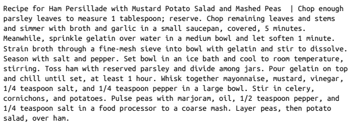
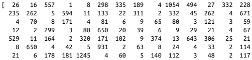
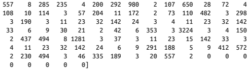

# 5.1 소개

> 교도관 에드워드 소프(edward sopp). 소설을 쓰고 싶은데 죄수 보느라 시간이 없다.
> 그래서 죄수들을 굴리기로 했다. LSTM(Literary Society for Troublesome Miscreants)를 만들었다.
>
> 이 감방(Ceil)에서 256명의 죄수들을 통해 각자의 의견을 받는다.
> 매일 에드워드는 소설의 제일 마지막 단어를 감방에 붙이면 이 단어를 기반으로 죄수들은 현재 이야기에 대한 의견을 업데이트한다.
> 각 죄수는 각자의 사고방식을 통해 다른 죄수의 의견과 자기 생각의 균형을 맞춘다.
> 먼저 새로운 단어에서 얻은 정보, 다른 죄수의 의견을 고려해 어제의 의견을 얼마나 잊을지 결정한다.
> 그리고 이에 따라서 어제에서 넘어온 예전 생각과 얼마나 섞을지 결정해서 오늘 새 의견을 만든다.
>
> 근데 죄수들은 각각 비밀이 많아서 모두 의견을 말하진 않는다.
> 마지막으로 고른 단어와 다른 죄수들의 의견을 고려해서 얼마나 내 의견을 피력할지 판단한다.
>
> 에드워드가 다음 단어를 만들고 싶다고 하면 죄수들이 교도관에게 각자의 의견을 말한다.
> 교도관은 이 정보를 합쳐서 소설의 끝에 추가할 최종 단어를 결정하고, 새 단어를 다시 죄수들에게 전달하여 소설을 완성한다.
>
> 에드워드는 죄수와 교도관을 훈련시키기 위해서 이전에 썼던 짧은 문장 예시를 감방에 던져준다.
> 그리고 죄수들이 고른 다음 단어가 올바른지 모니터링 한다.
> 죄수들에게 정확도를 알려주면 눈치껏 에드워드 스타일로 소설을 써주기 시작할 것이다.

이 이야기는 LSTM의 예시이다.

# 5.2 LSTM 네트워크 소개

LSTM은 순환 신경망의 한 종류이다.

순환 신경망은 순서가 있는 데이터를 다루기 위해서 이전의 정보를 다음 계산에 계속 가져간다는 의미이다.
그래서 순차 데이터를 처리하는 순환 층(또는 셀)이 있다.
처음엔 tanh(하이퍼볼릭 탄젠트) 함수 하나로 구성되어 있는 단순한 순환층이었기 때문에 그레이디언트 소실 문제가 발생한다.

그레이디언트 소실은 역전파로 초반 레이어까지 학습 신호를 보내는 과정에서 신호가 점점 작아지다가 0에 수렴하는 현상을 의미한다.

> 공부한걸 집에 가서 복습하려다 가는 길에 기억이 희미해져 영향이 약해진 꼴

그레이디언트 소실이 발생하는 원인은 단순하다.
역전파 특성 상 기울기가 여러 개의 미분 값을 계속 곱한 형태이다.
보통 사용되는 활성함수인 시그모이드나 tanh가 1보다 작기 때문에 결국엔 반복해서 곱하면 0으로 수렴하게 되는 것이다.
그래서 타임 스텝이 늘어날수록(멀리있는 앞으로 갈수록) 기울기가 지수적으로 작아지게 된다.

LSTM이 이를 개선한 방식이다. 시계열 예측이나 오디오 분류 등에 활용된다.
원리를 단순하게 설명하자면 집에 가다가 까먹지 않기 위해 메모(게이트)를 하여 중요한 건 잊지 않게 하는 방식이다.

## 5.2.1 레시피 데이터 셋

```python
with open('/app/data/epirecipes/full_format_recipes.json') as json_data:
    recipe_data = json.load(json_data)
    
filtered_data = [
    'Recipe for ' + x['title']+ ' | ' + ' '.join(x['directions'])
    for x in recipe_data
    if 'title' in x
    and x['title'] is not None
    and 'directions' in x
    and x['directions'] is not None
]
```



영양 성분, 재료 목록 같은 메타데이터를 포함한 2만개의 레시피로 구성되어있다. 덤으로 샘플 레시피 문자열도 포함되어있다.

## 5.2.2 텍스트 데이터 다루기

- 텍스트와 이미지의 차이
    - 텍스트는 개별적 데이터 조각(문자, 단어)이다.
        - 이미지는 색상 스펙트럼 위의 점이기 때문에 초록색을 파란색에 가깝게 바꾸기 쉽다.
            - 개별 픽셀에 대한 손실함수의 그레이디언트를 계산하면, 손실 함수 최소화를 위한 색의 변경 방향을 알 수 있으므로, 역전파 적용이 쉽다.
        - 하지만 텍스트는 이미지와 달리 cat을 dog에 가깝게 바꾸는 방법이 명확하지 않다.
            - 이산적인 데이터이므로 일반적으로 역전파를 적용할 수 없다.
    - 텍스트는 시간 차원만 존재한다.
        - 이미지는 두 개의 공간 차원이 있고, 시간 차원이 없기 때문에 순서가 크게 중요하지 않다.
            - 모든 픽셀을 동시에 처리할 수 있다.
        - 텍스트는 단어를 거꾸로 배열하면 의미 전달이 불가하다. 또한 단어 간에 순서에 대한 의존성이 있는 경우도 많다.
            - 질문에 대답한다거나, 대명사의 정보를 다음으로 넘겨야 한다거나.
    - 텍스트는 개별 단위의 작은 변화에도 민감하다.
        - 이미지는 개별 픽셀단위의 변화에 덜 민감하다. 집 그림에서 일부 픽셀을 바꿔도 집이다.
        - 하지만 텍스트는 단어 몇 개만 바뀌어도 문장이 달라지거나 이해가 불가능해진다.
            - 모든 단어가 문장 전체의 의미를 나타내는 데 중요하기 때문에 논리적 텍스트 생성이 매우 어렵다.
    - 텍스트는 규칙 기반의 문법 구조가 존재한다.
        - 이미지는 픽셀값 할당을 위한 규칙이 따로 없다.
        - 문서에 "The cat sat on the having" 과 같은 문장이 있다면 이는 문법적으로 틀렸다.
        - 또한 의미론적 규칙은 모델링하기 더욱 어렵다.
            - I am in the beach 라는 문장은 문법은 맞지만 의미가 통하지 않는다.

이제 이를 LSTM 신경망이 훈련하기 적합하게 만들어야 한다.

## 5.2.3 토큰화

```python
def pad_punctuation(s):
	s = re.sub(f"([{string.punctuation}])", r' \1 ', s)
    s = re.sub(' +', ' ', s)
    return s

# 구두점(쉼표, 마침표 등)을 별도의 단어로 처리하기 위해 공백을 추가.
text_data = [pad_punctuation(x) for x in filtered_data]

# 텐서플로 데이터셋으로 변환한다.
text_ds = tf.data.Dataset.from_tensor_slices(text_data).batch(32).shuffle(1000)

# 텍스트를 소문자로 바꾸고, 가장 자주 등장하는 만개의 단어에 정수 부여
# 시퀀스 길이가 201개의 토큰이 되도록 자르거나 패딩하는 케라스 TextVectorization 층을 만듦
vectorize_layer = layers.TextVectorization(
    standardize = 'lower',
    max_tokens = 10000,
    output_mode = "int",
    output_sequence_length = 200 + 1,
)
# TextVectorization 층을 훈련 데이터에 적용
vectorize_layer.adapt(text_ds)

# vocab 변수에 단어 토큰의 리스트 저장
vocab = vectorize_layer.get_vocabulary()
```




```python
def prepare_inputs(text):
	text = tf.expand_dims(text, -1) 
    tokenized_sentences = vectorize_layer(text) 
    x = tokenized_sentences[:, :-1]
    y = tokenized_sentences[:, 1:] 
    return x, y

# 레시피 토큰과 동일하지만 한 토큰 이동된 벡터로 구성된 훈련세트를 만듦
train_ds = text_ds.map(prepare_inputs)
```

```python
# Input층에는 시퀀스 길이를 미리 지정할 필요 없음
inputs = layers.Input(shape=(None,), dtype="int32")

# Embedding 층은 두 개의 매개변수가 필요함. 어휘사전의 크기 (10000)와 임베딩 벡터의 차원(100)
x = layers.Embedding(10000, 100)(inputs)

# LSTM 층에는 은닉 벡터의 차원(128)을 지정해야 함. 
# 마지막 타임 스텝의 은닉 상태 뿐 아닌 전체 타임 스텝의 은닉 상태 뿐 아닌 전체 타임 스텝의 은닉상태 반환
x = layers.LSTM(128, return_sequences=True)(x)

# Dense 층은 각 타임 스텝의 은닉 상태를 다음 토큰에 대한 확률 벡터로 변환
outputs = layers.Dense(10000, activation = 'softmax')(x) 

# Model은 입력 토큰 시퀀스가 주어지면 다음 토큰을 예측. 시퀀스에 있는 각 토큰에 대해서 수행
lstm = models.Model(inputs, outputs)

loss_fn = losses.SparseCategoricalCrossentropy() 
# SparseCategoricalCrossentropy 손실로 모델 컴파일.
# 범주형 크로스 엔트로피와 같으나 레이블이 원핫 인코딩 된 벡터가 아니라 정수일 때 사용
lstm.compile("adam", loss_fn)
lstm.fit(train_ds, epochs=25)
```

```python
class TextGenerator(callbacks.Callback):
    def __init__(self, index_to_word, top_k=10):
        self.index_to_word = index_to_word
        self.word_to_index = {
        	word: index for index, word in enumerate(index_to_word)
        }	# 어휘 사전의 역매핑(단어에서 토큰으로)을 만듦
        
    # 이 함수는 temperature 매개변수를 통해 확률 업데이트
    def sample_from(self, probs, temperature):
        probs = probs ** (1 / temperature)
        probs = probs / np.sum(probs)
        return np.random.choice(len(probs), p=probs), probs
    
    def generate(self, start_prompt, max_tokens, temperature):
        # 시작 프롬프트는 생성 과정을 시작하기 위해 모델에 제공되는 단어의 문자열. (예: recipe for)
        # 단어는 먼저 토큰의 리스트로 변환됨
        start_tokens = [
        	self.word_to_index.get(x, 1) for x in start_prompt.split() 
        ]
        sample_token = None
        info = []
        # max_tokens 길이가 되거나 중지 토큰(0)이 나올 때 까지 시퀀스를 생성
        while len(start_tokens) < max_tokens and sample_token != 0:
            x = np.array([start_tokens])
        	y = self.model.predict(x)	# 모델은 시퀀스의 다음에 나올 단어의 확률 출력
            # 이 확률은 sample_from 메서드로 전달, temperature 기반으로 다음 단어 선택
            sample_token, probs = self.sample_from(y[0][-1], temperature)	
            info.append({'prompt': start_prompt , 'word_probs': probs}) 
            # 다음 반복을 위해 새로운 단어를 프롬프트 텍스트에 추가
            start_tokens.append(sample_token)
            start_prompt = start_prompt + ' ' + self.index_to_word[sample_token] 
            print(f"\ngenerated text:\n{start_prompt}\n")
		return info
    
def on_epoch_end(self, epoch, logs=None):
	self.generate("recipe for", max_tokens = 100, temperature = 1.0)
```

```python
text_in = layers.Input(shape = (None,))
embedding = layers.Embedding(total_words, embedding_size)(text_in) 
x = layers.LSTM(n_units, return_sequences = True)(x)
x = layers.LSTM(n_units, return_sequences = True)(x) 
probabilites = layers.Dense(total_words, activation = 'softmax')(x) 
model = models.Model(text_in, probabilites)
```

```python
class MaskedConvLayer(layers.Layer):
    def __init__(self, mask_type, **kwargs):
        super(MaskedConvLayer, self).__init__()
        self.mask_type = mask_type
        # MaskedConvLayer는 일반적인 Conv2D 층을 기반으로 함
        self.conv = layers.Conv2D(**kwargs)
        
    def build(self, input_shape):
        self.conv.build(input_shape)
        kernel_shape = self.conv.kernel.get_shape()
        self.mask = np.zeros(shape=kernel_shape)	# 마스크 0으로 초기화
        self.mask[: kernel_shape[0] // 2, ...] = 1.0	# 이전 행의 픽셀은 마스킹을 해제하기 위해 1로 지정
        self.mask[kernel_shape[0] // 2, : kernel_shape[1] // 2, ...] = 1.0 	# 동일 행에 있는 이전 열의 픽셀은 마스킹을 해제하기 위해 1로 지정
        if self.mask_type == "B":
        	self.mask[kernel_shape[0] // 2, kernel_shape[1] // 2, ...] = 1.0	# 마스크 유형이 B면 중앙 픽셀은 마스킹을 해제하기 위해 1로 지정
            
    def call(self, inputs):
    	self.conv.kernel.assign(self.conv.kernel * self.mask)	# 마스크와 필터 가중치 곱함
        return self.conv(inputs)
```

```python
class ResidualBlock(layers.Layer):
    def __init__(self, filters, **kwargs):
        super(ResidualBlock, self).__init__(**kwargs)
        self.conv1 = layers.Conv2D(
        	filters=filters // 2, kernel_size=1, activation="relu" 
        )	# 첫 Conv2D 층은 채널 수를 절반으로 줄임
        self.pixel_conv = MaskedConv2D(
            mask_type="B",
            filters=filters // 2,
            kernel_size=3,
            activation="relu",
            padding="same",
        )	# 커널 크기가 3인 B유형 MaskedConv2D층은 다섯 개의 픽셀 정보만 사용
        	# 초점이 맞춰진 픽셀 위에 있는 픽셀 3개, 왼쪽 픽셀 1개, 초점이 맞춰진 픽셀 자체 1개
        self.conv2 = layers.Conv2D(
        	filters=filters, kernel_size=1, activation="relu" 
        )
        
    def call(self, inputs):
        x = self.conv1(inputs)
        x = self.pixel_conv(x)
        x = self.conv2(x)
        return layers.add([inputs, x])	# 합성곱 층의 출력을 입력에 더함. -> 스킵 연결
```

```python
# 16x16x1의 흑백 이미지 입력. 범위는 0에서 1사이
inputs = layers.Input(shape=(16, 16, 1)) 
x = MaskedConv2D(
    mask_type="A", 
    filters=128, 
    kernel_size=7, 
    activation="relu",
    padding="same"
    # 커널 크기가 7인 첫번째 A형 MaskedConv2D층은 24개 픽셀 정보 사용.
    # 초점 픽셀 위 세 줄에 있는 21개 픽셀, 왼쪽 3개 픽셀 (초점 픽셀 자체는 안씀)
)(inputs)

for _ in range(5):
	x = ResidualBlock(filters=128)(x)	# ResidualBlock 층 5개 쌓음
    
for _ in range(2):
	x = MaskedConv2D(
        mask_type="B", 
        filters=128, 
        kernel_size=1, 
        strides=1, 
        activation="relu", 
        padding="valid",
    )(x)	# 커널 크기 1인 두개의 B형 MaskedConv2D층이 각 픽셀의 채널에 대해 Dense층의 역할을 함
    
out = layers.Conv2D(
    filters=4, 
    kernel_size=1,
    strides=1, 
    activation="softmax", 
    padding="valid"
)(x)	# 최종 Conv2D 층이 채널 수를 4개 (이 예제의 픽셀 값 개수)로 줄임

# 이 모델은 한 이미지를 받고 동일한 크기의 이미지를 출력
pixel_cnn = models.Model(inputs, out)
adam = optimizers.Adam(learning_rate=0.0005)
pixel_cnn.compile(optimizer=adam, loss="sparse_categorical_crossentropy")
pixel_cnn.fit(
    input_data, 
    output_data, 
    batch_size=128 , 
    epochs=150
)	# 모델 훈련의 input_data는 [0, 1] 범위(실수)로 스케일 조정되고, output_data는 [0, 3] 범위(정수)
```

```python
class ImageGenerator(callbacks.Callback):
    def __init__(self, num_img):
    	self.num_img = num_img
        
    def sample_from(self, probs, temperature):
        probs = probs ** (1 / temperature)
        probs = probs / np.sum(probs)
        return np.random.choice(len(probs), p=probs)
    
    def generate(self, temperature):
        generated_images = np.zeros(
        shape=(self.num_img,) + (pixel_cnn.input_shape)[1:]
        )	# 빈 이미지 (모두 0)로 시작
        batch, rows, cols, channels = generated_images.shape
        
        for row in range(rows):
            for col in range(cols):
                for channel in range(channels):
                probs = self.model.predict(generated_images)[
                	:, row, col, :
                ]	# 현재 이미지 행, 열, 채널에 대해 반복. 다음 픽셀값의 분포 예측
                generated_images[:, row, col, channel] = [ 
                    self.sample_from(x, temperature) for x in probs
                ]	# 예측된 분포에서 픽셀값 샘플링 (예: [0, 3] 범위의 정수)
                generated_images[:, row, col, channel] /= 4	
                # 픽셀값을 [0, 1]범위로 변환. 현재 이미지 픽셀값에 덮어 씌운 후 다음 반복 진행
        return generated_images
    
    def on_epoch_end(self, epoch, logs=None): 
        generated_images = self.generate(temperature = 1.0) 
        display(
            generated_images,
            save_to = "./output/generated_img_%03d.png" % (epoch) 
        )
        
img_generator_callback = ImageGenerator(num_img=10)
```

```python
import tensorflow_probability as tfp

dist = tfp.distributions.PixelCNN(
    image_shape=(32, 32, 1),
    num_resnet=1,
    num_hierarchies=2,
    num_filters=32,
    num_logistic_mix=5,
    dropout_p=.3,
)	# PixelCNN을 하나의 분포로 정의함. 즉 출력 층이 다섯 개의 로지스틱 분포로 구성된 혼합 분포

image_input = layers.Input(shape=(32, 32, 1))	# 32x32x1 흑백 이미지

log_prob = dist.log_prob(image_input)

# 모델은 흑백 이미지를 입력으로 받아 PixelCNN이 계산한 혼합 분포에 따른 로그 가능도를 출력
model = models.Model(inputs=image_input, outputs=log_prob)	

# 손실함수는 입력 이미지 배치에 대한 음의 로그 가능도의 평균
model.add_loss(-tf.reduce_mean(log_prob))

dist.sample(10).numpy()
```

```python
layers.MultiHeadAttention(
    num_heads = 4,	# 이 멀티헤드 어텐션 층에는 4개의 헤드
    key_dim = 128,	# 키와 쿼리의 길이는 128
    value_dim = 64,	# 값은 길이가 64
    output_shape = 256	# 출력 벡터의 길이는 256
)
```

```python
def causal_attention_mask(batch_size, n_dest, n_src, dtype): 
    i = tf.range(n_dest)[:, None]
    j = tf.range(n_src)
    m = i >= j - n_src + n_dest
    mask = tf.cast(m, dtype)
    mask = tf.reshape(mask, [1, n_dest, n_src])
    mult = tf.concat(
    	[tf.expand_dims(batch_size, -1), tf.constant([1, 1], dtype=tf.int32)], 0 )
    return tf.tile(mask, mult)

np.transpose(causal_attention_mask(1, 10, 10, dtype = tf.int32)[0])
```

```python
class TransformerBlock(layers.Layer):
    # TransformerBlock에 속하는 하위 층을 초기화 함수에서 정의
    def __init__(self, num_heads, key_dim, embed_dim, ff_dim, dropout_rate=0.1): 
        super(TransformerBlock, self).__init__()
        self.num_heads = num_heads
        self.key_dim = key_dim
        self.embed_dim = embed_dim
        self.ff_dim = ff_dim
        self.dropout_rate = dropout_rate
        self.attn = layers.MultiHeadAttention(
        	num_heads, key_dim, output_shape = embed_dim
        )
        self.dropout_1 = layers.Dropout(self.dropout_rate) 
        self.ln_1 = layers.LayerNormalization(epsilon=1e-6) 
        self.ffn_1 = layers.Dense(self.ff_dim, activation="relu") 
        self.ffn_2 = layers.Dense(self.embed_dim)
        self.dropout_2 = layers.Dropout(self.dropout_rate) 
        self.ln_2 = layers.LayerNormalization(epsilon=1e-6)
        
    def call(self, inputs):
        input_shape = tf.shape(inputs)
        batch_size = input_shape[0]
        seq_len = input_shape[1]
        causal_mask = causal_attention_mask(
        	batch_size, seq_len, seq_len, tf.bool
        )	# 쿼리로부터 미래의 키를 숨기기 위한 Causal Mask 만듦
        attention_output, attention_scores = self.attn(
            inputs,
            inputs,
            attention_mask=causal_mask,
            return_attention_scores=True
        )	# Attention Mask를 지정해 multi head attention 층을 만듦
        attention_output = self.dropout_1(attention_output) 
        out1 = self.ln_1(inputs + attention_output)	# 첫 번째 덧셈 및 정규화 층
        ffn_1 = self.ffn_1(out1)	# 피드 포워드 층
        ffn_2 = self.ffn_2(ffn_1)
        ffn_output = self.dropout_2(ffn_2)
        return (self.ln_2(out1 + ffn_output), attention_scores)	# 두 번째 덧셈 및 정규화 층
```

```python
class TokenAndPositionEmbedding(layers.Layer):
    def __init__(self, maxlen, vocab_size, embed_dim): 
        super(TokenAndPositionEmbedding, self).__init__()
        self.maxlen = maxlen
    	self.vocab_size =vocab_size
    	self.embed_dim = embed_dim
        # 임베딩 층을 사용해서 토큰을 임베딩 한다
    	self.token_emb = layers.Embedding(
            input_dim=vocab_size, output_dim=embed_dim
        )
        # 토큰의 위치도 임베딩 층을 통해 임베딩 한다
    	self.pos_emb = layers.Embedding(input_dim=maxlen, output_dim=embed_dim)
    
    def call(self, x):
        maxlen = tf.shape(x)[-1]
        positions = tf.range(start=0, limit=maxlen, delta=1)
        positions = self.pos_emb(positions)
        x = self.token_emb(x)
        # 층의 출력은 토큰과 위치 인코딩의 합
        return x + positions
```

```python
MAX_LEN = 80
VOCAB_SIZE = 10000
EMBEDDING_DIM = 256
N_HEADS = 2
KEY_DIM = 256
FEED_FORWARD_DIM = 256

# 입력은 0으로 패딩
inputs = layers.Input(shape=(None,), dtype=tf.int32)
# TokenAndPositionEmbedding 층을 사용해 텍스트 인코딩
x = TokenAndPositionEmbedding(MAX_LEN, VOCAB_SIZE, EMBEDDING_DIM)(inputs) 
# 이 인코딩이 TransformerBlock을 통과함
x, attention_scores = TransformerBlock(
	N_HEADS, KEY_DIM, EMBEDDING_DIM, FEED_FORWARD_DIM
)(x)
# 변환된 출력이 소프트맥스 활성화 함수를 가진 Dense층을 거쳐 후속 단어의 분포를 예측
outputs = layers.Dense(VOCAB_SIZE, activation = 'softmax')(x)
# Model 클래스 객체는 단어 토큰의 시퀀스를 입력받고 예측된 후속 단어의 분포를 출력
# 트랜스포머 블록의 출력도 반환되므로 모델이 어떤 단어에 주의를 기울이는지 검사할 수 있음
gpt = models.Model(inputs=inputs, outputs=[outputs, attention])
# 예측된 단어 분포에 대한 SparseCategoricalCrossentropy 손실로 모델을 컴파일 함
gpt.compile("adam", loss=[losses.SparseCategoricalCrossentropy(), None])
gpt.fit(train_ds, epochs=5)
```

